# AWS - Systems Manager(SSM)

[Back](../index.md)

- [AWS - Systems Manager(SSM)](#aws---systems-managerssm)
  - [`AWS Systems Manager`](#aws-systems-manager)
    - [Parameter Store](#parameter-store)
    - [Standard and advanced parameter tiers](#standard-and-advanced-parameter-tiers)
    - [Parameters Policies](#parameters-policies)
  - [Hands-on](#hands-on)
  - [Hands-on: integrate with lambda](#hands-on-integrate-with-lambda)
  - [SSM - Session Manager](#ssm---session-manager)
    - [Hands-on](#hands-on-1)
  - [Run Command](#run-command)
  - [Patch Manager](#patch-manager)
  - [Maintenance Windows](#maintenance-windows)
    - [Automation](#automation)

---

## `AWS Systems Manager`

- `AWS Systems Manager`

  - formerly known as "Amazon Simple Systems Manager (SSM)" and "Amazon EC2 Systems Manager (SSM)"
  - **View operational data** for groups of resources, so you can quickly identify and act on any **issues** that might impact applications that use those resources.

---

### Parameter Store

- `AWS Systems Manager Parameter Store` / `SSM Parameter Store`

  - Centralized storage and management of your **secrets** and **configuration** data such as passwords, database strings, and license codes.
  - You can **encrypt** values, or store as **plain text**, and secure **access** at every level.

- **Features**:

  - **Version** tracking of configurations / secrets
  - Serverless, scalable, durable, easy SDK

- **Integration**:
  - Optional Seamless **Encryption** using `KMS`
  - **Security** through `IAM`
  - **Notifications** with Amazon `EventBridge`
  - **Integration** with `CloudFormation`


- Sample:
  - You have a secret value that you use for encryption purposes, and you want to **store and track the value**s of this secret over time. Which AWS service should you use?
    - **SSM Parameters Store** can be used to **store secrets and has built-in version tracking** capability. Each time you edit the value of a parameter, SSM Parameter Store creates a new version of the parameter and retains the previous versions. You can view the details, including the values, of all versions in a parameter's history.
  - You would like to externally maintain the **configuration values** of your main database, to be picked up at runtime by your application. What's the best place to store them to maintain control and **version history**?
    - SSM Parameters Store

---

- Hierarchy


---

### Standard and advanced parameter tiers


---

### Parameters Policies

- for advanced parameters
- Allow to assign a `TTL` to a parameter (`expiration date`) to **force updating or deleting** sensitive data such as passwords
- Can assign **multiple policies** at a time


---

## Hands-on

- String parameter
  


- Security string


- Get parameter using CLI

```sh
aws ssm get-parameters --names /my-app/dev-pwd /my-app/dev-url
```


- Decrype parameter

```sh
# GET PARAMETERS WITH DECRYPTION
aws ssm get-parameters --names /my-app/dev-pwd /my-app/dev-url --with-decryption
```


- Get parameters by path

```sh
# GET PARAMETERS BY PATH
aws ssm get-parameters-by-path --path /my-app/dev/
```


- Get by path recursively and decryption

```sh
# GET PARAMETERS BY PATH WITH DECRYPTION
aws ssm get-parameters-by-path --path /my-app/ --recursive --with-decryption
```


---

## Hands-on: integrate with lambda


- function code:

```py
import json
import boto3
import os

ssm = boto3.client('ssm', region_name="us-east-1")
app_name = os.environ['APP_NAME']

def lambda_handler(event, context):
    db_url = ssm.get_parameters(Names=[app_name + "/dev-url"])
    print(db_url)
    db_password = ssm.get_parameters(Names=[app_name + "/dev_pwd"], WithDecryption=True)
    print(db_password)
    return "worked!"
```

- Add environment variables


- Edit role: access to SSM


- Test


- Edit role: (skip this step)
  - access to KMS for decryption if using Customer managed keys


---

## SSM - Session Manager

- `Session Manager`

  - Allows you to **start a secure shell** on your `EC2` and **on-premises servers**

- Features
  - **No** SSH access, bastion hosts, or SSH keys needed
  - **No port** 22 needed (**better** security)
  - Supports Linux, macOS, and Windows
  - **Send session lo**g data to `S3` or `CloudWatch Logs`

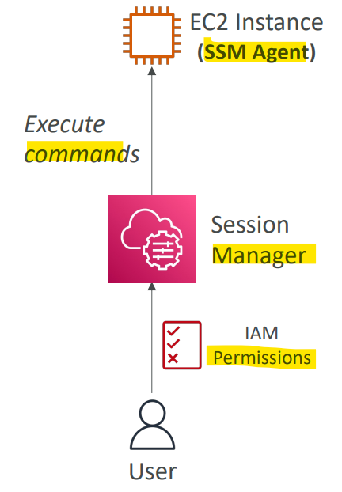

---

### Hands-on

- Create role for ssm to access to ec2

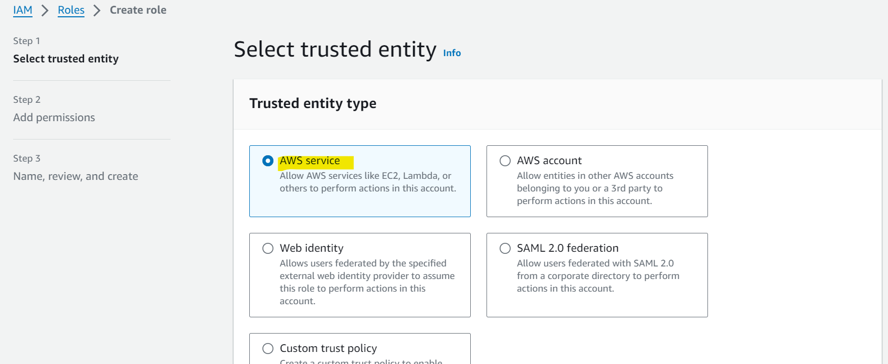

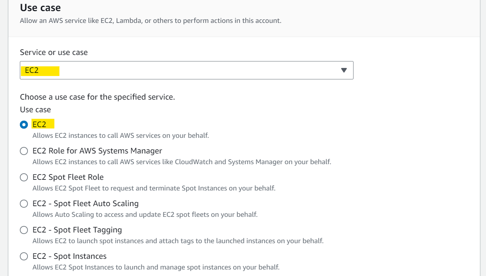

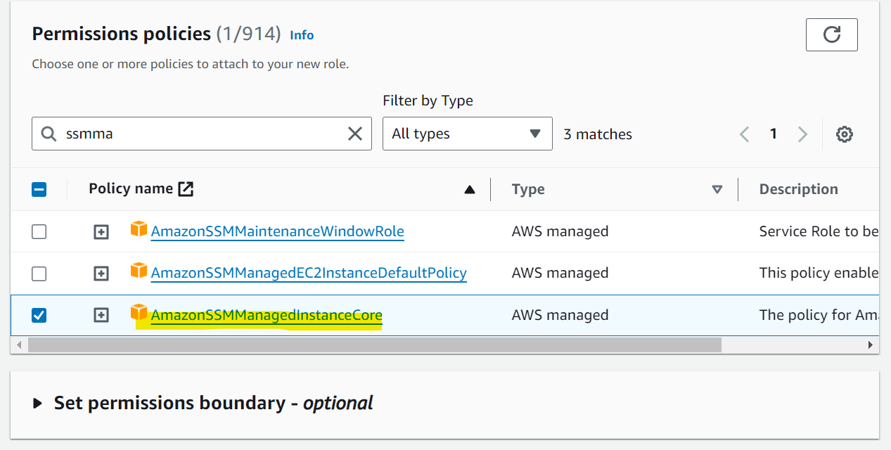

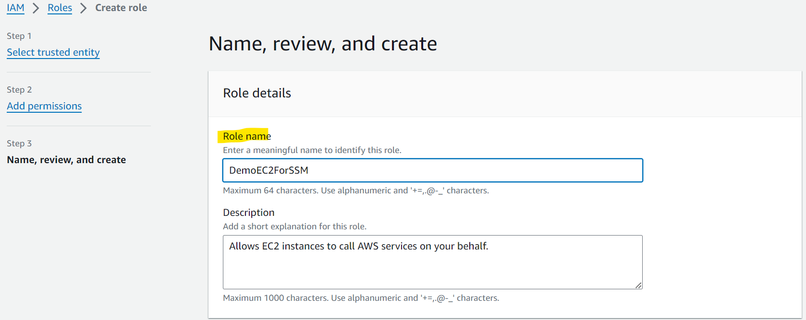

---

- Create an instance with no ssh
  - No key pair
  - disable ssh
  - assign role for ssm

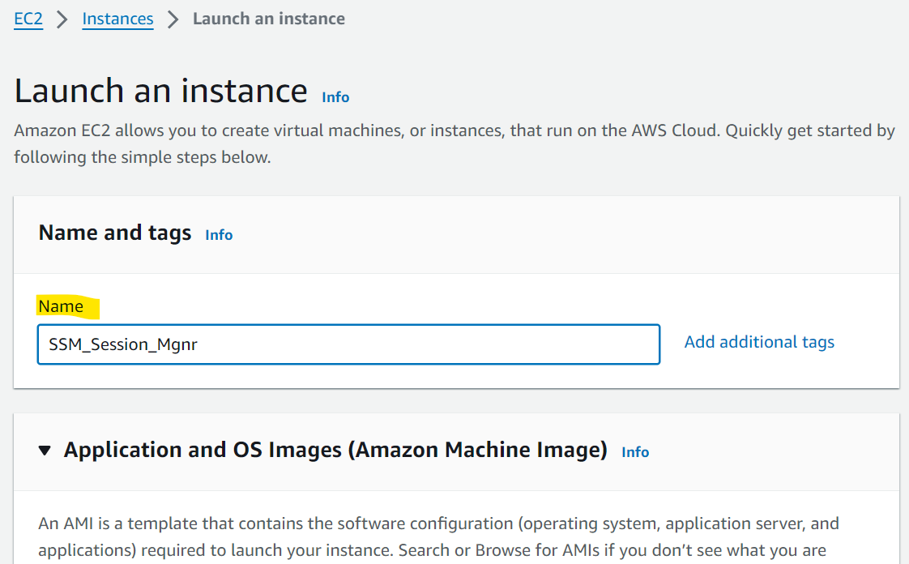

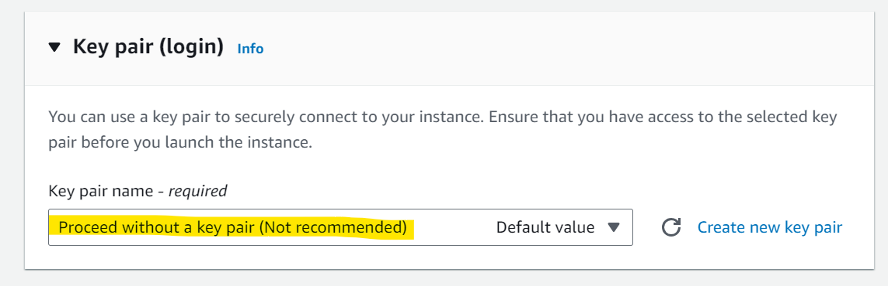

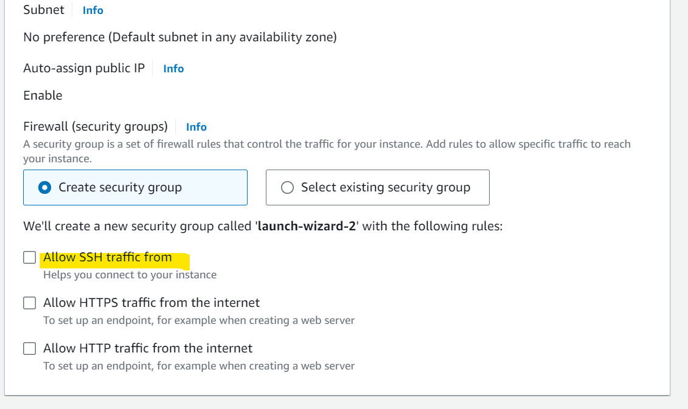

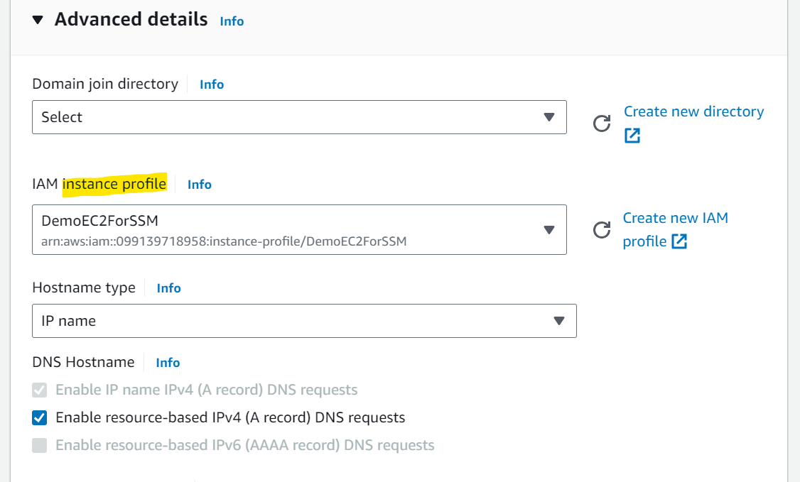

- outcome

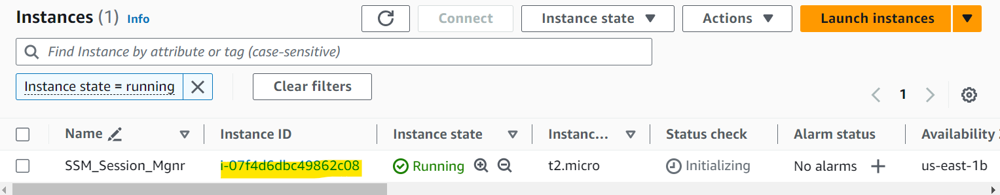

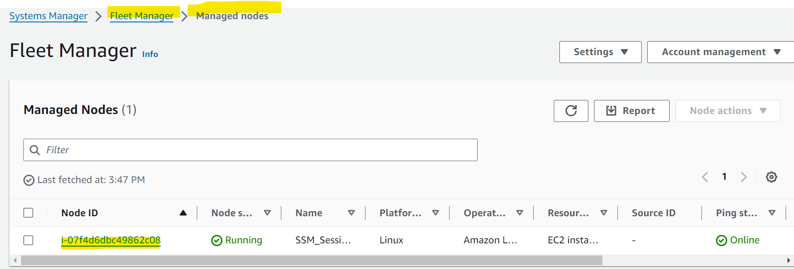

---

- Start session

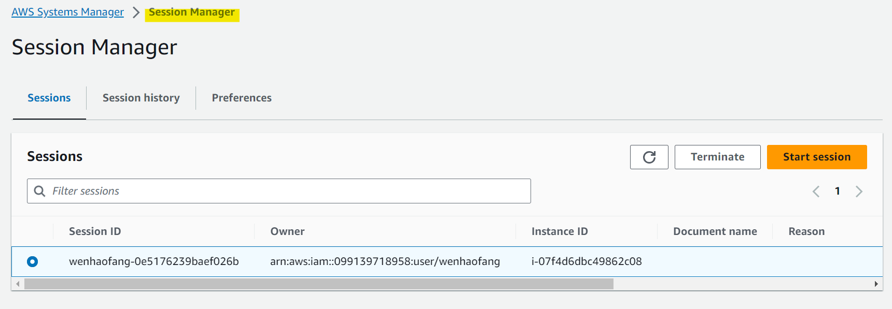

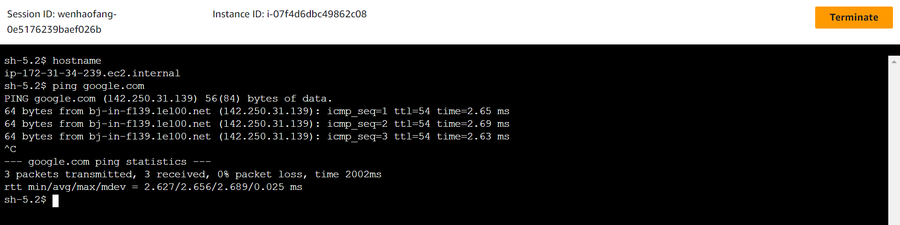

---

## Run Command

- `Run Command`

  - Execute a document (= **script**) or just run a **command**

- **Features**:

  - Run command across **multiple** instances (using **resource groups**)
  - **No** need for `SSH`

- **Integration**
  - Command **Output** can be shown in the `AWS Console`, **sent** to `S3` bucket or `CloudWatch Logs`
  - **Send notifications** to `SNS` about command **status** (In progress, Success, Failed, …)
  - **Integrated** with `IAM` & `CloudTrail`
  - **Can be invoked** using `EventBridge`

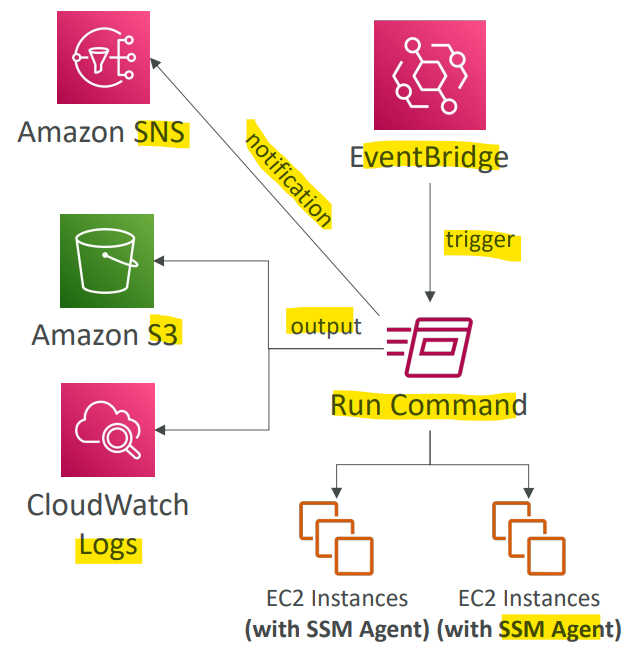

---

## Patch Manager

- `Patch Manager`

  - **Automates the process of patching** managed instances

- Features:
  - **OS** updates, **applications** updates, **security** updates
  - **Supports** `EC2` instances and **on-premises servers**
  - Supports Linux, macOS, and Windows
  - Patch **on-demand** or on a **schedule** using `Maintenance Windows`
  - **Scan** instances and **generate** patch compliance **report** (missing patches)

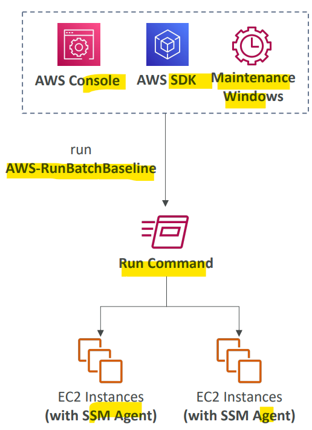

---

## Maintenance Windows

- `Maintenance Windows`

  - Defines a **schedule** for when **to perform actions** on your instances
  - Example: OS patching, updating drivers, installing software, …

- Maintenance Window contains
  - **Schedule**
  - **Duration**
  - Set of registered **instances**
  - Set of registered **tasks**

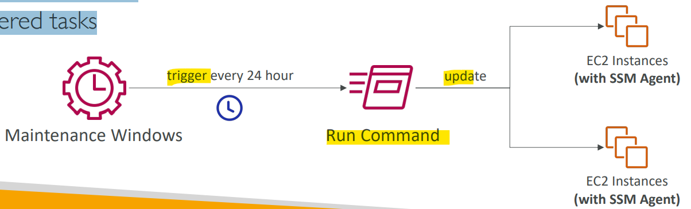

---

### Automation

- `Automation`

  - **Simplifies** common **maintenance and deployment tasks** of EC2 instances and other AWS resources
  - Examples: **restart** instances, **create** an `AMI`, `EBS` **snapshot**

- Automation Runbook

  - **SSM Documents to define actions** preformed on your EC2 instances or AWS resources (pre-defined or custom)

- Can be triggered using:
  - **Manually** using AWS `Console`, AWS `CLI` or `SDK`
  - Amazon `EventBridge`
  - On a **schedule** using `Maintenance Windows`
  - By AWS `Config` for rules **remediations**

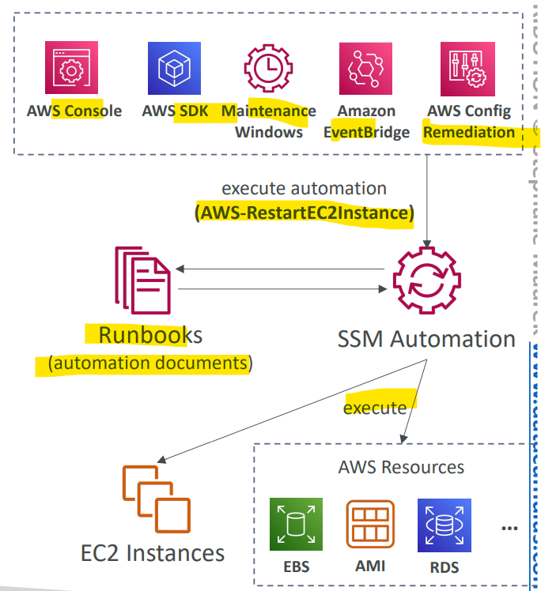

---

[TOP](#aws---systems-managerssm)
