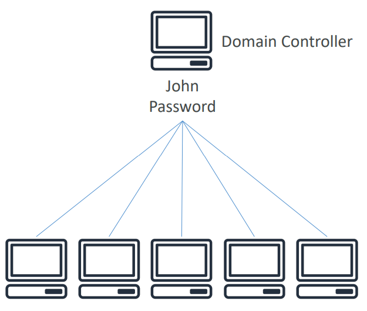
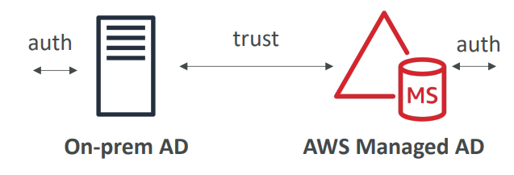
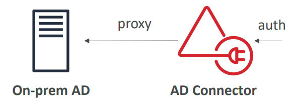
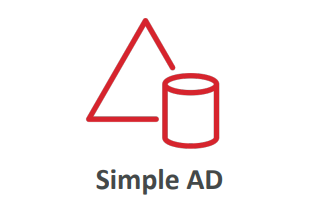
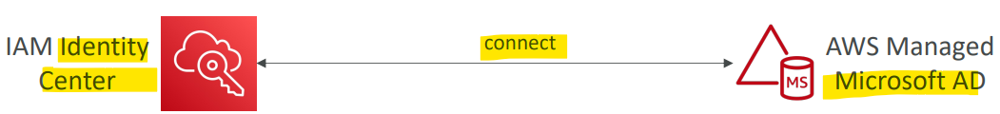
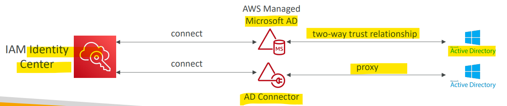
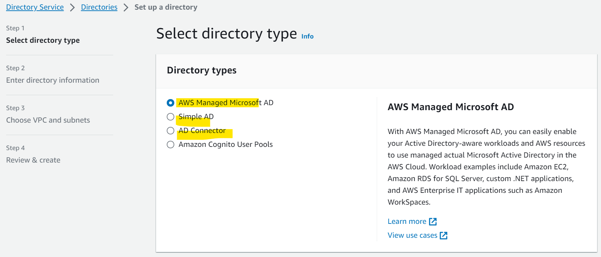
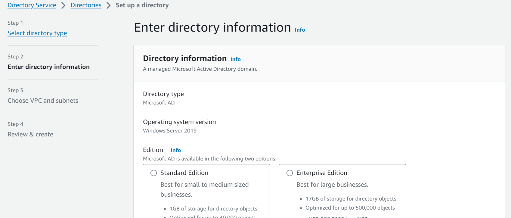

# AWS - Directory Services

[Back](../index.md)

- [AWS - Directory Services](#aws---directory-services)
  - [`Microsoft Active Directory (AD)`](#microsoft-active-directory-ad)
  - [`AWS Directory Services`](#aws-directory-services)
    - [Types of Directory Services](#types-of-directory-services)
    - [Integrate with IAM Identity Center](#integrate-with-iam-identity-center)
    - [Hands-on](#hands-on)

---

## `Microsoft Active Directory (AD)`

- Found on any `Windows Server` with `AD Domain Services`
- **Database of objects**:
  - User Accounts, Computers, Printers, File Shares, Security Groups
- Centralized security management, create account, assign permissions
- Objects are **organized in `trees`**
- A group of `trees` is a `forest`

---

## `AWS Directory Services`

- `AWS Directory Services`

  - allow Windows ec2 instance to join the domain controllers for your network and share all the logins, credentials, and so on.
  - A directory in AWS make it closer to ec2 instances running windows.

---

### Types of Directory Services

- `AWS Managed Microsoft AD`

  - Create your own AD in AWS, manage **users locally**, supports MFA
  - Establish “trust” **connections** with your **on-premises AD**
  - On-premises 或 Directory Services 任何一方认证即可访问另一方资源.

- `AD Connector`

  - `Directory Gateway` (proxy) to **redirect** to on-premises AD supports MFA
  - **Users** are solely **managed on the on-premises AD**
  - connector is just proxy, all users are managed on the on-premises AD.

- `Simple AD`
  - AD-compatible managed directory **on AWS**
  - **Cannot be joined** with **on-premises** AD
  - no on-premises AD

---

### Integrate with IAM Identity Center

- `IAM Identity Center` connect to an `AWS Managed Microsoft AD (Directory Service)`
  - Integration is **out of the box**

- `IAM Identity Center` connect to a **Self-Managed Directory**
  - 2 ways to build integration:
    - Create **Two-way Trust Relationship** using` AWS Managed Microsoft AD`
    - Create an `AD Connector`

---

### Hands-on

---

[TOP](#aws---directory-services)
