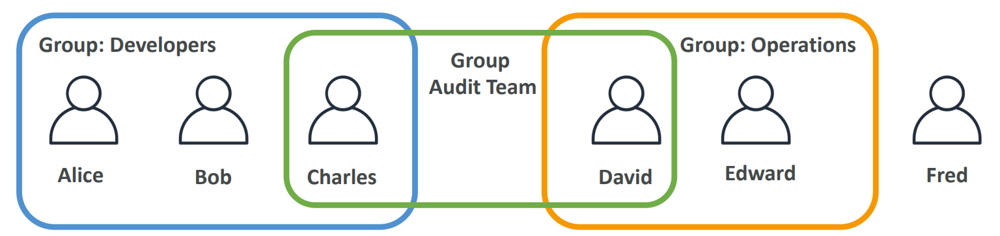

# AWS - Identity and Access Management (AWS IAM)

[Back](../index.md)

- [AWS - Identity and Access Management (AWS IAM)](#aws---identity-and-access-management-aws-iam)
  - [IAM - Concept](#iam---concept)
    - [User \& Group](#user--group)
    - [Permission](#permission)
    - [Role for Service](#role-for-service)
  - [Security](#security)
    - [Password Policy](#password-policy)
      - [`Hands-on`](#hands-on)
    - [MFA](#mfa)
  - [Access of user](#access-of-user)
    - [AWS CLI](#aws-cli)
      - [`Hands-on`](#hands-on-1)
    - [AWS SDK](#aws-sdk)
  - [Security Tools](#security-tools)
    - [Hands-on](#hands-on-2)
  - [Best Practice](#best-practice)
  - [Summary: IAM Section](#summary-iam-section)

---

## IAM - Concept

### User & Group

- `IAM`:
  - `Identity and Access Management`
  - Global service

- `Root account`
  - Account created by default, shouldn’t be used or shared.

- `User`
  - People within an organization, and can be grouped.

- `Groups`
  - a collection of users who have the same level of permissions.
  - contain users only, not other groups

- `Users` don’t have to belong to a `group`, and `user` can belong to multiple `groups`



---

### Permission

- Permission
  - whether an action is allowed or not.

- Policy
  - define the permissions of the users

- `Users` or `Groups` can be assigned JSON documents called `policies`

- Principle of permission in AWS: `the least privilege principle`: 
  - don’t give more permissions than a user needs

```json
{
  "Version": "2012-10-17",
  "Statement": [
    {
      "Effect": "Allow",
      "Action": "ec2:Describe*",
      "Resource": "*"
    },
    {
      "Effect": "Allow",
      "Action": "elasticloadbalancing:Describe*",
      "Resource": "*"
    },
    {
      "Effect": "Allow",
      "Action": [
        "cloudwatch:ListMetrics",
        "cloudwatch:GetMetricStatistics","cloudwatch:Describe*"
        ],
      "Resource": "*"
    }
  ]
}
```

- IAM Policies inheritance
  - David has permissions both in Operation and Audit Team.


- IAM Policies Structure

  - **Version**: policy language version, always include `"2012-10-17"`
  - **Id**: an identifier for the policy (optional) 
  - **Statement**: one or more individual statements (required)

    - **Sid**: an identifier for the statement (optional) 
    - **Effect**: whether the statement allows or denies access (Allow, Deny)
    - **Principal**: account/user/role to which this policy applied to 
    - **Action**: list of actions this policy allows or denies 
    - **Resource**: list of resources to which the actions applied to 
    - **Condition**: conditions for when this policy is in effect (optional)


---

### Role for Service

- `role`
  - the permissions assigned to AWS services to perform anctions on user's behalf.

- Common roles: 
  - EC2 Instance Roles 
  - Lambda Function Roles 
  - Roles for CloudFormation 

---

## Security

### Password Policy

- Strong passwords = higher security for your account
- In AWS, you **can** setup a password policy:
  - Set a minimum password **length**
  - Require specific **character** types:
  - including **uppercase** letters
  - lowercase letters
  - numbers
  - non-alphanumeric characters

- Allow all IAM users to change their own passwords
- Require users to change their password after some time (password expiration)
- Prevent password re-use

---

#### `Hands-on`

- `IAM` Console -> `Account settings` -> `Password policy` -> `Edit`


---

### MFA

- `MFA`
  - `Multi Factor Authentication`

- MFA = password you know + security device you own

- Main **benefit** of MFA:
  - if a password is stolen or hacked, the account is not compromised

- MFA devices options
  - Virtual MFA device, `Google Authenticator`, `Authy`, `Microsoft Authenticator`
  -  U2F(Universal 2nd Factor) Security Key. U盾
  -  Hardware Key Fob MFA Device. 口令牌
  -  Hardware Key Fob MFA Device for `AWS GovCloud` (US)


---

## Access of user

- To access AWS, you have three options:
  - `AWS Management Console` (protected by password + MFA)
  - `AWS Command Line Interface (CLI)`: protected by access keys
  - `AWS Software Developer Kit (SDK)` - for code: protected by access keys

- Access Keys
  - the account secret, just like a password
  - generated through the AWS Console
  - Users manage their own access keys.
  - Don’t share them


- `Access Key ID` ~= username
- `Secret Access Key` ~= password

---

### AWS CLI

- `AWS CLI`: AWS Command Line Interface

  - A tool that enables you to interact with AWS services **using commands in your command-line shell**
  - Alternative to using AWS Management Console


- Direct access to the **public APIs** of AWS services
- You can develop **scripts** to manage your resources
- It’s open-source https://github.com/aws/aws-cli

---

#### `Hands-on`

- Install
  - https://docs.aws.amazon.com/cli/latest/userguide/getting-started-install.html

- Configure
  
  - 1. Create access key:
    -  You can have a maximum of two access keys (active or inactive) at a time.
    - `IAM` > `Users` > select user > `Security credentials` > `Access keys` > `Create access key`
    - download .csv file and do not share.

  - 2. Local configure 

```sh
aws configure
# AWS Access Key ID: input id
# AWS Secret Access Key [None]: input secret
# Default region name [None]: input a region, eg: us-east-1
# Default output format [None]: press enter

# to test if configureation correct, use the following command:
aws iam list-users  # list users in iam
# if success:
# {
#     "Users": [
#         {
#             "Path": "/",
#             "UserName": userName,
#             "UserId": userId,
#             "Arn": arn,
#             "CreateDate": "2023-04-30T20:12:05+00:00",
#             "PasswordLastUsed": "2023-09-10T02:19:21+00:00"
#         }
#     ]
# }
```

---

### AWS SDK

- `AWS SDK`: AWS Software Development Kit
  - Language-specific APIs (set of libraries)
  - Enables you to access and manage AWS services **programmatically**
  - Embedded within your application

- Supports
  - SDKs (JavaScript, Python, PHP, .NET, Ruby, Java, Go, Node.js, C++)
  - Mobile SDKs (Android, iOS, …)
  - IoT Device SDKs (Embedded C, Arduino, …)

- Example: AWS CLI is built on AWS SDK for Python

---

## Security Tools


- IAM Credentials Report (account-level)
  - a report that lists **all your account's users** and the **status** of their various credentials

- IAM Access Advisor (user-level)
  - Access advisor shows the **service permissions** granted to a user and when those services were last accessed.
  - You can use this information **to revise your policies**.

---

### Hands-on

- `IAM` > `Credential Report` > download


- `IAM` > `Usesr` > select user > `Access Advisor` tab


---

## Best Practice

- IAM Guidelines & Best Practices
  - Don’t use the root account except for AWS account setup
  - One physical user = One AWS user
  - Assign users to groups and assign permissions to groups
  - Create a strong password policy
  - Use and enforce the use of Multi Factor Authentication (MFA)
  - Create and use Roles for giving permissions to AWS services
  - Use Access Keys for Programmatic Access (CLI / SDK)
  - Audit permissions of your account using IAM Credentials Report & IAM Access Advisor
  - Never share IAM users & Access Keys

---

## Summary: IAM Section

- **Term**
  - `Users`: 
    - mapped to a physical user, has a password for AWS Console
  - `Groups`: 
    - contains users only
  - `Policies`: 
    - JSON document that outlines permissions for users or groups
  - `Roles`: 
    - for EC2 instances or AWS services

- **Security**: 
  - `MFA` + Password Policy

- **Access of User**
  - `AWS CLI`: manage your AWS services using the command-line
  - `AWS SDK`: manage your AWS services using a programming language

- `Access Keys`: 
  - access AWS using the CLI or SDK
  
- **Audit**: 
  - `IAM Credential Reports`
  - `IAM Access Advisor`

---

[TOP](#aws---identity-and-access-management-aws-iam)
