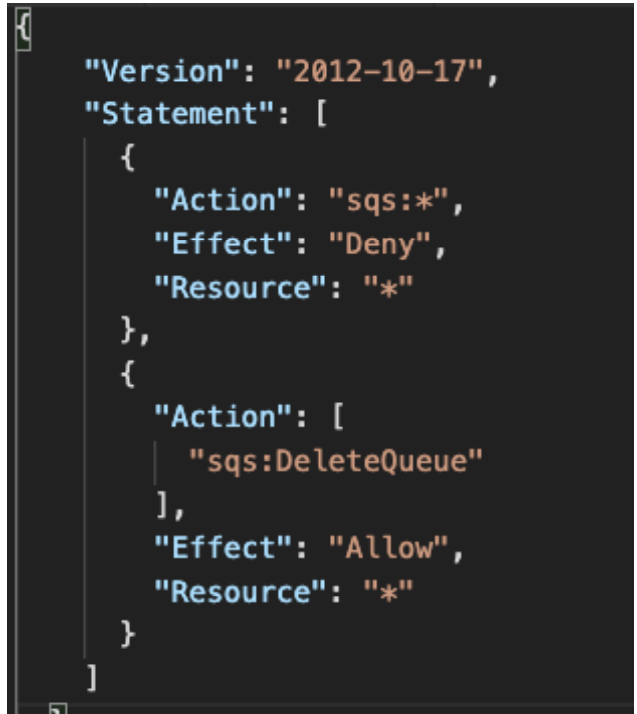
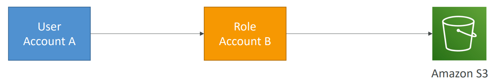

# AWS - `Identity and Access Management (AWS IAM)`

[Back](../index.md)

- [AWS - `Identity and Access Management (AWS IAM)`](#aws---identity-and-access-management-aws-iam)
  - [IAM](#iam)
  - [`User` \& `Group`](#user--group)
  - [Security](#security)
    - [Password Policy](#password-policy)
      - [Hands-on](#hands-on)
    - [MFA](#mfa)
    - [Security Tools](#security-tools)
      - [Hands-on](#hands-on-1)
  - [Access of user](#access-of-user)
    - [`AWS CLI`](#aws-cli)
      - [Hands-on](#hands-on-2)
    - [`AWS SDK`](#aws-sdk)
  - [`IAM Policy`](#iam-policy)
    - [IAM Policy Evaluation Logic](#iam-policy-evaluation-logic)
    - [Policies inheritance](#policies-inheritance)
    - [Policies Structure](#policies-structure)
    - [Policy Conditions](#policy-conditions)
      - [Common Policy Conditions](#common-policy-conditions)
    - [Example: IAM policy for S3](#example-iam-policy-for-s3)
  - [`Role`](#role)
  - [IAM Roles vs Resource Based Policies](#iam-roles-vs-resource-based-policies)
    - [Example: Amazon EventBridge (记住服务)](#example-amazon-eventbridge-记住服务)
  - [`IAM Permission Boundaries`](#iam-permission-boundaries)
    - [Use Case](#use-case)
    - [Hands-on](#hands-on-3)
  - [Best Practice](#best-practice)
  - [Summary: IAM Section](#summary-iam-section)

---

## IAM

## `User` & `Group`

- `IAM`:

  - `Identity and Access Management`
  - Global service

- `Root account`

  - Account created by default, shouldn’t be used or shared.

- `User`

  - People within an organization, and can be grouped.

- `Groups`

  - a collection of users who have the same level of permissions.
  - contain users only, not other groups

- `Users` don’t have to belong to a `group`, and `user` can belong to multiple `groups`


---

## Security

### Password Policy

- Strong passwords = higher security for your account
- In AWS, you **can** setup a password policy:

  - Set a minimum password **length**
  - Require specific **character** types:
  - including **uppercase** letters
  - lowercase letters
  - numbers
  - non-alphanumeric characters

- Allow all IAM users to change their own passwords
- Require users to change their password after some time (password expiration)
- Prevent password re-use

---

#### Hands-on

- `IAM` Console -> `Account settings` -> `Password policy` -> `Edit`


---

### MFA

- `MFA`

  - `Multi Factor Authentication`

- MFA = password you know + security device you own

- Main **benefit** of MFA:

  - if a password is stolen or hacked, the account is not compromised

- MFA devices options
  - Virtual MFA device, `Google Authenticator`, `Authy`, `Microsoft Authenticator`
  - U2F(Universal 2nd Factor) Security Key. U 盾
  - Hardware Key Fob MFA Device. 口令牌
  - Hardware Key Fob MFA Device for `AWS GovCloud` (US)


---

### Security Tools

- `IAM Credentials Report` (account-level)

  - a report that lists **all your account's users** and the **status** of their various credentials

- `IAM Access Advisor` (user-level)
  - Access advisor shows the **service permissions** granted to a user and when those services were last accessed.
  - You can use this information **to revise your policies**.

---

#### Hands-on

- `IAM` > `Credential Report` > download


- `IAM` > `Usesr` > select user > `Access Advisor` tab


---

## Access of user

- To access AWS, you have three options:

  - `AWS Management Console` (protected by password + MFA)
  - `AWS Command Line Interface (CLI)`: protected by access keys
  - `AWS Software Developer Kit (SDK)` - for code: protected by access keys

- Access Keys

  - the account secret, just like a password
  - generated through the AWS Console
  - Users manage their own access keys.
  - Don’t share them

- `Access Key ID` ~= username
- `Secret Access Key` ~= password

---

### `AWS CLI`

- `AWS CLI`: AWS Command Line Interface

  - A tool that enables you to interact with AWS services **using commands in your command-line shell**
  - Alternative to using AWS Management Console

- Direct access to the **public APIs** of AWS services
- You can develop **scripts** to manage your resources
- It’s open-source https://github.com/aws/aws-cli

---

#### Hands-on

- Install

  - https://docs.aws.amazon.com/cli/latest/userguide/getting-started-install.html

- Configure

  - 1. Create access key:

    - You can have a maximum of two access keys (active or inactive) at a time.
    - `IAM` > `Users` > select user > `Security credentials` > `Access keys` > `Create access key`
    - download .csv file and do not share.

  - 2. Local configure

```sh
aws configure
# AWS Access Key ID: input id
# AWS Secret Access Key [None]: input secret
# Default region name [None]: input a region, eg: us-east-1
# Default output format [None]: press enter

# to test if configureation correct, use the following command:
aws iam list-users  # list users in iam
# if success:
# {
#     "Users": [
#         {
#             "Path": "/",
#             "UserName": userName,
#             "UserId": userId,
#             "Arn": arn,
#             "CreateDate": "2023-04-30T20:12:05+00:00",
#             "PasswordLastUsed": "2023-09-10T02:19:21+00:00"
#         }
#     ]
# }
```

---

### `AWS SDK`

- `AWS SDK`: AWS Software Development Kit

  - Language-specific APIs (set of libraries)
  - Enables you to access and manage AWS services **programmatically**
  - Embedded within your application

- Supports

  - SDKs (JavaScript, Python, PHP, .NET, Ruby, Java, Go, Node.js, C++)
  - Mobile SDKs (Android, iOS, …)
  - IoT Device SDKs (Embedded C, Arduino, …)

- Example: AWS CLI is built on AWS SDK for Python

---

## `IAM Policy`

- `Permission`

  - whether an action is allowed or not.

- `Policy`

  - define the permissions of the users

- `Users` or `Groups` can be assigned JSON documents called `policies`

- Principle of permission in AWS: `the least privilege principle`:
  - don’t give more permissions than a user needs

```json
{
  "Version": "2012-10-17",
  "Statement": [
    {
      "Effect": "Allow",
      "Action": "ec2:Describe*",
      "Resource": "*"
    },
    {
      "Effect": "Allow",
      "Action": "elasticloadbalancing:Describe*",
      "Resource": "*"
    },
    {
      "Effect": "Allow",
      "Action": [
        "cloudwatch:ListMetrics",
        "cloudwatch:GetMetricStatistics",
        "cloudwatch:Describe*"
      ],
      "Resource": "*"
    }
  ]
}
```

---

### IAM Policy Evaluation Logic


- When a specific IAM action is made, the following are evaluated:
  - explicit deny
  - Organ SCP(principal account)
  - resource-based policy(requested resource)
  - identity-based policy(principal)
  - permission boundary(principal)
  - session(principal>policy>role)

---

- Example: Policy



- Can you perform sqs:CreateQueue?
  - No, explicit deny. `sqs:*`, `Deny`, `#`
- Can you perform sqs:DeleteQueue?
  - No, explicit deny > explicit allow
- Can you perform ec2:DescribeInstances?
  - No, in this policy, no explicit allow or deny. But by default, deny everything.

---

### Policies inheritance

- David has permissions both in Operation and Audit Team.
  

---

### Policies Structure

- **Version**: policy language version, always include `"2012-10-17"`
- **Id**: an identifier for the policy (optional)
- **Statement**: one or more individual statements (required)

  - **Sid**: an identifier for the statement (optional)
  - **Effect**: whether the statement allows or denies access (Allow, Deny)
  - **Principal**: account/user/role to which this policy applied to
  - **Action**: list of actions this policy allows or denies
  - **Resource**: list of resources to which the actions applied to
  - **Condition**: conditions for when this policy is in effect (optional)


---

### Policy Conditions

- `IAM Conditions`
  - specify conditions for when a policy is in effect.
  - Can apply to policy for users, resource, endpoint, and so on.

---

#### Common Policy Conditions

- `aws:SourceIp`
  - **restrict the client IP** from which the API **calls** are being made


> Deny any action unless client calls are made from the a range IP.
>
> - Only API calls are made within these IP addresses.
> - Use case:
>   - limit access to AWS environment only from user's company network.

---

- `aws:RequestedRegion`
  - **restrict the region** the **API calls** are made to


> - Deny access if API calls are made from these regions.
>
> - Use case:
>   - Global company want to restrict access to aws resources from some regions.

- Sample:
  - Which of the following IAM condition key you can use only to allow API calls to a specified AWS region?
    - `RequestedRegion`, **not** `RequiredRegion`

---

- `ec2:ResourceTag`
  - restrict **based on tags**


> - Only the PrincipalTag(user tag) ,Department, which is Data and ResourceTag, Project, which is DataAnalytics, can perform start and stop instances.
>   - Restrict based on both resource and user tags

---

- aws:MultiFactorAuthPresent
  - to force MFA


> - Allow all action on all ec2 instances.
> - Deny stop and terminate actions if has not MFA.

---

- `aws:PrincipalOrgID`
  - can be used in any resource policies to **restrict access to accounts** that are **member** of an AWS **Organization**. (与 Organ 连结)


> - S3 object operation are limited to the member within an organization.

---

### Example: IAM policy for S3

- `s3:ListBucket` permission applies to `arn:aws:s3:::test`

  - enable to list buckets
  - `ListBucket` is a `bucket level permission`.
    - In the arn, it only need to specify the bucket name(test).

- `s3:GetObject`, `s3:PutObject`, `s3:DeleteObject` applies to `arn:awn:s3:::test/*`
  - enable to get,put,and delete objects.
  - They are `object level permission`
    - Arn need to specify `bucket_name/*`


- Sample:
  - You are managing the AWS account for your company, and you want to give one of the developers access to read files from an S3 bucket. You have updated the bucket policy to this, but he still can't access the files in the bucket. What is the problem?

```json
{
  "Version": "2012-10-17",
  "Statement": [
    {
      "Sid": "AllowsRead",
      "Effect": "Allow",
      "Principal": {
        "AWS": "arn:aws:iam::123456789012:user/Dave"
      },
      "Action": "s3:GetObject",
      "Resource": "arn:aws:s3:::static-files-bucket-xxx"
    }
  ]
}
```

- Should change to `-xxx/#`, because this is an object-level permission.

---

## `Role`

- `role`

  - the **permissions** assigned to AWS services **to perform anctions on user's behalf**.

- Common roles:
  - EC2 Instance Roles
  - Lambda Function Roles
  - Roles for CloudFormation

---

## IAM Roles vs Resource Based Policies

- Cross account:

  - ie. want to make an API calls on S3 bucket cross account

- **2 Options**:
  - OR using a **role** as a proxy



- attaching a **resource-based policy** to a resource (example: S3 bucket policy)


- Difference

  - When you **assume a `role`** (user, application or service), you **give up** your **original permissions** and take the permissions **assigned to the role**
  - When using a `resource-based policy`, the principal **doesn’t have to give up** his permissions

- **Example**:

  - User in account A needs to scan a DynamoDB table in Account A and dump it in an S3 bucket in Account B.
    - Using `resource-based policy`, as not to give up any permission.

- `Reousrce-based policy` is supported by:
  - Amazon `S3` buckets, `SNS` topics, `SQS` queues, etc…**记住**

---

### Example: Amazon EventBridge (记住服务)

- When a rule runs, it needs **permissions on the target**

- Services supporting `Resource-based policy`:

  - `Lambda`, `SNS`, `SQS`, `CloudWatch` Logs, `API Gateway`…


- Services supporting `IAM role`:
  - `Kinesis` stream, `Systems Manager Run Command`, `ECS` task…


- Sample:
  - When **configuring permissions** for EventBridge to configure a **Lambda** function as a target you should use ………………….. but when you want to configure a **Kinesis** Data Streams as a target you should use …………………..
    - Resource-Based Policy, Identity-based policy.

---

## `IAM Permission Boundaries`

- `IAM Permission Boundaries` are supported for `users` and `roles` (**not `groups`**)
- Advanced feature to use a managed policy **to set the maximum permissions** an IAM entity can get.


> - Permission Boundary defines permission on s3, cloudwatch, and ec2. But attach a policy defining permission on iam.
> - Because the attached policy is outside the permission boudary, there is no permission.
> - Permission boudary 只是定义范围,不定义具体权限. 只有附加的 policy 才是实质赋权.

- 注意:
  - 即使 user 被授权是 fullaccess 或 Admin, 如果设置了 boundary, 则其权限只限于 boundaries 内容

---

### Use Case

- Can be used in combinations of AWS `Organizations SCP`


> 只有三方重合的权限才有效

- Use cases
  - Delegate responsibilities to **non administrators** within their `permission boundaries`,
    - e.g.: create new IAM users
  - Allow developers to self-assign policies and anage their own permissions, while making sure they **can’t “escalate” their privileges** (= make themselves admin)
  - Useful to restrict **one specific user**特定用户
    - instead of a whole account using `Organizations` & `SCP`

---

### Hands-on


---

## Best Practice

- IAM Guidelines & Best Practices
  - Don’t use the root account except for AWS account setup
  - One physical user = One AWS user
  - Assign users to groups and assign permissions to groups
  - Create a strong password policy
  - Use and enforce the use of Multi Factor Authentication (MFA)
  - Create and use Roles for giving permissions to AWS services
  - Use Access Keys for Programmatic Access (CLI / SDK)
  - Audit permissions of your account using IAM Credentials Report & IAM Access Advisor
  - Never share IAM users & Access Keys

---

## Summary: IAM Section

- **Term**

  - `Users`:
    - mapped to a physical user, has a password for AWS Console
  - `Groups`:
    - contains users only
  - `Policies`:
    - JSON document that outlines permissions for users or groups
  - `Roles`:
    - for EC2 instances or AWS services

- **Security**:

  - `MFA` + Password Policy

- **Access of User**

  - `AWS CLI`: manage your AWS services using the command-line
  - `AWS SDK`: manage your AWS services using a programming language

- `Access Keys`:
  - access AWS using the CLI or SDK
- **Audit**:
  - `IAM Credential Reports`: users + credential status
  - `IAM Access Advisor`: permission of a user + last access

---

[TOP](#aws---identity-and-access-management-aws-iam)
