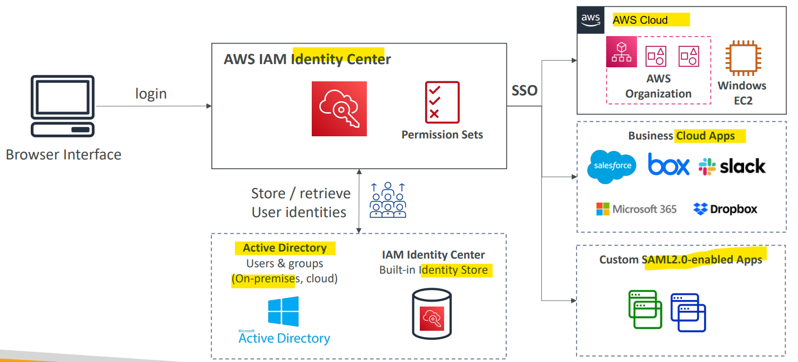
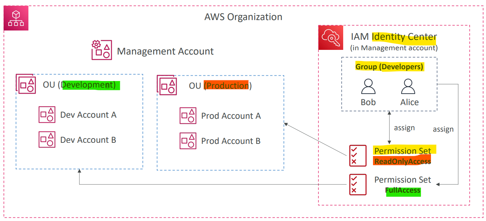
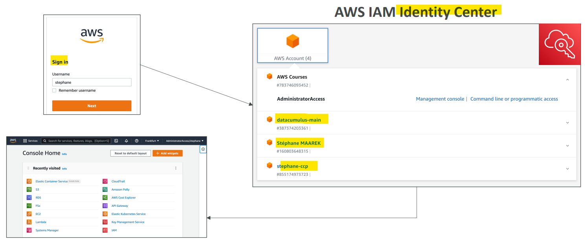
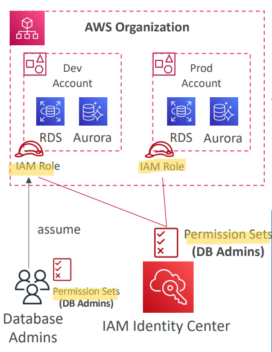

# AWS - IAM Identity Center

[Back](../index.md)

- [AWS - IAM Identity Center](#aws---iam-identity-center)
  - [`IAM Identity Center`](#iam-identity-center)
    - [Login Flow](#login-flow)
    - [Fine-grained Permissions and Assignments](#fine-grained-permissions-and-assignments)

---

## `IAM Identity Center`

- `IAM Identity Center`

  - (successor to `AWS Single Sign-On`)
  - One login (single sign-on) for all your
    - AWS **accounts** in AWS Organizations(常考 one login into multiple AWS accounts)
    - Business **cloud applications** (e.g., Salesforce, Box, Microsoft 365, …)
    - `SAML2.0`-enabled **applications**
    - EC2 **Windows Instances**

- Identity **providers**
  - Built-in **identity store** in `IAM Identity Center`
  - 3rd party:
    - `Active Directory (AD)`, `OneLogin`, `Okta`…

- Identity Center working with permission, users, and groups.

---

### Login Flow

---

### Fine-grained Permissions and Assignments

- 不同方法应对不同场景来实现权限的精确控制.

- `Permission Sets`(Organ)

  - a collection of one or more `IAM Policies` assigned to **users and groups** to define AWS **access**
  - used to manage **Multi-Account Permissions**
    - Manage **access across AWS accounts** in your `AWS Organization`

- `Application Assignments`(SAML application)

  - SSO access to many `SAML 2.0` business **applications** (Salesforce, Box, Microsoft 365, …)
  - Provide required **URLs**, **certificates**, and **metadata**

- `Attribute-Based Access Control (ABAC)`(built-in)
  - Fine-grained permissions based on **users’ attributes** stored in `IAM Identity Center Identity Store`
    - Example: cost center, title, locale, …
  - **Use case**:
    - **Define** permissions **once**, then **modify** AWS access by **changing the attributes**

---

[TOP](#aws---iam-identity-center)
