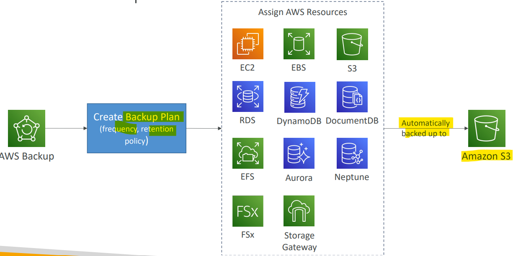
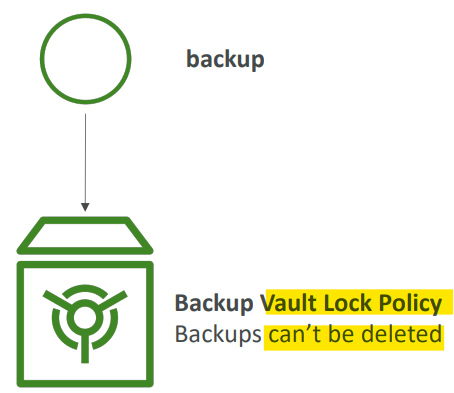
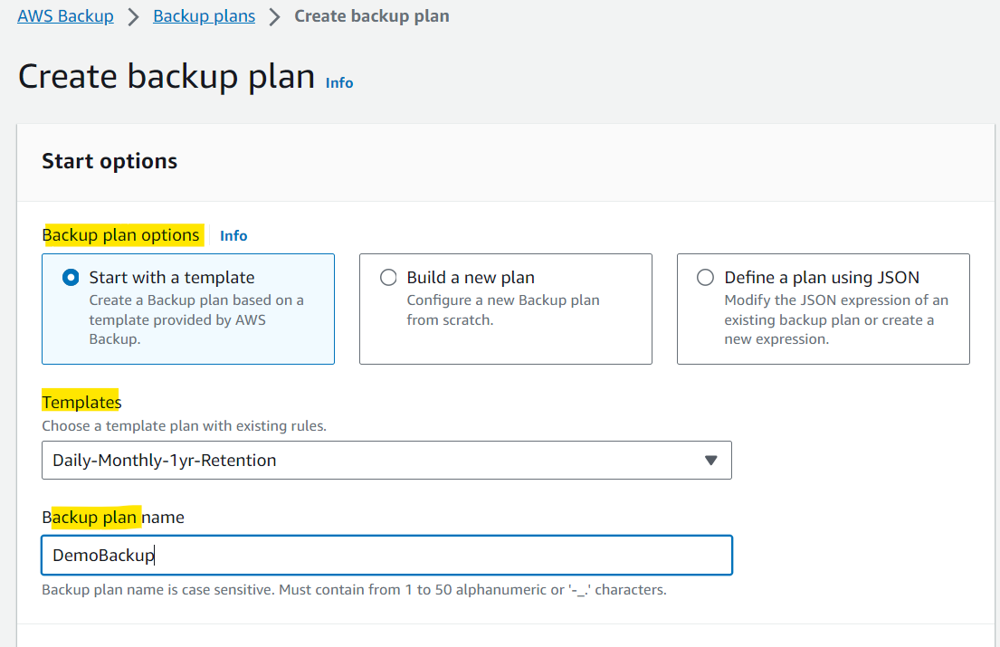
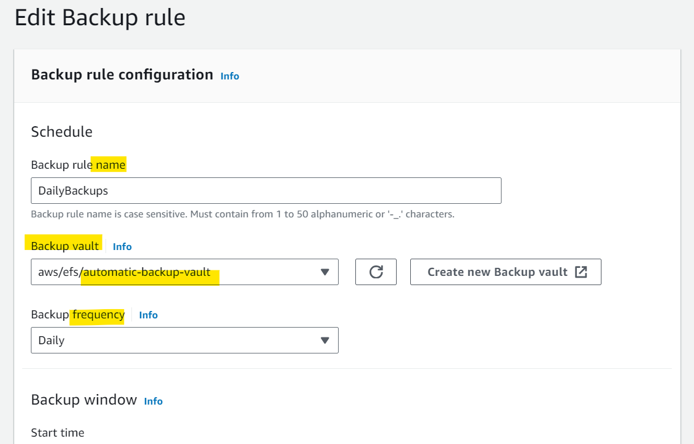
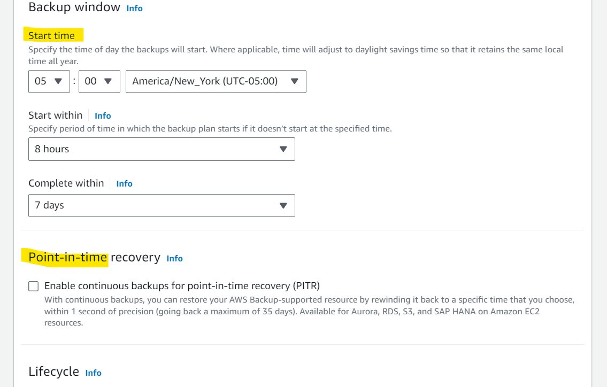
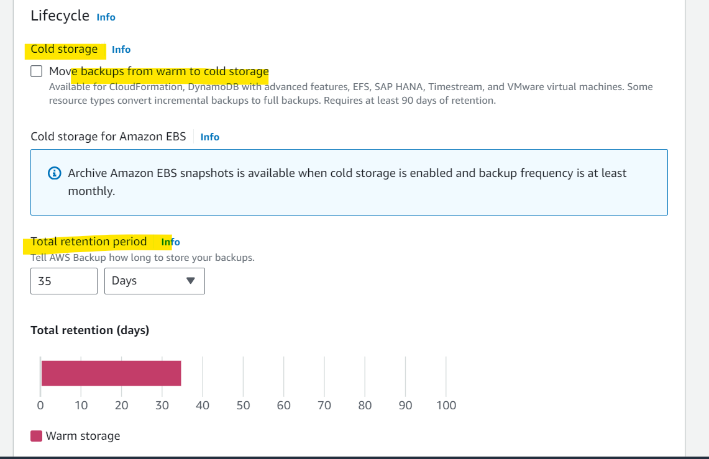
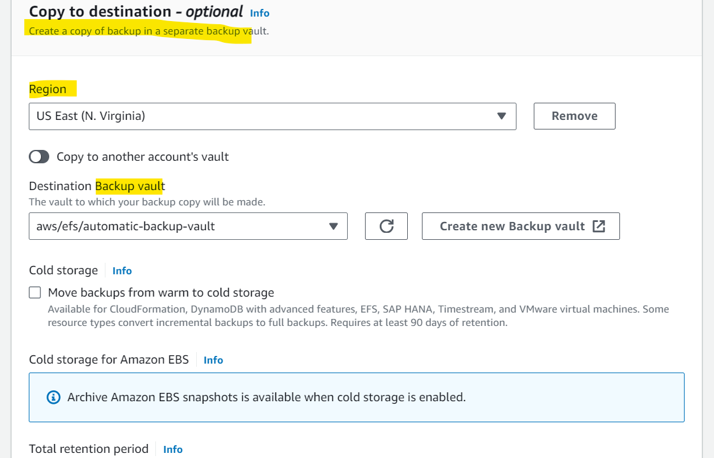

# AWS Migration - AWS Backup

[Back](../../index.md)

- [AWS Migration - AWS Backup](#aws-migration---aws-backup)
  - [AWS Backup](#aws-backup)
    - [Vault Lock](#vault-lock)
    - [Hands-on](#hands-on)

---

## AWS Backup

- `AWS Backup`

  - **Centrally** manage and **automate backups** across AWS services

- Feature:

  - Fully managed service
  - **No** need to create **custom scripts and manual processes**
  - Supports cross-**region** backups
  - Supports cross-**account** backups
  - Supports `PITR(point-in-time recoery)` for supported services
  - **On-Demand** and **Scheduled** backups
  - **Tag-based** backup **policies**

- Supported services:

  - Amazon `EC2` / Amazon `EBS`
  - Amazon `S3`
  - Amazon `RDS` (all DBs engines) / Amazon `Aurora` / Amazon `DynamoDB`
  - Amazon `DocumentDB` / Amazon `Neptune`
  - Amazon `EFS` / Amazon `FSx` (Lustre & Windows File Server)
  - AWS `Storage Gateway (Volume Gateway)`

- You create **backup policies** known as `Backup Plans`
  - Backup **frequency** (every 12 hours, daily, weekly, monthly, cron expression)
  - Backup **window**
  - **Transition** to **Cold Storage** (Never, Days, Weeks, Months, Years)
  - **Retention Period** (Always, Days, Weeks, Months, Years)

- Sample:

  - You are running many resources in AWS such as EC2 instances, EBS volumes, DynamoDB tables... You want an **easy way to manage backups across all** these AWS services from a single place. Which AWS offering makes this process easy?

    - Backup
    - AWS Backup enables you to **centralize** and **automate** data protection across AWS services. It helps you support your **regulatory compliance** or **business policies** for data protection.

  - Which AWS service can you use to **automate the backup across different AWS services** such as RDS, DynamoDB, Aurora, and EFS file systems, and EBS volumes?
    - Backup

---

### Vault Lock

- Enforce a `WORM (Write Once Read Many)` state for all the backups that you store in your AWS Backup Vault

- Additional layer of defense to protect your backups against:

  - **Inadvertent** or **malicious** delete operations
  - Updates that shorten or **alter retention periods**

- Even the **root user cannot delete** backups when enabled

---

### Hands-on

- Create backup plan

- Assign resources
  - can assign by tag name or resource ID
  - skiped

---

[TOP](#aws-migration---aws-backup)
