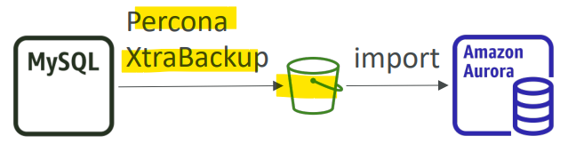

# AWS Migration - Database Migration Service

[Back](../../index.md)

- [AWS Migration - Database Migration Service](#aws-migration---database-migration-service)
  - [`Database Migration Service`](#database-migration-service)
    - [Sources and Targets](#sources-and-targets)
    - [`Schema Conversion Tool (SCT)`](#schema-conversion-tool-sct)
    - [Continuous Replication](#continuous-replication)
    - [Multi-AZ Deployment](#multi-az-deployment)
    - [Hands-on](#hands-on)
  - [Use Case: `RDS` \& `Aurora` MySQL Migration](#use-case-rds--aurora-mysql-migration)
    - [`RDS` MySQL to `Aurora` MySQL](#rds-mysql-to-aurora-mysql)
    - [External MySQL to `Aurora` MySQL](#external-mysql-to-aurora-mysql)
    - [DMS: Up and running](#dms-up-and-running)
  - [Use Case: `RDS` \& `Aurora` PostgreSQL Migrations](#use-case-rds--aurora-postgresql-migrations)
    - [`RDS` PostgreSQL to `Aurora` PostgreSQL](#rds-postgresql-to-aurora-postgresql)
    - [External PostgreSQL to Aurora PostgreSQL](#external-postgresql-to-aurora-postgresql)
    - [DMS: up and running](#dms-up-and-running-1)

---

## `Database Migration Service`

- `Database Migration Service`

  - Used to quickly and securely **migrate databases** to AWS, resilient, self healing

- Feature:

  - The **source database remains available** during the migration
  - **Continuous Data Replication** using `CDC(change data capture)`
  - You **must create an EC2 instance** to perform the replication tasks

- **Supports**:
  - **Homogeneous** migrations:
    - ex Oracle to Oracle
  - **Heterogeneous** migrations:
    - ex Microsoft SQL Server to Aurora

---

### Sources and Targets

- **SOURCES**:

  - **On-Premises** and **EC2 instances** databases:
    - Oracle, MS SQL Server, MySQL, MariaDB, PostgreSQL, MongoDB, SAP, DB2
  - **Azure**:
    - Azure SQL Database
  - Amazon **RDS**:
    - all including Aurora
  - **Amazon S3**
  - **DocumentDB**

- **TARGETS**:
  - **On-Premises** and EC2 **instances databases**:
    - Oracle, MS SQL Server, MySQL, MariaDB, PostgreSQL, SAP
  - Amazon **RDS**
  - **Redshift**, **DynamoDB**, **S3**
  - **OpenSearch** Service
  - **Kinesis** Data Streams
  - Apache **Kafka**
  - **DocumentDB** & Amazon **Neptune**
  - **Redis** & **Babelfish**

---

### `Schema Conversion Tool (SCT)`

- `Schema Conversion Tool (SCT)`

  - **Convert** your Database’s **Schema** from one engine to another when DB engines are different.
  - Example `OLTP`: (SQL Server or Oracle) to MySQL, PostgreSQL, Aurora
  - Example `OLAP`: (Teradata or Oracle) to Amazon Redshift

- Prefer **compute-intensive** instances to optimize data conversions

- You do **not need** to use SCT if you are migrating the **same DB engine**

  - Ex: On-Premise PostgreSQL => `RDS` PostgreSQL
  - The DB engine is still PostgreSQL (RDS is the platform)

- Sample:
  - You have an on-premises **Oracle** database that you want to migrate to AWS, specifically to Amazon **Aurora**. How would you do the migration?
    - AWS `SCT` to convert db schema, AWS `DMS` to migrate the data.

---

### Continuous Replication

- first, SCT
- then migration

---

### Multi-AZ Deployment

- When **Multi-AZ Enabled**, DMS provisions and maintains a **synchronously** stand **replica** in a **different AZ**

- Advantages:
  - Provides Data **Redundancy**
  - Eliminates **I/O freezes**
  - Minimizes **latency spikes**

---

### Hands-on

- Create Replication Instance

- Create endpoins

- Create migration task

---

## Use Case: `RDS` & `Aurora` MySQL Migration

### `RDS` MySQL to `Aurora` MySQL

- 1. DB **Snapshots** from `RDS` MySQL **restored** as MySQL `Aurora` DB
  - **downtime**

- 2. Create an `Aurora Read Replica` from your `RDS` MySQL, and **when the replication lag is 0**, promote it as its own DB cluster

  - continuous, can **take time** and **cost $**

- Sample:
  - A company is using RDS for MySQL as their main database but, lately they have been facing issues in managing the database, performance issues, and the scalability. And they have decided to use Aurora for MySQL instead for better performance, less complexity and less administrative tasks required. What is the best way and most **cost-effective** way to **migrate from RDS for MySQL to Aurora** for MySQL?
    - create a snapshot from RDS and restore to Aurora

---

### External MySQL to `Aurora` MySQL

- Option 1:

  - Use `Percona XtraBackup` to create a **file backup** in Amazon `S3`
  - Create an `Aurora` MySQL DB from Amazon `S3`

- Option 2:

  - Create an `Aurora` MySQL DB
  - Use the **mysql dump utility** to migrate MySQL into `Aurora`
    - slower than S3 method

---

### DMS: Up and running

- Use `DMS` if both databases are **up and running**
  - do continious replication between 2 db.

---

## Use Case: `RDS` & `Aurora` PostgreSQL Migrations

### `RDS` PostgreSQL to `Aurora` PostgreSQL

- **Option 1**: DB **Snapshots** from `RDS` PostgreSQL **restored** as PostgreSQL `Aurora` DB

  - Downtime

- **Option 2**: Create an `Aurora Read Replica` from your RDS PostgreSQL, and when the **replication lag** is 0, **promote** it as its own DB cluster

  - can **take time** and **cost** $

---

### External PostgreSQL to Aurora PostgreSQL

- Create a **backup** and put it in Amazon `S3`
- **Import** it using the `aws_s3 Aurora extension`

---

### DMS: up and running

- Use DMS if both databases are up and running
  - do continious replication between 2 db.

---

[TOP](#aws-migration---database-migration-service)
