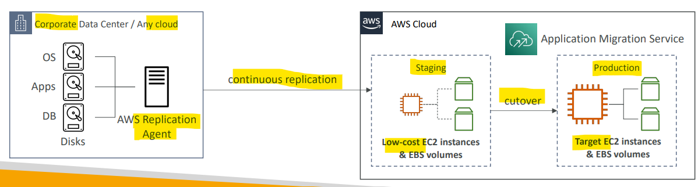

# AWS Migration - AWS Application Migration Service (MGN)

[Back](../../index.md)

- [AWS Migration - AWS Application Migration Service (MGN)](#aws-migration---aws-application-migration-service-mgn)
  - [AWS Application Migration Service (MGN)](#aws-application-migration-service-mgn)

---

## AWS Application Migration Service (MGN)

- The “AWS evolution” of `CloudEndure Migration`, replacing `AWS Server Migration Service (SMS)`

- `Application Migration Service (MGN)`

  - a lift-and-shift (**rehost**) solution which **simplify migrating applications** to AWS
  - **Converts** your physical, virtual, and cloud-based servers **to run natively on AWS**

- Supports wide range of platforms, Operating Systems, and databases
- **Minimal downtime, reduced costs**
  - no need to hire engineers for migration
  - migration will be done automatically.

- Sample:
  - A company planning to **migrate** its existing websites, applications, servers, virtual machines, and data **to AWS**. They want to do a **lift-and-shift migration** with minimum downtime and reduced costs. Which AWS service can help in this scenario?
    - Application Migration Service

---

[TOP](#aws-migration---aws-application-migration-service-mgn)
