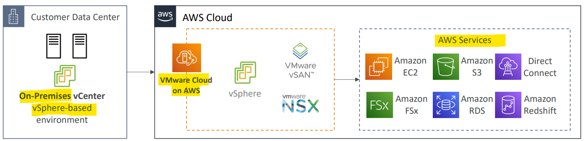

# AWS - Migration

[Back](../../index.md)

- [AWS - Migration](#aws---migration)
  - [On-Premise strategy with AWS](#on-premise-strategy-with-aws)
  - [Transferring large amount of data into AWS](#transferring-large-amount-of-data-into-aws)
  - [VMware Cloud on AWS](#vmware-cloud-on-aws)

---

## On-Premise strategy with AWS

- Ability to **download Amazon Linux 2 `AMI`** as a VM: **AMI**

  - `.iso`format
  - VMWare, KVM, VirtualBox (Oracle VM), Microsoft Hyper-V

- **VM Import / Export**: **VM**

  - Migrate existing applications into EC2
  - Create a **DR repository strategy** for your on-premises VMs
  - Can **export** back the VMs from EC2 to on-premises

- `AWS Application Discovery Service`: **plan, gather info**

  - **Gather information** about your on-premises servers to **plan a migration**
  - Server **utilization and dependency mappings**
  - Track with `AWS Migration Hub`

- `AWS Database Migration Service (DMS)`: **DB**

  - replicate On-premise => AWS , AWS => AWS, AWS => On-premise
  - Works with various database technologies (Oracle, MySQL, DynamoDB, etc..)

- `AWS Server Migration Service (SMS)`: **Server**
  - **Incremental replication** of on-premises **live servers** to AWS

---

## Transferring large amount of data into AWS

- Example: transfer 200 TB of data in the cloud. We have a 100 Mbps internet connection.

- **Over the internet / `Site-to-Site VPN`**:

  - **Immediate** to setup
  - Will take `200(TB)*1000(GB)*1000(MB)*8(Mb)/100 Mbps` = `16,000,000s` = 185d

- **Over `direct connect` 1Gbps:**

  - Long for the one-time setup (over a **month**)
  - Will take `200(TB)*1000(GB)*8(Gb)/1 Gbps` = `1,600,000`s = 18.5d

- **Over `Snowball`:**

  - Will take 2 to 3 snowballs in parallel
  - Takes about **1 week** for the end-to-end transfer
  - Can be **combined** with `DMS`

- **For on-going replication / transfers**:
  - `Site-to-Site VPN`
  - `DX` with `DMS`
  - `DataSync`

---

## VMware Cloud on AWS

- Some customers use `VMware Cloud` to manage their **on-premises Data Center**
- They want to extend the Data Center capacity to AWS, but **keep using the VMware Cloud software**
- …Enter VMware Cloud on AWS

- **Use cases**
  - **Migrate** your VMware vSphere-based **workloads** to AWS
  - Run your **production workloads across** VMware vSphere-based private, public, and hybrid cloud environments
  - Have a **disaster recover strategy**

- Sample:
  - A company is using VMware on its on-premises data center to manage its infrastructure. There is a requirement to extend their data center and infrastructure to AWS but keep using the technology stack they are using which is VMware. Which AWS service can they use?
    - VMware Cloud on AWS

---

[TOP](#aws---migration)
