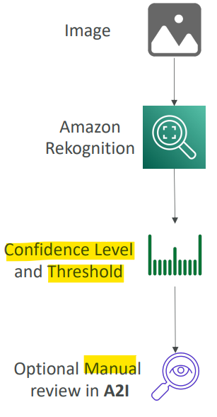
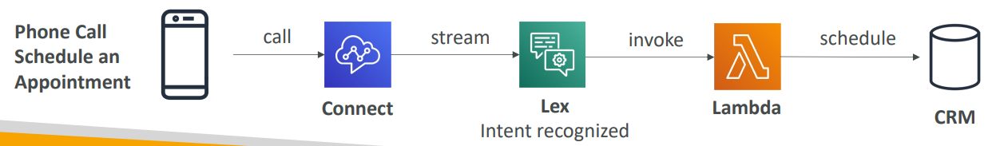
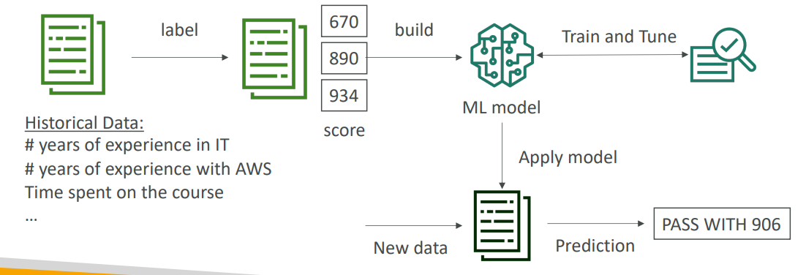
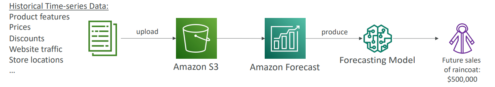
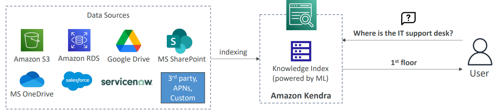
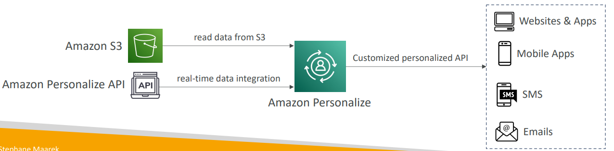
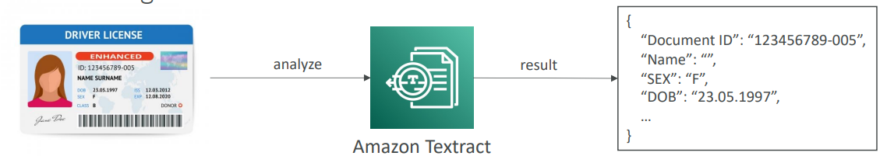

# AWS - Machine Learning

[Back](../index.md)

- [AWS - Machine Learning](#aws---machine-learning)
  - [`Amazon Rekognition`](#amazon-rekognition)
    - [Content Moderation](#content-moderation)
  - [`Amazon Transcribe`](#amazon-transcribe)
  - [`Amazon Polly`](#amazon-polly)
    - [Lexicon \& SSML](#lexicon--ssml)
  - [`Amazon Translate`](#amazon-translate)
  - [`Amazon Lex`](#amazon-lex)
  - [`Amazon Connect`](#amazon-connect)
  - [`Amazon Comprehend`](#amazon-comprehend)
  - [`Amazon Comprehend Medical`](#amazon-comprehend-medical)
  - [`Amazon SageMaker`](#amazon-sagemaker)
  - [`Amazon Forecast`](#amazon-forecast)
  - [`Amazon Kendra`](#amazon-kendra)
  - [`Amazon Personalize`](#amazon-personalize)
  - [`Amazon Textract`](#amazon-textract)
  - [Summary](#summary)

---

## `Amazon Rekognition`

- Usage:

  - Find objects, people, text, scenes in **images** and **videos** using ML
  - **Facial** analysis and facial search to do **user verification**, people counting
  - Create a database of “familiar faces” or compare against celebrities

- **Use cases**:
  - Labeling
  - Content Moderation
  - Text Detection
  - Face Detection and Analysis (gender, age range, emotions…)
  - Face Search and Verification
  - Celebrity Recognition
  - Pathing (ex: for sports game analysis)

---

### Content Moderation

- Detect content that is **inappropriate**, **unwanted**, or **offensive** (image and videos)
- Used in social media, broadcast media, advertising, and e-commerce situations to **create a safer user experience**
- Set a `Minimum Confidence Threshold` for items that will be **flagged**
- Flag **sensitive content** for manual review in `Amazon Augmented AI (A2I)`
- Help comply with **regulations**

---

## `Amazon Transcribe`

- Usage:

  - Automatically convert speech to text
  - Uses a **deep learning** process called `automatic speech recognition (ASR)` to convert speech to text quickly and accurately

- Feature

  - Automatically remove `Personally Identifiable Information (PII)` using `Redaction`
  - Supports `Automatic Language Identification` for **multi-lingual audio**

- **Use cases**:
  - **transcribe** customer service calls
  - automate closed **captioning** and **subtitling**
  - generate metadata for media assets to create a fully **searchable archive**

---

## `Amazon Polly`

- Turn **text** into **lifelike speech** using deep learning
- Allowing you to create applications that **talk**

---

### Lexicon & SSML

- `Lexicon`

  - **Customize the pronunciation** of words with `Pronunciation lexicons`

    - **Stylized** words: St3ph4ne => “Stephane”
    - **Acronyms**: AWS => “Amazon Web Services”

  - Upload the lexicons and use them in the `SynthesizeSpeech` operation

- `SSML`
  - Generate speech from plain text or from documents marked up with `Speech Synthesis Markup Language (SSML)` – enables more customization
    - **emphasizing** specific words or phrases
    - using **phonetic pronunciation**
    - including **breathing** sounds, whispering
    - using the **Newscaster speaking style**

---

## `Amazon Translate`

- Natural and accurate **language translation**
- Amazon Translate allows you to **localize content** -such as websites and applications- for international users, and to easily **translate large volumes of text** efficiently

---

## `Amazon Lex`

- same technology that powers `Alexa`
- `Automatic Speech Recognition (ASR)` to **convert speech to text**
- **Natural Language Understanding** to recognize the **intent** of text, callers
- Helps build **chatbots**, **call center bots**

---

## `Amazon Connect`

- Receive calls, create contact flows, cloud-based **virtual contact center**
- Can integrate with other `CRM` systems or AWS
- No upfront payments, 80% **cheaper** than traditional contact center solutions

---

## `Amazon Comprehend`

- For `Natural Language Processing` – `NLP`
- Fully managed and **serverless** service
- Uses machine learning to **find insights and relationships** in text

  - **Language** of the text
  - **Extracts** key phrases, places, people, brands, or events
  - Understands how **positive or negative** the text is
  - Analyzes text using tokenization and parts of speech
  - Automatically **organizes** a collection of text files **by topic**

- Sample **use cases**:
  - **analyze customer interactions** (emails) to find what leads to a positive or negative experience
  - Create and **groups** articles by topics that Comprehend will uncover

---

## `Amazon Comprehend Medical`

- `Amazon Comprehend Medical` detects and returns useful information in **unstructured clinical text**:

  - Physician’s notes
  - Discharge summaries
  - Test results
  - Case notes

- `DetectPHI API`

  - Uses `NLP` to detect `Protected Health Information (PHI)`

- Architecture of common Use Case:
  - **Store** your documents in `Amazon S3`
  - analyze **real-time** data with `Kinesis Data Firehose`
  - use `Amazon Transcribe` to transcribe patient narratives into text that can be analyzed by `Amazon Comprehend Medical`.

---

## `Amazon SageMaker`

- Fully managed service for developers / data scientists to **build ML models**
  - Typically, difficult to **do all the processes in one place + provision servers**
  - SageMaker **removes the heavy lifting** from each step of the machine learning process to **make it easier to develop** high quality models.
- Machine learning process (simplified): predicting your exam score

---

## `Amazon Forecast`

- Usage:

  - Fully managed service that uses ML to **deliver highly accurate forecasts**
    - ie: predict the future sales of a raincoat

- Features:

  - 50% more **accurate** than looking at the data itself
  - **Reduce forecasting time** from months to hours

- **Use cases**:
  - Product Demand Planning,
  - Financial Planning,
  - Resource Planning, …

---

## `Amazon Kendra`

- Fully managed **document search service** powered by Machine Learning
- **Extract answers** from within a **document** (text, pdf, HTML, PowerPoint, MS Word, FAQs…)
- **Natural language search** capabilities
- Learn from user **interactions/feedback** to promote preferred results (**Incremental Learning**)
- Ability to **manually fine-tune** search results (importance of data, freshness, custom, …)

---

## `Amazon Personalize`

- Usage:

  - Fully managed ML-service to build apps with **real-time** **personalized recommendations**
  - personalized product recommendations/re-ranking, customized direct marketing
    - ie: User bought gardening tools, provide recommendations on the next one to buy

- Feature

  - Same **technology used by Amazon.com**
  - **Integrates** into existing _websites_, _applications_, _SMS_, _email_ marketing systems, …
  - **Implement in days**, not months (you **don’t need to build, train, and deploy** ML solutions)

- **Use cases**:
  - retail stores,
  - media and entertainment…

---

## `Amazon Textract`

- Automatically **extracts** text, handwriting, and data **from any scanned documents** using AI and ML
- **Extract data** from forms and tables
- **Read** and process any type of document (PDFs, images, …)

- **Use cases**:
  - Financial Services (e.g., invoices, financial reports)
  - Healthcare (e.g., medical records, insurance claims)
  - Public Sector (e.g., tax forms, ID documents, passports)

---

## Summary

| Service              | Use case                                        |
| -------------------- | ----------------------------------------------- |
| `SageMaker`          | build ML models                                 |
| `Forecast`           | build highly accurate forecasts, planning       |
| `Rekognition`        | face detection, labeling, celebrity recognition |
| `Textract`           | Extract text and data in documents              |
| `Comprehend`         | NLP(natural language processing)                |
| `Comprehend Medical` | NLP in clinical text                            |
| `Kendra`             | document search, : ML-powered search engine     |
| `Translate`          | language translation                            |
| `Polly`              | text to audio                                   |
| `Transcribe`         | audio to text (ex: subtitles)                   |
| `Lex`                | build conversational bots – chatbots            |
| `Connect`            | virtual contact center                          |
| `Personalize`        | real-time personalized recommendations          |

---

[TOP](#aws---machine-learning)
