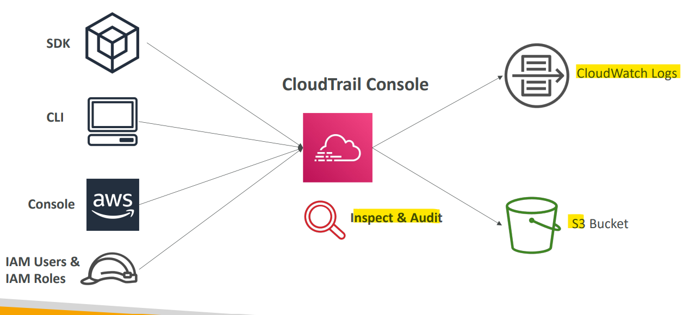
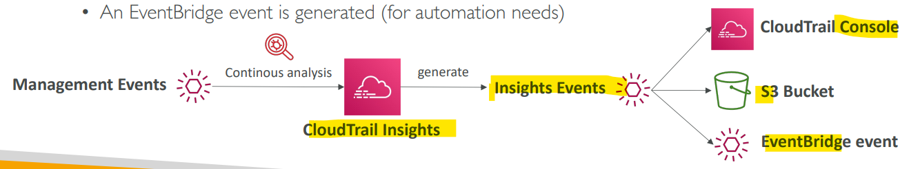
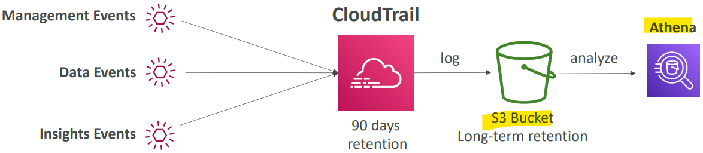
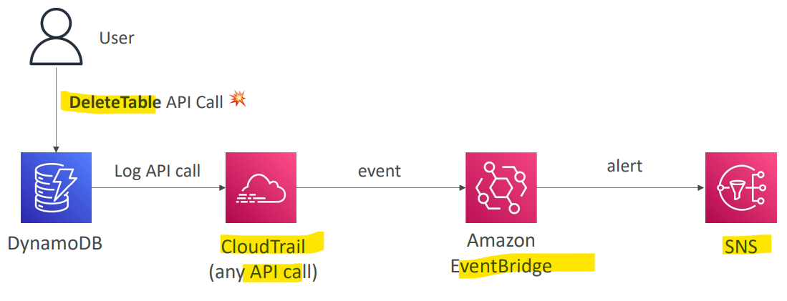
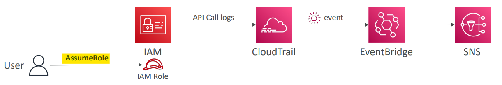
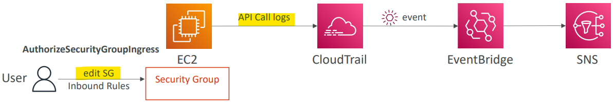
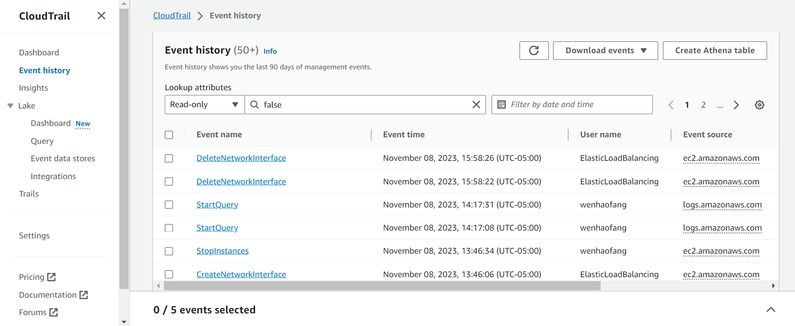

# AWS - CloudTrail

[Back](../index.md)

- [AWS - CloudTrail](#aws---cloudtrail)
  - [`AWS CloudTrail`](#aws-cloudtrail)
  - [Events](#events)
    - [Management Events](#management-events)
    - [Data Events](#data-events)
    - [Insights Event - unusual activity, cost](#insights-event---unusual-activity-cost)
  - [Events Retention](#events-retention)
  - [Use Case - EventBridge Integration](#use-case---eventbridge-integration)
  - [Hands-on](#hands-on)

---

## `AWS CloudTrail`

- `AWS CloudTrail`

  - Provides **governance**, **compliance** and **audit** for your AWS **Account**
  - enabled by default!

- Features:

  - Get an h**istory of events / API calls** made within your AWS Account by:

    - Console
    - SDK
    - CLI
    - AWS Services

  - Can put logs from `CloudTrail` **into** `CloudWatch Logs` or `S3`
  - A `trail` can be applied to **All Regions (default)** or a **single Region**.

- If a resource is deleted in AWS, **investigate `CloudTrail` first!**

- Sample:
  - Someone has terminated an EC2 instance in your AWS account last week, which was hosting a critical database that contains sensitive data. Which AWS service helps you find who did that and when?
    - AWS CloudTrail allows you to log, continuously monitor, and retain account activity related to actions across your AWS infrastructure. It provides the event history of your AWS account activity, audit API calls made through the AWS Management Console, AWS SDKs, AWS CLI. So, the EC2 instance termination API call will appear here. You can use CloudTrail **to detect unusual activity** in your AWS accounts.
  - Someone changed the configuration of a resource and made it non-compliant. Which AWS service is responsible for **logging who** made modifications to resources?
    - AWS CloudTrail

---

## Events

- 3 Types of Events

### Management Events

- Operations that are **performed on resources** in your AWS account
  - e.g.,
    - Configuring security (IAM AttachRolePolicy)
    - Configuring rules for routing data (Amazon EC2 CreateSubnet)
    - Setting up logging (AWS CloudTrail CreateTrail)
- By **default**, trails are configured to **log management events**.
- Can **separate** `Read Events` (that don’t modify resources) from `Write Events` (that may modify resources)

---

### Data Events

- By default, data events are **not logged** (because high volume operations)
- Amazon S3 object-level activity (ex: GetObject, DeleteObject, PutObject): can **separate** `Read` and `Write Events`
- AWS Lambda function execution activity (the Invoke API)

---

### Insights Event - unusual activity, cost

- Not enable by default. Not free.
- Enable `CloudTrail Insights` to detect **unusual activity** in your account:

  - **inaccurate** resource **provisioning**
  - hitting **service limits**
  - Bursts of AWS **IAM actions**
  - Gaps in **periodic maintenance activity**

- `CloudTrail Insights` **analyzes** normal management events to **create a baseline**

  - And then **continuously analyzes write events** to detect **unusual patterns**

- Process:
  - Anomalies **appear** in the CloudTrail **console**
  - **Event** is sent to Amazon `S3`
  - An `EventBridge` **event** is generated (for automation needs)

- Sample:
  - You have CloudTrail enabled for your AWS Account in all AWS Regions. What should you use to detect unusual activity in your AWS Account?
    - CloudTrail Insights

---

## Events Retention

- Events are stored for **90 days** in `CloudTrail`
- To keep events beyond this period, **log** them to `S3` and use `Athena`

- Sample:
  - One of your teammates terminated an EC2 instance 4 months ago which has critical data. You don't know who made this so you are going to review all API calls within this period using CloudTrail. You already have CloudTrail set up and configured to send logs to the S3 bucket. What should you do to find out who made this?
    - You can use the CloudTrail Console to view the last **90** days of recorded API activity.
    - For events older than 90 days, use `Athena` to analyze CloudTrail logs stored in S3.

---

## Use Case - EventBridge Integration

- Intercept API Calls

- Get notified when assuming role
  - Assume Role will call API, which will be logged into CouldTrail.

- Get notified when edit SG rules
  - Edit SG rule will call API, which will be logged

- Sample:
  - A company is developing a Serverless application on AWS using Lambda, DynamoDB, and Cognito. A junior developer joined a few weeks ago and accidentally deleted one of the DynamoDB tables in the dev AWS account which contained important data. The CTO asks you to **prevent** this from happening again and there must be a **notification system to monitor** if there is an attempt to make such deletion actions for the DynamoDB tables. What would you do?
    - Assign dev to a IAM group which prevent deletion. Configure EventBridge to capture any `DeleteTable` API Calls through CloudTrail and send notification using SNS.

---

## Hands-on

---

[TOP](#aws---cloudtrail)
