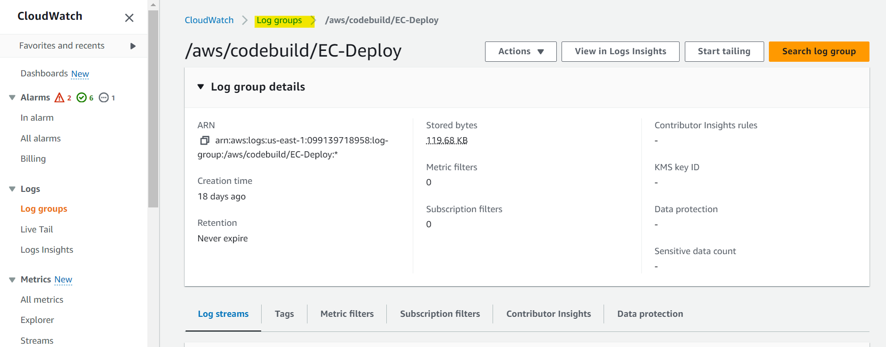
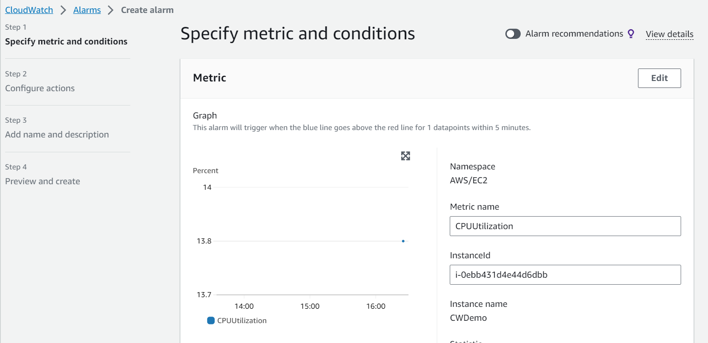

# AWS - CloudWatch

[Back](../index.md)

- [AWS - CloudWatch](#aws---cloudwatch)
  - [`Amazon CloudWatch`](#amazon-cloudwatch)
  - [`CloudWatch` - Metrics](#cloudwatch---metrics)
    - [Streams](#streams)
  - [`CloudWatch` - Logs](#cloudwatch---logs)
    - [Sources](#sources)
    - [Logs Insights](#logs-insights)
    - [S3 Export](#s3-export)
    - [Logs Subscriptions](#logs-subscriptions)
      - [Logs Aggregation](#logs-aggregation)
    - [Hands-on](#hands-on)
  - [`CloudWatch` Agent](#cloudwatch-agent)
    - [Types of CloudWatch Agent](#types-of-cloudwatch-agent)
    - [CloudWatch Unified Agent – Metrics](#cloudwatch-unified-agent--metrics)
  - [`CloudWatch` - Alarms](#cloudwatch---alarms)
    - [Alarm Targets](#alarm-targets)
    - [Composite Alarms](#composite-alarms)
    - [Use Case: EC2 Instance Recovery](#use-case-ec2-instance-recovery)
    - [Hands-on](#hands-on-1)
  - [`CloudWatch` - Insights](#cloudwatch---insights)
    - [Container Insights](#container-insights)
    - [Lambda Insights](#lambda-insights)
    - [Contributor Insights](#contributor-insights)
    - [Application Insights](#application-insights)
    - [Summary: CloudWatch Insights and Operational Visibility](#summary-cloudwatch-insights-and-operational-visibility)

---

## `Amazon CloudWatch`

- Sample: You have made a configuration change and would like to evaluate the impact of it on the performance of your application. Which AWS service should you use?
  - Amazon `CloudWatch` is a **monitoring** service that allows you to monitor your applications, respond to system-wide **performance** changes, optimize resource utilization, and get a unified view of operational health. It is used to monitor your applications' performance and metrics.

---

## `CloudWatch` - Metrics

- `CloudWatch` provides metrics **for every services** in AWS

- `Metric`

  - a variable to monitor (CPUUtilization, NetworkIn…)
  - `Metrics` belong to **namespaces**(one namespace per service)
  - `Metrics` have **timestamps**

- Can create `CloudWatch dashboards` of metrics
- Can create `CloudWatch Custom Metrics` (for the **RAM** for example)

- `Dimension`

  - an **attribute** of a metric (instance id, _environment_, etc…).
  - Up to **30** dimensions per metric

---

### Streams

- **Continually stream** CloudWatch metrics to a destination of your choice, with **near-real-time** delivery and **low latency**.
  - `Amazon Kinesis Data Firehose` (and then its destinations)
  - **3rd party** service provider:
    - Datadog, Dynatrace, New Relic, Splunk, Sumo Logic…
- **Option** to **filter** metrics to only stream a subset of them


- Sample:
  - …. is a CloudWatch feature that allows you to send CloudWatch metrics in near real-time to S3 bucket (through Kinesis Data Firehose) and 3rd party destinations (e.g., Splunk, Datadog, …).
    - Metric Streams

---

## `CloudWatch` - Logs

- Usage:

  - used to store application log in AWS.

- **Log groups**:

  - arbitrary **name**, usually **representing an application**

- **Log stream**:

  - represent log **instances** within application / log **files** / **containers**

- CloudWatch `Logs` can send logs to:

  - Amazon `S3` (exports)
  - `Kinesis Data Streams`
  - `Kinesis Data Firehose`
  - AWS `Lambda`
  - `OpenSearch`

- Can define **log expiration policies** (never expire, 1 day to 10 years…)

- Security
  - Logs are **encrypted by default**
  - Can setup `KMS-based` encryption with your own keys

---

### Sources

- SDK, CloudWatch **Logs Agent**, CloudWatch **Unified Agent**
- `Elastic Beanstalk`:
  - collection of **logs from application**
- `ECS`:
  - collection from **containers**
- `AWS Lambda`:
  - collection from **function logs**
- `VPC Flow Logs`:
  - VPC specific **logs**
- `API Gateway`:
  - request record
- `CloudTrail` based on **filter**
- `Route53`:
  - Log **DNS queries**

---

### Logs Insights

- Usage

  - **Search** and **analyze** log data stored in `CloudWatch Logs`
    - ie: find a specific IP inside a log, count occurrences of “ERROR” in your logs…

- Provides a purpose-built **query language**

  - **Automatically discovers fields** from _AWS services_ and _JSON log events_
  - **Fetch** desired event fields, **filter** based on conditions, **calculate** aggregate statistics, sort events, **limit** number of events…
  - Can save queries and **add** them to `CloudWatch Dashboards`

- Can query **multiple** `Log Groups` in **different AWS accounts**
- It’s a query engine, **not a real-time engine**, only query historical data.


---

### S3 Export

- Log data can take up to **12 hours** to become available for batch export

- `CreateExportTask`

  - the API call used to initiate export

- a batch export
  - **Not** near-real time or real-time…


---

### Logs Subscriptions

- Get a **real-time log events** from `CloudWatch Logs` for processing and analysis
- Send to `Kinesis Data Streams`, `Kinesis Data Firehose`, or `Lambda`
- **Subscription Filter**
  - filter which logs are events delivered to your destination


---

#### Logs Aggregation

- Multi-Account & Multi Region


- **Cross-Account Subscription**
  - send **log events** to resources in a different AWS account (KDS, KDF)


---

### Hands-on




- Retension


- Log stream


- Metric filter


- Subscription filters


- Export Data to S3


- Create Log Group


- Log Insights


---

## `CloudWatch` Agent

- `CloudWatch Agent`

  - A small program to send log to `CloudWatch`

- By **default**, **no logs** from your `EC2` machine will go to `CloudWatch`
- You need to run a `CloudWatch agent` on EC2 to push the log files you want
- Make sure `IAM permissions` are correct
- The `CloudWatch log agent` can be setup **on-premises** too


---

### Types of CloudWatch Agent

- Both for virtual servers (EC2 instances, on-premises servers…)

- `CloudWatch Logs Agent`

  - Old version of the agent
  - Can **only** send to `CloudWatch Logs`

- `CloudWatch Unified Agent`

  - Both metrics and logs
  - Collect additional **system-level metrics** such as **RAM**, processes, etc…
  - Collect logs to send to `CloudWatch Logs`
  - **Centralized configuration** using `SSM` Parameter Store

- Sample:
  - How would you monitor your EC2 instance memory usage in CloudWatch?
  - Unifited CW Agent + CW custom metric

---

### CloudWatch Unified Agent – Metrics

- Unified Agent

  - **out-of-the box metrics** for EC2 – disk, CPU, network (high level)
  - Collected **directly on** your `Linux` server / `EC2` instance

- Metrics

  - **CPU**
    - active, guest, idle, system, user, steal
  - **Disk** metrics
    - free, used, total,
  - Disk **IO**
    - writes, reads, bytes, iops
  - **RAM**
    - free, inactive, used, total, cached
  - **Netstat**
    - number of TCP and UDP connections, net packets, bytes
  - **Processes**
    - total, dead, bloqued, idle, running, sleep
  - **Swap Space**
    - free, used, used %

---

## `CloudWatch` - Alarms

- `Alarms`

  - used to **trigger notifications** for any metric
  - Various options (sampling, %, max, min, etc…)

- **Alarm States**:

  - `OK`: not triggered
  - `INSUFFICIENT_DATA`: not enough data to determine a state
  - `ALARM`: the threhold has been breached and a notification will be sent.

- **Period**:

  - Length of time in seconds **to evaluate the metric**
  - **High resolution** custom metrics:
    - 10 sec, 30 sec or multiples of 60 sec

- Integration:

  - `Alarms` can be created based on `CloudWatch Logs Metrics Filters`


- Test

  - To **test** alarms and notifications, set the alarm state to `Alarm` **using `CLI`**

```sh
aws cloudwatch set-alarm-state --alarm-name "myalarm" --state-value ALARM --state-reason "testing purposes"

```

---

### Alarm Targets

- 3 types of Alarm **target**

  - Amazon `EC2`
    - trigger to **Stop, Terminate, Reboot, or Recover** an EC2 Instance
  - `EC2 Auto Scaling`
    - Trigger Auto Scaling Action, scall out or in.
  - Amazon `SNS`
    - Send notification to `SNS` (from which you can do pretty much anything)

- Sample:
  - You have an application hosted on a fleet of EC2 instances managed by an Auto Scaling Group that you configured its minimum capacity to 2. Also, you have created a CloudWatch Alarm that is configured to scale in your ASG when CPU Utilization is below 60%. Currently, your application runs on 2 EC2 instances and has low traffic and the CloudWatch Alarm is in the ALARM state. What will happen?
    - The number of EC2 instances in an ASG **can not go below the minimum capacity**, even if the CloudWatch alarm would **in theory trigger** an EC2 instance termination.

---

### Composite Alarms

- `Composite Alarms`
  - monitor the states of **multiple** other alarms
    - `CloudWatch Alarms` are on a **single metric**
  - `AND` and `OR` conditions
- Helpful **to reduce “alarm noise”** by creating complex composite alarms


---

### Use Case: EC2 Instance Recovery

- Status Check:

  - **Instance status** = check the **EC2 VM**
  - **System status** = check the underlying **hardware**


- When **Recovery**:
  - Same Private, Public, Elastic IP, metadata, placement group

---

### Hands-on

- Create EC2 instance


- Create Alarm





- Trigger Alarm manually
  - EC2 terminated when alarm is triggered.


---

## `CloudWatch` - Insights

### Container Insights

- Collect, aggregate, summarize **metrics and logs from containers**
- Available for **containers on**…

  - `Amazon Elastic Container Service` (Amazon ECS)
  - `Amazon Elastic Kubernetes Services` (Amazon EKS)
  - `Kubernetes` platforms on `EC2`
  - `Fargate` (both for `ECS` and `EKS`)

- In Amazon EKS and Kubernetes, `CloudWatch Insights` is using a **containerized version** of the `CloudWatch Agent` to discover containers.都是使用 Agent, 不过是 container 版本.


---

### Lambda Insights

- Monitoring and troubleshooting solution for **serverless applications running on AWS Lambda**
- Collects, aggregates, and summarizes **system-level metrics** including CPU
  time, memory, disk, and network
- Collects, aggregates, and summarizes **diagnostic information** such as cold starts and Lambda worker shutdowns
- Lambda Insights is provided as a `Lambda Layer`

---

### Contributor Insights

- Analyze **log data** and create time series that display **contributor data**.

  - See metrics about the **top-N contributors**
  - The total number of unique contributors, and their usage.

- This helps you find **top talkers** and understand who or what is **impacting system performance**.
- Works for **any AWS-generated logs** (VPC, DNS, etc..)

  - ie, you can find **bad hosts**, identify the **heaviest network users**, or find the URLs that **generate the most errors**.

- Rules
  - You can build your rules **from scratch**,
  - you can also use **sample rules** that AWS has created – leverages your CloudWatch Logs
  - CloudWatch also provides **built-in rules** that you can use to analyze metrics from other AWS services.


- Sample:
  - A DevOps engineer is working for a company and managing its infrastructure and resources on AWS. There was a sudden spike in traffic for the main application for the company which was not normal in this period of the year. The application is hosted on a couple of EC2 instances in private subnets and is fronted by an Application Load Balancer in a public subnet. To detect if this is normal traffic or an attack, the DevOps engineer enabled the VPC Flow Logs for the subnets and stored those logs in CloudWatch Log Group. The DevOps wants to analyze those logs and find out the top IP addresses making requests against the website to check if there is an attack. Which of the following can help the DevOps engineer to analyze those logs?
    - Cw Contributor Insights

---

### Application Insights

- Provides **automated dashboards** that show potential problems with monitored applications, to **help isolate ongoing issues**
- Your **applications run on Amazon EC2 Instances** with **select technologies only** (Java, .NET, Microsoft IIS Web Server, databases…)
- And you can use other AWS resources such as Amazon EBS, RDS, ELB, ASG, Lambda, SQS, DynamoDB, S3 bucket, ECS, EKS, SNS, API Gateway…
- Powered by `SageMaker` internally
- Enhanced visibility into your **application health** to reduce the time it will take you to troubleshoot and repair your applications
- Findings and alerts are sent to Amazon `EventBridge` and `SSM OpsCenter`

---

### Summary: CloudWatch Insights and Operational Visibility

- CloudWatch `Container Insights`

  - **ECS**, **EKS**, **Kubernetes** on EC2, Fargate, **needs agent for Kubernetes**
  - Metrics and logs

- CloudWatch `Lambda Insights`

  - Detailed metrics to troubleshoot **serverless applications**

- CloudWatch `Contributors Insights`

  - Find **“Top-N” Contributors** through CloudWatch Logs

- CloudWatch `Application Insights`
  - Automatic **dashboard to troubleshoot** your **application and related AWS services**

---

[TOP](#aws---cloudwatch)
