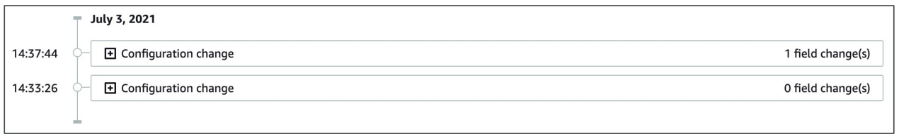

# AWS - Config

[Back](../index.md)

- [AWS - Config](#aws---config)
  - [`AWS Config`](#aws-config)
  - [Resource](#resource)
  - [Rules](#rules)
    - [Config Rules – Notifications](#config-rules--notifications)
    - [Config Rules – Remediations](#config-rules--remediations)
  - [Hands-on](#hands-on)

---

## `AWS Config`

- Helps with auditing and recording **compliance** of your AWS resources
- Helps **record configurations and changes** over time
- **Questions** that can be solved by AWS Config:
  - Is there _unrestricted SSH access_ to my security groups?
  - Do my buckets have any _public access_?
  - How has my _ALB configuration changed_ over time?
- You can **receive alerts** (SNS notifications) for any changes
- `AWS Config`
  - a **per-region service**
  - Can be **aggregated** across **regions** and **accounts**
- Possibility of **storing** the configuration data into `S3` (**analyzed** by `Athena`)

---

## Resource

- View **compliance** of a resource over time

- View **configuration** of a resource over time

- View `CloudTrail` **API calls** of a resource over time

---

## Rules

- Types:

  - Can use **AWS managed config rules** (over 75)
  - Can make **custom** config rules (must be defined in AWS Lambda)
    - Ex: evaluate if each _EBS disk_ is of type gp2
    - Ex: evaluate if each _EC2 instance_ is t2.micro

- Rules can be **evaluated / triggered**:

  - For each **config change**
  - And / or: at regular time **intervals**(ie: every 2 hours)

- AWS Config Rules does **not prevent** actions from happening (**no deny**)(just overview of configurateion)

  - `IAM` deny

- **Pricing**:

  - no free tier, $0.003 per **configuration** item recorded per region,
    $0.001 per config rule **evaluation** per region

- Sample:
  - You are running a website on a fleet of EC2 instances with OS that has a known **vulnerability on port 84**. You want to continuously **monitor** your EC2 instances if they have port 84 exposed. How should you do this?
    - Setup Config Rules
  - You would like to evaluate the compliance of your resource's configurations over time. Which AWS service will you choose?
    - AWS Config

---

### Config Rules – Notifications

- Use `EventBridge` to **trigger notifications** when AWS resources are noncomplian

- Ability to send **configuration changes** and **compliance state notifications** to `SNS` (all events – use SNS Filtering or filter at client-side)

- Sample:
  - You are running a critical website on a set of EC2 instances with a tightened Security Group that has restricted SSH access. You have enabled AWS Config in your AWS Region and you want to be notified via email when someone modified your EC2 instances' Security Group. Which AWS Config feature helps you do this?
    - AWX Config Notifications

---

### Config Rules – Remediations

- **Automate remediation** of non-compliant resources using `SSM Automation Documents`
- Use `AWS-Managed Automation Documents` or create **custom** `Automation Documents`
- Tip:
  - you can create custom `Automation Documents` that **invokes** `Lambda` function
  - You can set `Remediation Retries` if the resource is still non-compliant after auto-remediation

- Sample
  - You have enabled AWS Config to monitor Security Groups if there's unrestricted SSH access to any of your EC2 instances. Which AWS Config feature can you use to automatically re-configure your Security Groups to their correct state?
    - Config Remediations

---

## Hands-on

---

[TOP](#aws---config)
