# AWS - EventBridge

[Back](../index.md)

- [AWS - EventBridge](#aws---eventbridge)
  - [`Amazon EventBridge`](#amazon-eventbridge)
    - [Event Bus](#event-bus)
  - [Schema Registry](#schema-registry)
  - [Resource-based Policy](#resource-based-policy)
  - [Hands-on](#hands-on)

---

## `Amazon EventBridge`

- **formerly** `CloudWatch Events`

- Usage:
  - **Schedule**: Cron jobs (scheduled scripts)

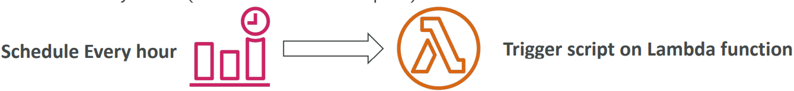

- **Event Pattern**: Event **rules** to react to a service doing something

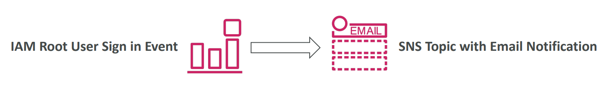

- **Trigger Lambda** functions, send SQS/SNS messages…

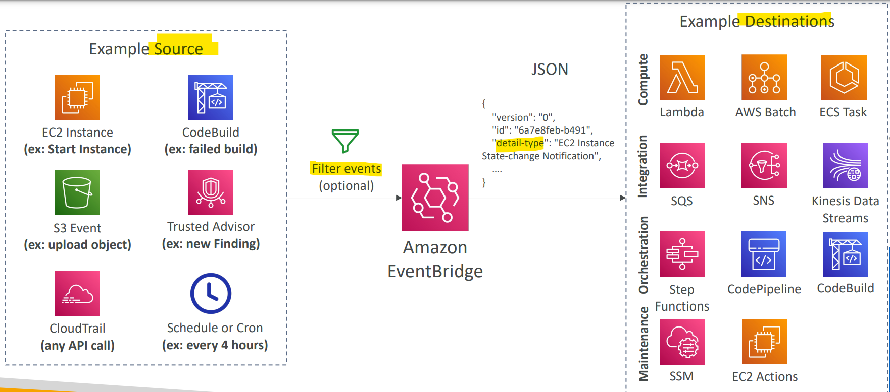

---

### Event Bus

- `event bus`

  - a mediator that transfers a message from a sender to a receiver.
  - it provides a loosely coupled communication way between objects, services and applications.
  - The main idea is delivering and processing events **asynchronously**.

- Types of event bus:
  - **Default** Event Bus
    - AWS Services
  - **Partner** Event Bus
    - AWS Saas _Partners_
  - **Custom** Evnet Bus
    - Cusom Apps

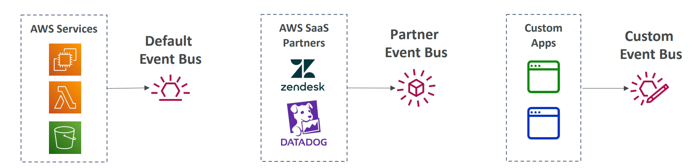

- `Event buses` can be **accessed by other AWS accounts** using `Resource-based Policies`

- **Archive Event**

  - You can **archive** events (all/filter) sent to an event bus (indefinitely or set period)
  - Ability to **replay** archived events

- sample:
  - A company has a running Serverless application on AWS which uses EventBridge as an inter-communication channel between different services within the application. There is a requirement to use the events in the prod environment in the dev environment to make some tests. The tests will be done every 6 months, so the events need to **be stored and used later on**. What is the most efficient and cost-effective way to store EventBridge events and use them later?
    - use EventBridge `Archive` and `Replay` feature.

---

## Schema Registry

- Evnets are in JSON format.

- `EventBridge` can **analyze** the events in your bus and **infer** the schema
- `Schema Registry`
  - allows you to **generate code** for your application, that will know in advance how data is **structured** in the event bus. 知道 schema,就知道如何 extract data.
- Schema can be **versioned**.

---

## Resource-based Policy

- `Resource-based Policy`

  - used to manage permissions for a specific Event Bus

  - ie: allow/deny events from **another AWS account** or AWS **region**

- **Use case**:
  - a centrol event bus to **aggregate all events** from your AWS Organization in a single AWS account or AWS region
    EventBridge – Resource-based Policy

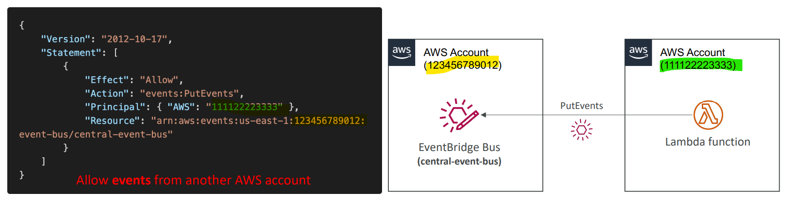

---

## Hands-on

- Create event bus

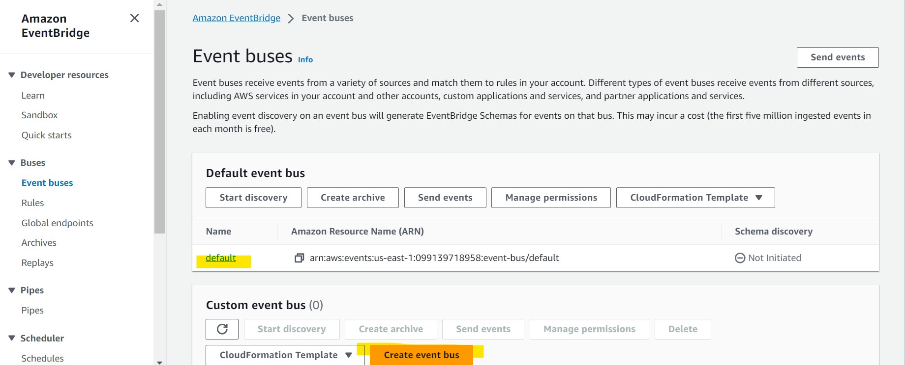

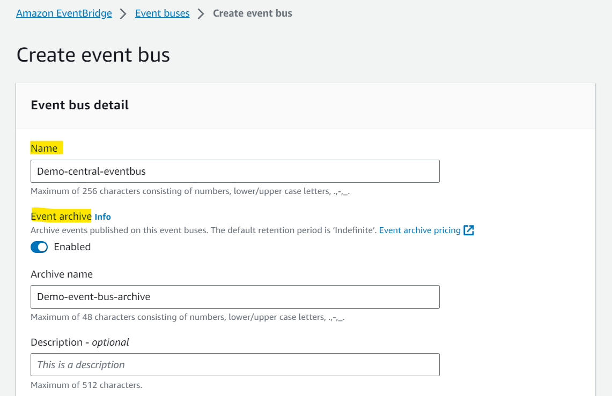

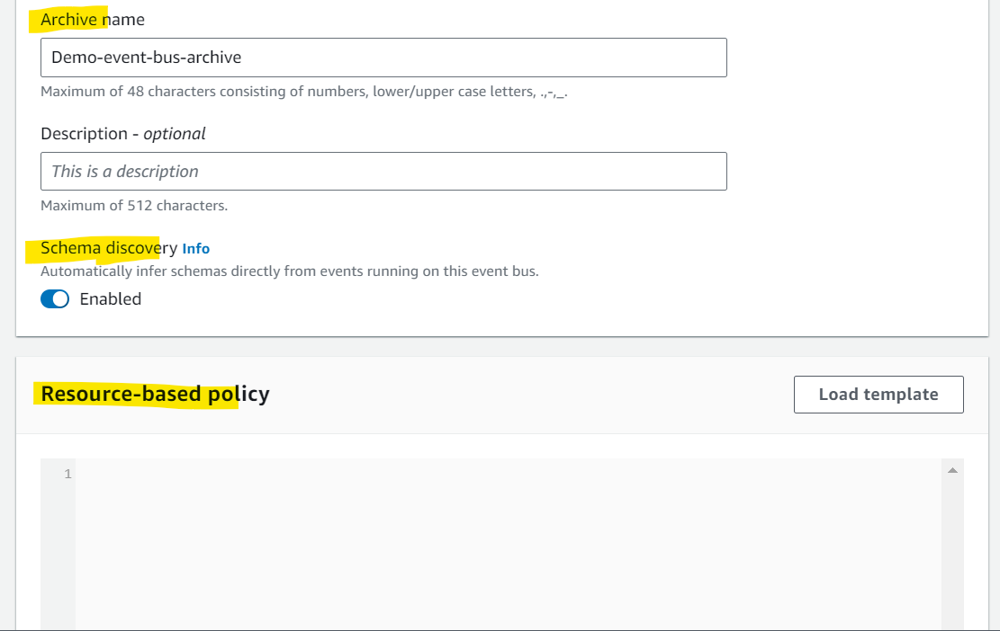

- Create rule
  - Any ec2 instance is stoped or terminated, the SNS topic will send email.
  - 已实测通过.

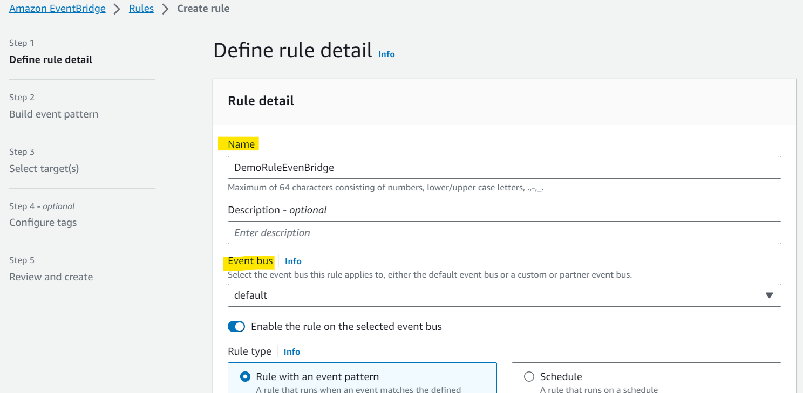

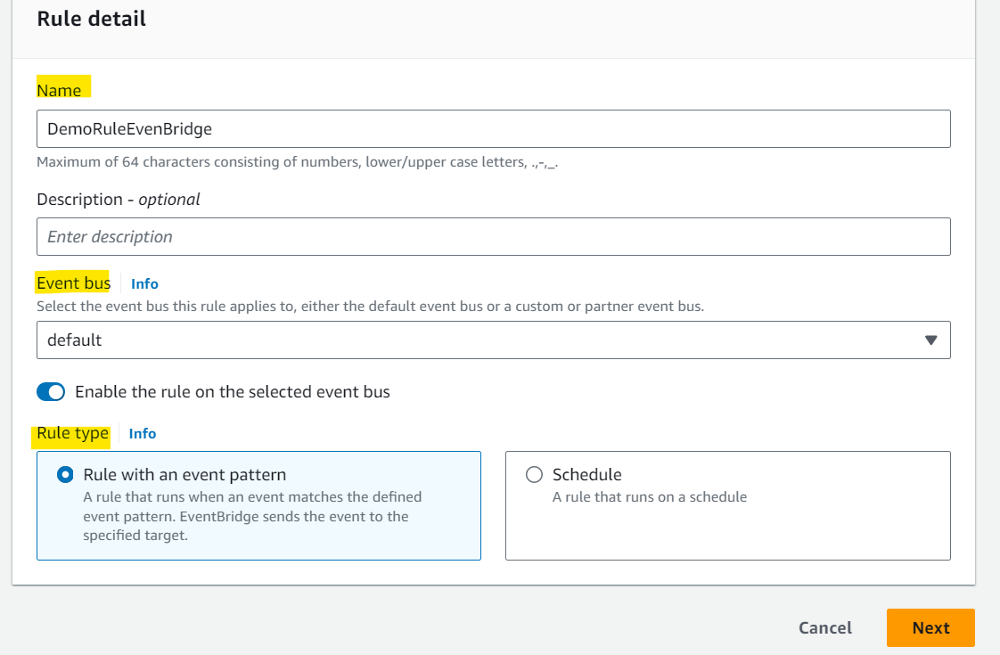

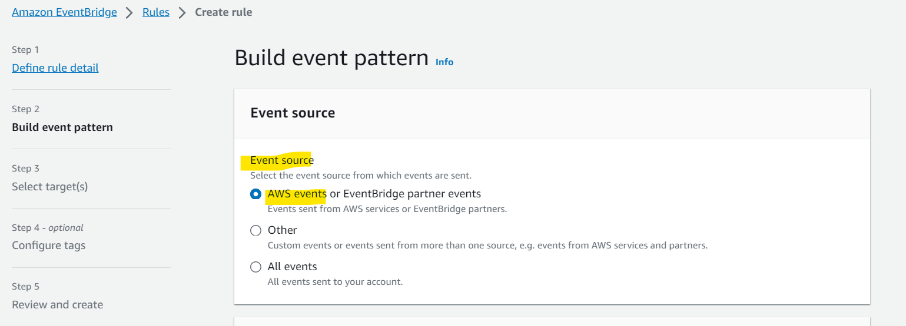

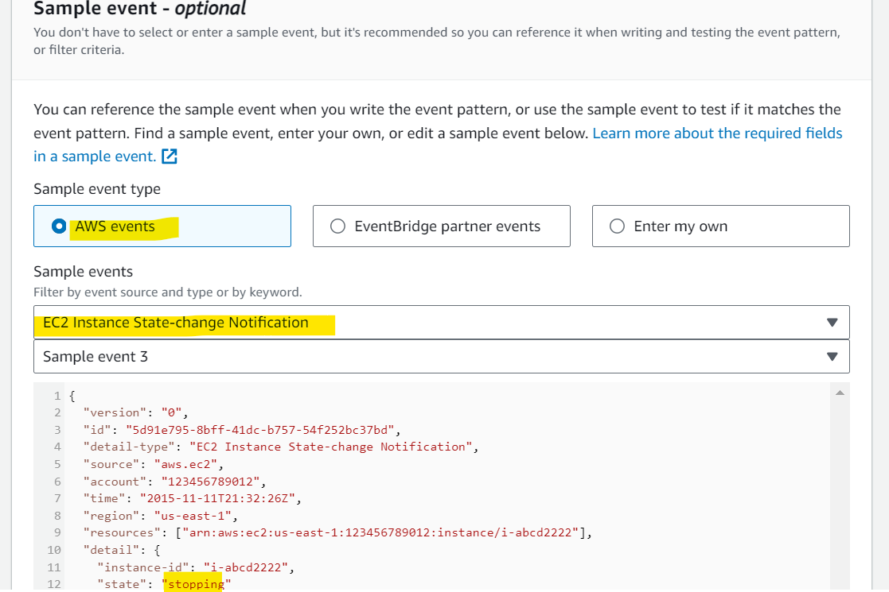

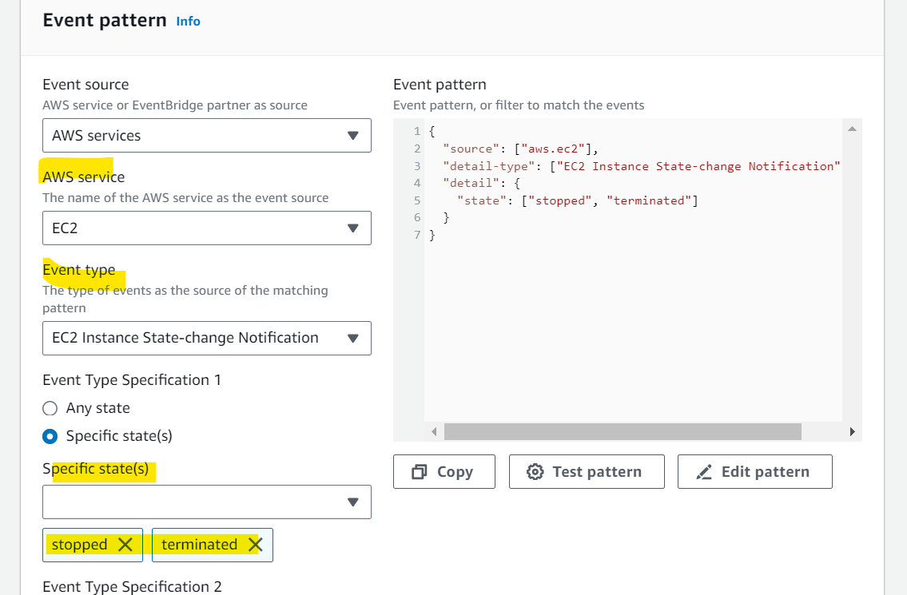

---

[Top](#aws---eventbridge)
