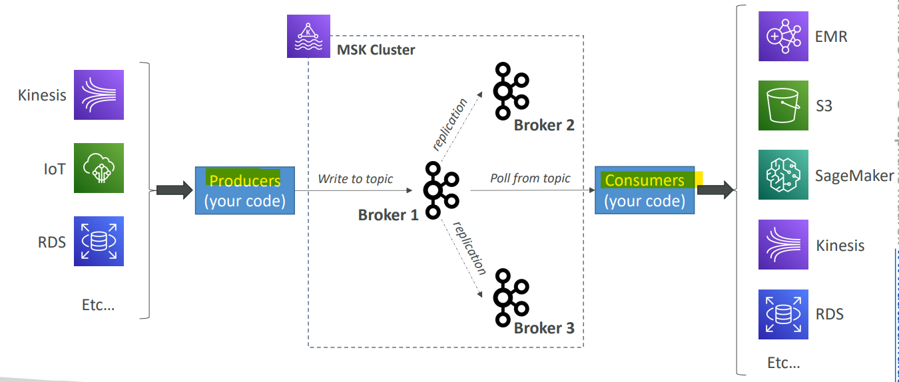
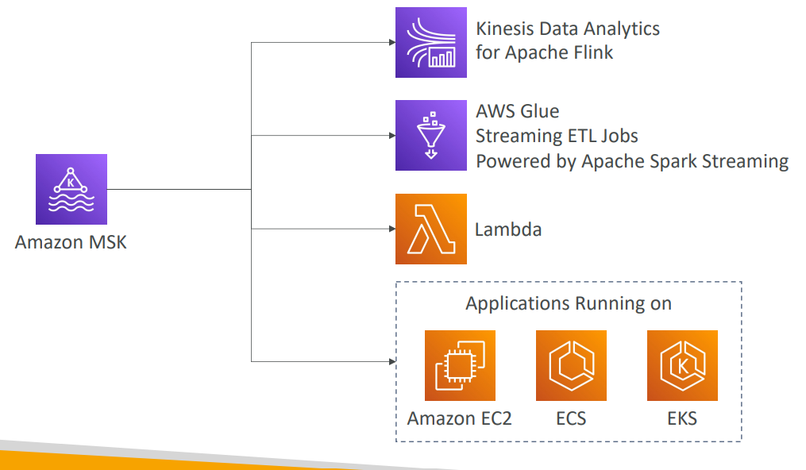

# AWS - Amazon Managed Streaming for Apache Kafka(MSK)

[Back](../index.md)

- [AWS - Amazon Managed Streaming for Apache Kafka(MSK)](#aws---amazon-managed-streaming-for-apache-kafkamsk)
  - [Amazon MSK](#amazon-msk)
    - [Consumers](#consumers)
  - [Kinesis Data Streams vs. Amazon MSK](#kinesis-data-streams-vs-amazon-msk)

---

## Amazon MSK

- `Amazon MSK`

  - **Alternative** to `Amazon Kinesis`
    - allow to stream data.

- Fully **managed** `Apache Kafka` on AWS

  - Allow you to create, update, delete **clusters**
  - MSK creates & manages `Kafka` **brokers nodes** & **Zookeeper nodes** for you
  - **Deploy** the MSK cluster in your VPC, **multi-AZ** (up to **3** for HA)
  - Automatic **recovery** from common `Apache Kafka` **failures**
  - Data is **stored** on `EBS` volumes for **as long as you want**

- **MSK Serverless**
  - Run Apache Kafka on MSK **without managing the capacity**
  - MSK **automatically provisions** resources and **scales** compute & storage

---

### Consumers

---

## Kinesis Data Streams vs. Amazon MSK

- `Kinesis Data Streams`

  - `1 MB` message **size limit**
  - Data Streams with **Shards**
  - Shard **Splitting** & **Merging**
  - **TLS** In-flight encryption
  - **KMS** at-rest encryption

- `Amazon MSK`
  - `1MB` **default**, configure for **higher** (ex: 10MB)
  - Kafka **Topics** with **Partitions**
  - Can only **add partitions** to a **topic**
  - `PLAINTEXT` or `TLS` In-flight **Encryption**
  - `KMS` at-rest **encryption**

---

[TOP](#aws---amazon-managed-streaming-for-apache-kafkamsk)
