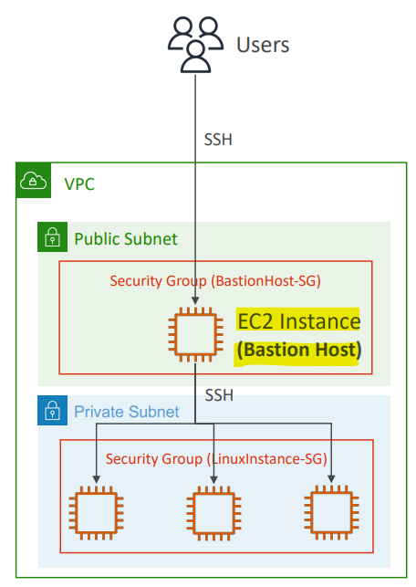
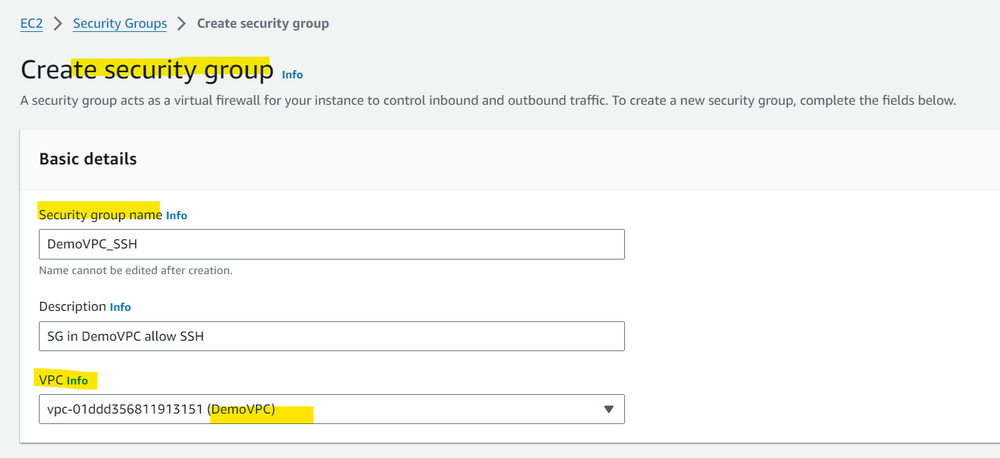
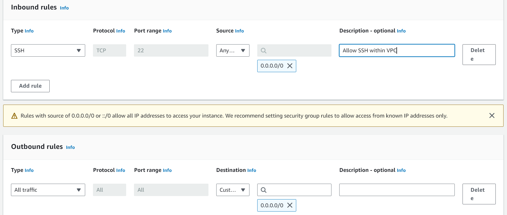
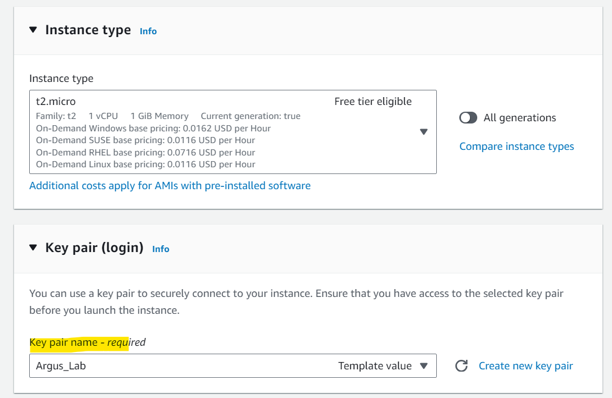
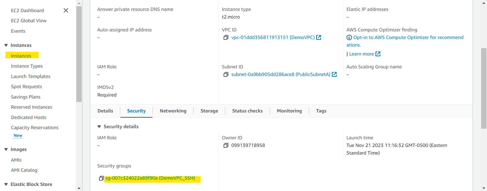
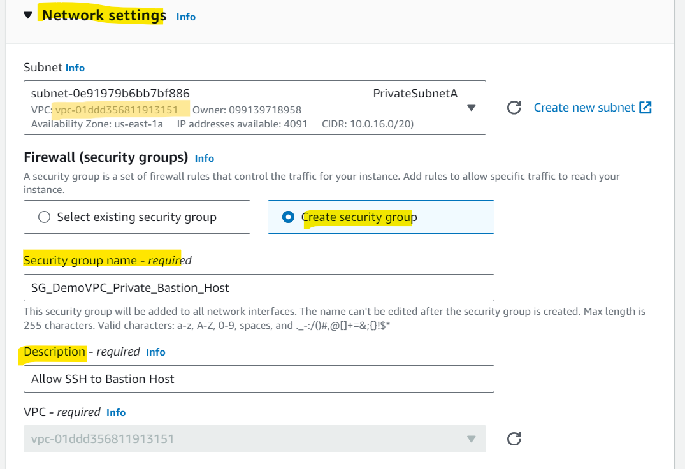
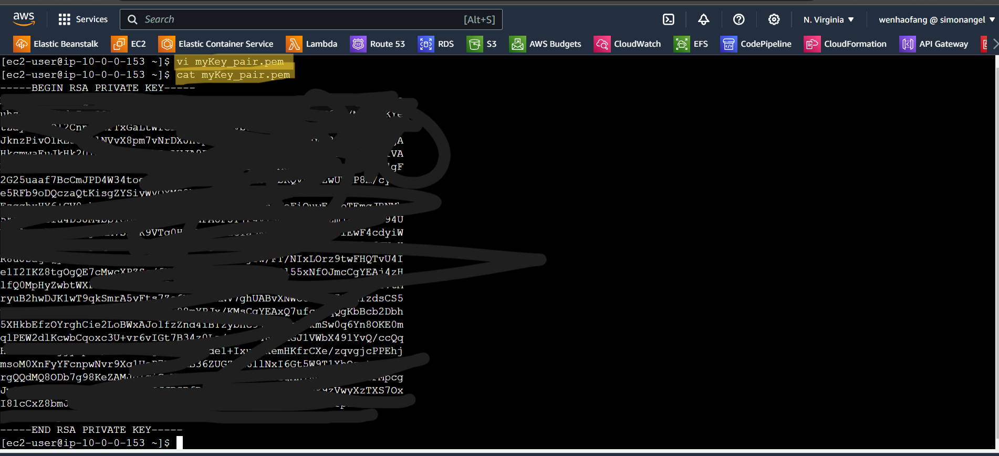
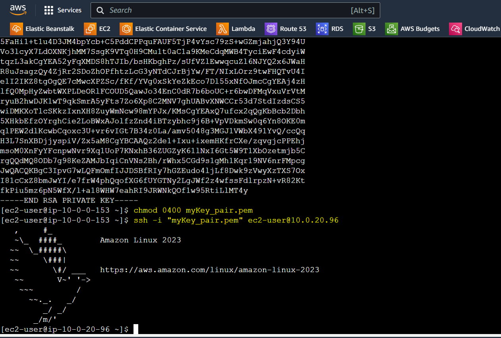
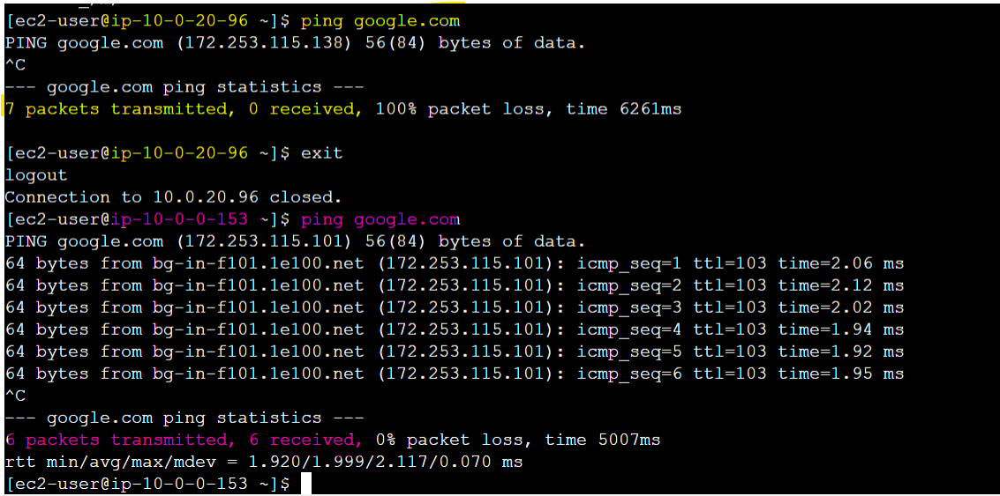

# AWS Networking - Bastion Host

[Back](../index.md)

- [AWS Networking - Bastion Host](#aws-networking---bastion-host)
  - [Bastion Hosts](#bastion-hosts)
    - [Hands-on](#hands-on)

---

## Bastion Hosts

- `Bastion Host`
  - used to SSH into our private EC2 instances, which are in the private subnets and have not direct access to public internet.
- The `bastion` is in the `public subnet` which is then **connected to all other private subnets**

- `Bastion Host` **security group** must allow **inbound** from the internet on **port 22** from **restricted CIDR**, for example the public CIDR of your corporation

- `Security Group` of the EC2 Instances must allow

  - the `Security Group` of the `Bastion Host`
  - the `private IP` of the `Bastion host`

- 一台在公网=Bastion: 限定入流 CIDR,可以 SSH 到 internet 和私网
- 私网服务器: 允许 Basion/允许私有 IP

- Sample:
  - A web application backend is hosted on EC2 instances in private subnets fronted by an Application Load Balancer in public subnets. There is a requirement to give some of the developers access to the backend EC2 instances but without exposing the backend EC2 instances to the Internet. You have created a bastion host EC2 instance in the public subnet and configured the backend EC2 instances Security Group to allow traffic from the bastion host. Which of the following is the best configuration for **bastion host Security Group** to make it secure?
    - allow traffic only on port 22 from company's public CIDR

---

### Hands-on

- Note: SG's VPC must match with the EC2's VPC, otherwise instance cannot launch.

- Create SG in VPC allowing SSH

- Create `Bastion Host` EC2 instance in **public subnet** in the same VPC
  - using Key pair to enable SSH
  - attach sg allowing SSH

---

- Create an EC2 instacne in **private subnet** within the same VPC
  - using key pair
  - define a SG
    - define inbound rules: SSH + sg attached to Bastion Host

---

- Connect to Bastion Host to configure key pair `.pem` file

- change mode: `chmode 0400 <pem_file>`
- Connect to private EC2 instance with SSH: `ssh -i "pem_file" username@private_ip`

- Test connection: `ping google.com`
  - in private EC2, cannot ping
  - in Bastion Host, can ping

---

[TOP](#aws-networking---bastion-host)
