# AWS - CloudFront & Global Accelerator

[Back](../../index.md)

- [AWS - CloudFront \& Global Accelerator](#aws---cloudfront--global-accelerator)
  - [`Amazon CloudFront`](#amazon-cloudfront)
    - [Origins](#origins)
      - [S3 bucket](#s3-bucket)
        - [CloudFront vs S3 Cross Region Replication](#cloudfront-vs-s3-cross-region-replication)
        - [Hands-on:s3](#hands-ons3)
      - [Custom Origin (HTTP)](#custom-origin-http)
    - [CloudFront Geo Restriction](#cloudfront-geo-restriction)
      - [Hands-on: Geo](#hands-on-geo)
    - [Price Classes](#price-classes)
    - [Cache Invalidations](#cache-invalidations)
  - [`AWS Global Accelerator`](#aws-global-accelerator)
  - [Global Accelerator vs CloudFront](#global-accelerator-vs-cloudfront)

---

## `Amazon CloudFront`

- Benefits:

  - `Content Delivery Network (CDN)`

    - Improves read performance, content is **cached** at the edge

  - Improves users experience

    - 216 Point of Presence globally (edge locations)

  - DDoS protection (because worldwide), integration with Shield, AWS Web Application Firewall

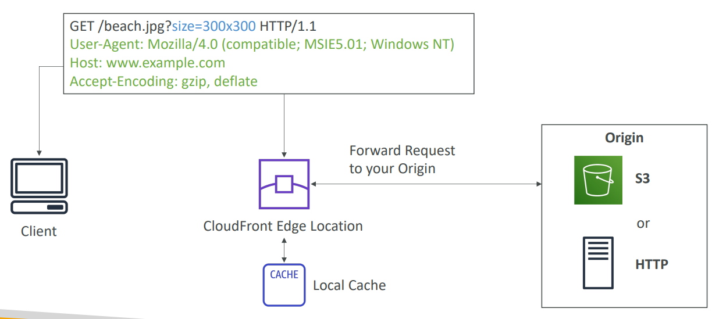

---

### Origins

#### S3 bucket

- For distributing files and **caching** them at the edge
- Enhanced **security** with CloudFront **Origin Access Control (OAC)**
- `OAC` is replacing `Origin Access Identity (OAI)`
- CloudFront can be used **as an ingress (to upload files** to S3)

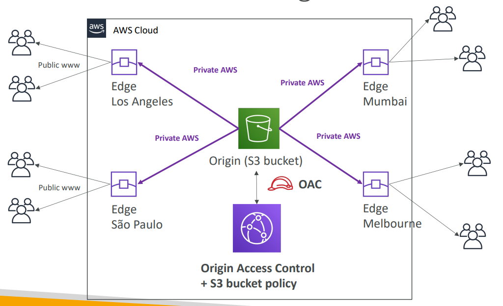

- Sample question: `OAC`
  - You have a static website hosted on an S3 bucket. You have created a CloudFront Distribution that points to your S3 bucket to better serve your requests and improve performance. After a while, you noticed that users can still access your website directly from the S3 bucket. You want to enforce users to access the website only through CloudFront. How would you achieve that?
  - Configure `CloudFront Distribution` and create an `Origin Access Control (OAC)`, then update `S3` Bucket Policy to only accept requests from `CloudFront Distribution`.

---

##### CloudFront vs S3 Cross Region Replication

- `CloudFront`:

  - Global Edge network
  - Files are **cached for a TTL** (maybe a day)
  - Great for **static content** that must be available **everywhere**

- `S3 Cross Region Replication`:
  - Must be **setup for each region** you want replication to happen
  - Files are **updated in near real-time**
  - **Read only**
  - Great for **dynamic content** that needs to be available at **low-latency** in **few regions**

---

##### Hands-on:s3

- Create s3 for cloudfront

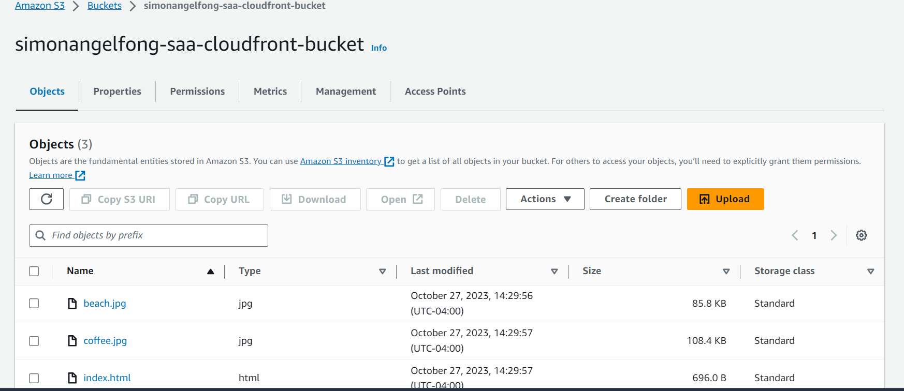

- Create cloudfront distribution

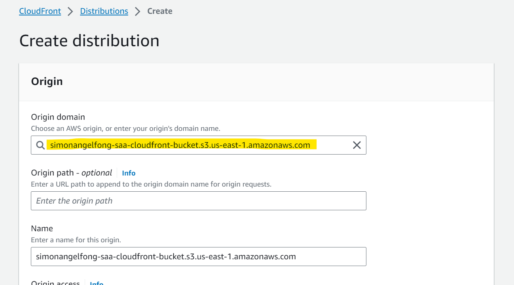

- Create OAC

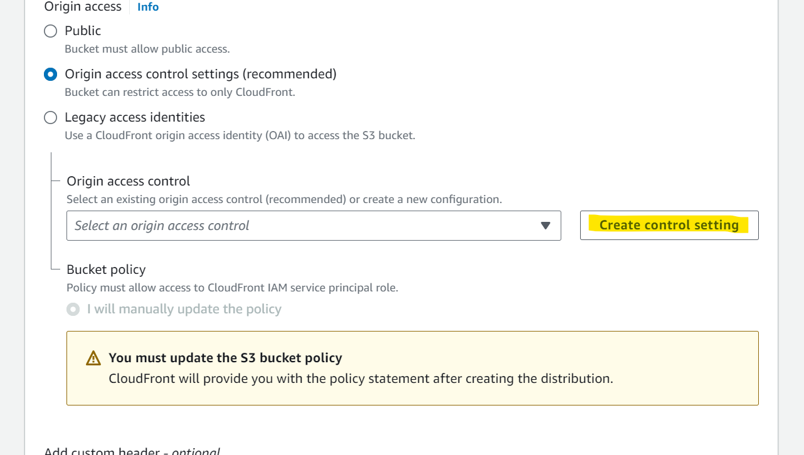

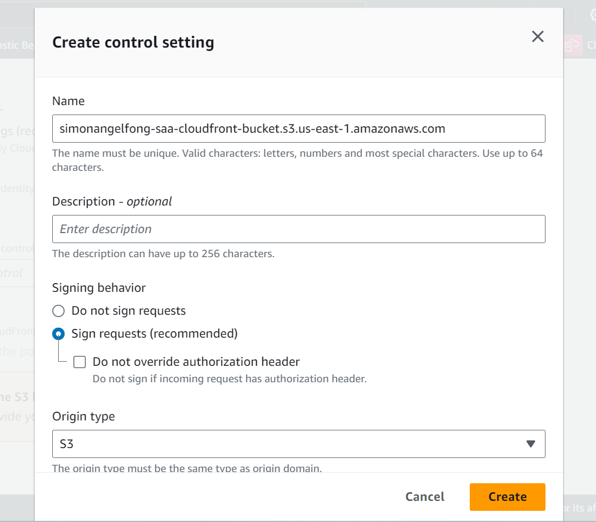

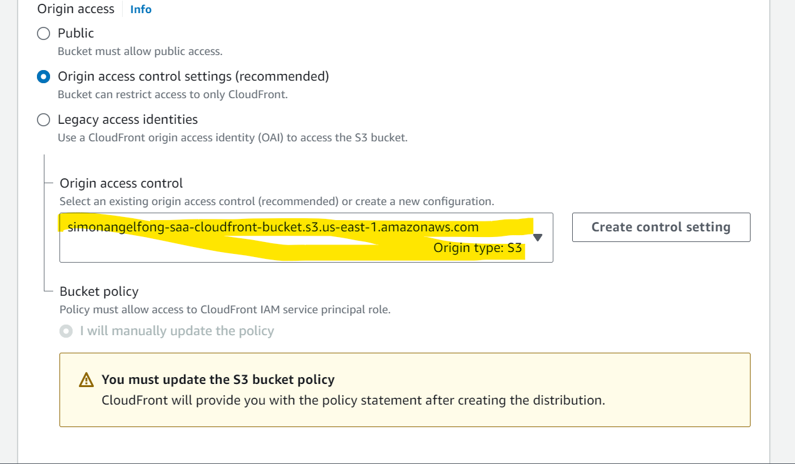

- More configuration of cloudfront

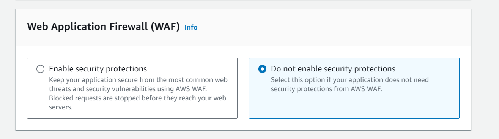

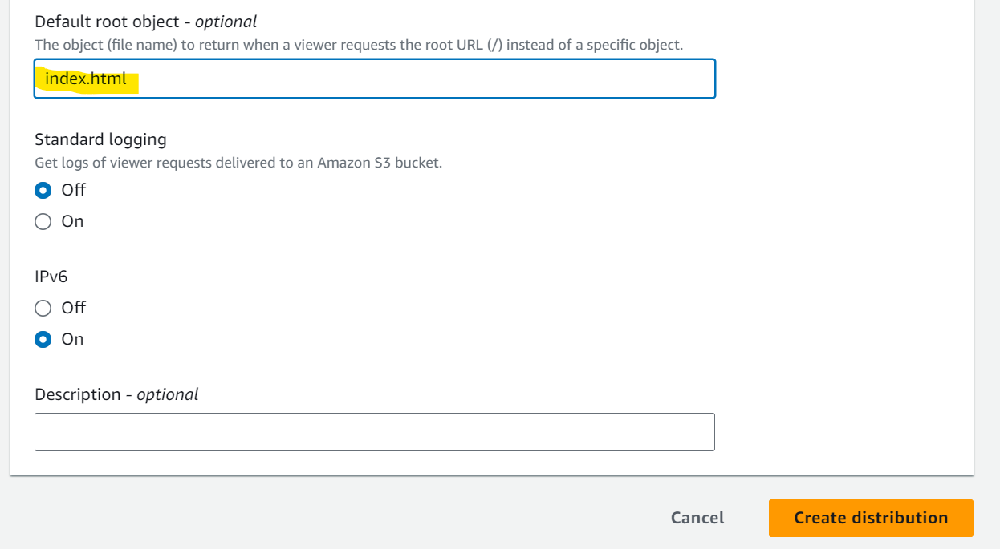

- Update bucket policy for cloudfront

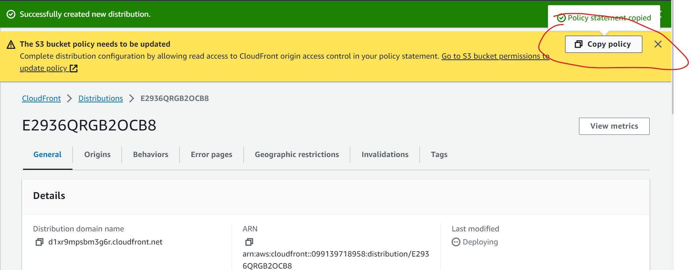

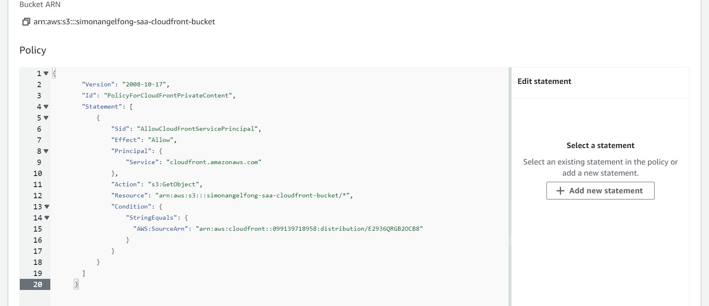

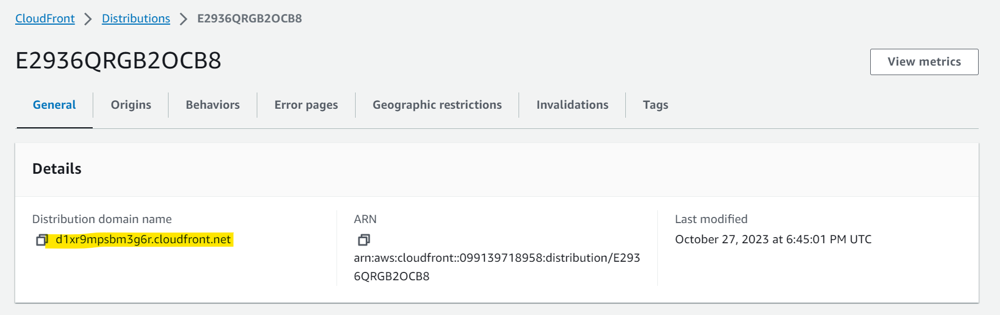

- Related object can be access
  - Object is retrieved from bucket for the first time.
  - Then, object is cached in cloudfront resulting in low lattency.

- OAC

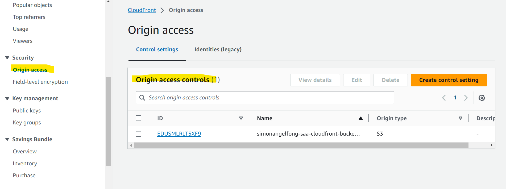

---

#### Custom Origin (HTTP)

- `Application Load Balancer`
- `EC2` instance
- `S3` website (must first enable the bucket as a static S3 website)
- **Any HTTP backend** you want

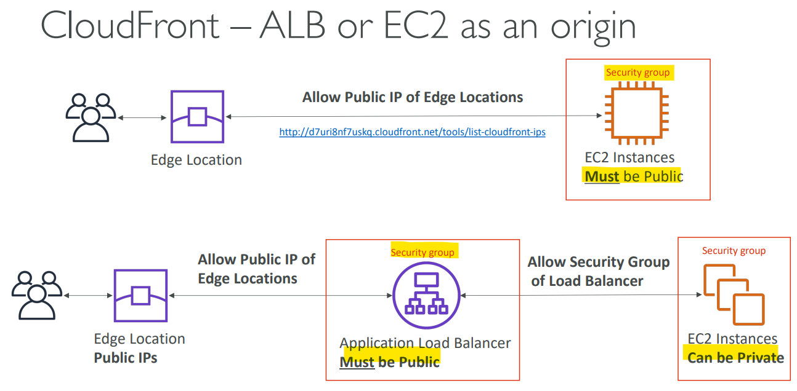

---

### CloudFront Geo Restriction

- You can **restrict who can access** your distribution

- **Allowlist**:
  - **Allow** your users to access your content only if they're in one of the countries on a list of **approved countries**.
- **Blocklist**:

  - **Prevent** your users from accessing your content if they're in one of the countries on a list of **banned countries**.

- The “country” is determined using a 3rd party Geo-IP database

- **Use case**:
  - Copyright Laws to control access to content

---

#### Hands-on: Geo

---

### Price Classes

- CloudFront Edge locations are all around the world
- The **cost** of data out per edge location **varies**

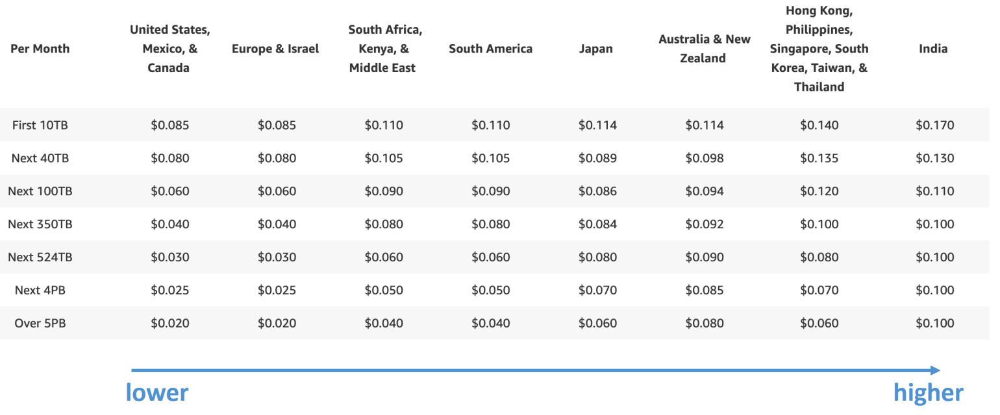

- You can reduce the number of edge locations for cost reduction
- Three price classes:

1. `Price Class All`: **all regions** – best performance
2. `Price Class 200`: **most regions**, but excludes the most expensive regions
3. `Price Class 100`: **only the least expensive regions**

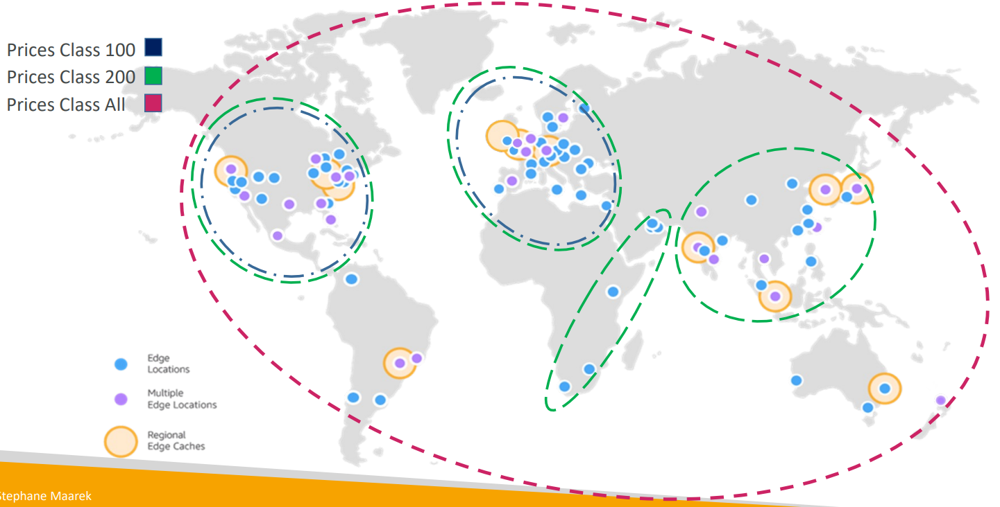

- Sample Question:
  - A company is deploying a media-sharing website to AWS. They are going to use CloudFront to deliver the context with low latency to their customers where they are located in both US and Europe only. After a while there a huge costs for CloudFront. Which CloudFront feature allows you to decrease costs by targeting only US and Europe?
  - CloudFront Price Classes

---

### Cache Invalidations

- In case you update the back-end origin, CloudFront doesn’t know about it and will only get the refreshed content after the TTL has expired

- `CloudFront Invalidation`

  - force an entire or partial cache refresh (thus bypassing the TTL)

- You can invalidate
  - all files (`*`)
  - a special path (`/images/*`)

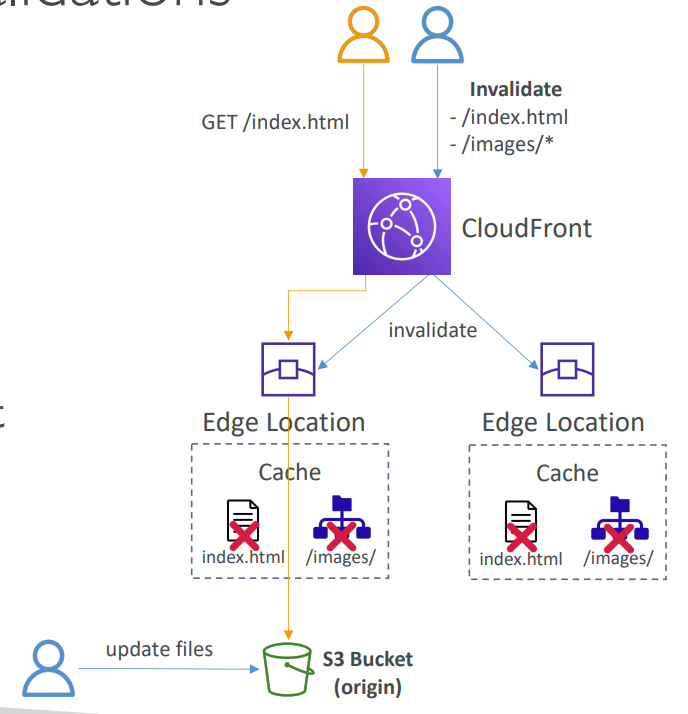

- Sample Question:
  - A WordPress website is hosted in a set of EC2 instances in an EC2 Auto Scaling Group and fronted by a CloudFront Distribution which is configured to cache the content for 3 days. You have released a new version of the website and want to release it immediately to production without waiting for 3 days for the cached content to be expired. What is the easiest and most efficient way to solve this?
  - CloudFront Cache Invalidation

---

## `AWS Global Accelerator`

- `Unicast IP` vs `Anycast IP`
  - `Unicast IP`:
    - one server holds one IP address
  - `Anycast IP`:
    - all servers hold the same IP address and the **client is routed to the nearest one**

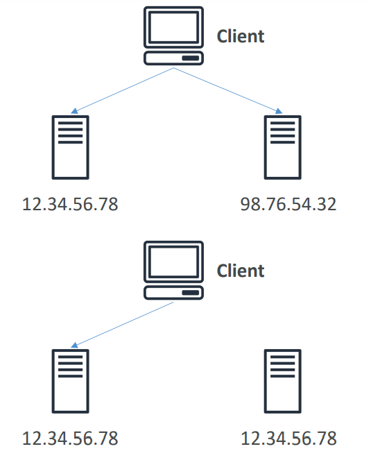

---

- Problem of global users for our application
  - You have deployed an application and have global users who want to access it directly.
  - They go over the public internet, which can add a lot of **latency due to many hops**
  - We wish to go as fast as possible through AWS network to minimize latency

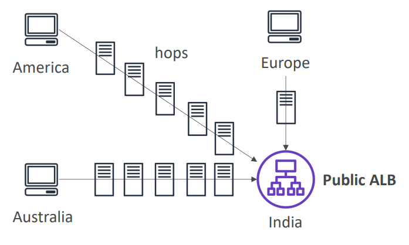

---

- `AWS Global Accelerator`

  - **Leverage the AWS internal network** to route to your application
  - 2 `Anycast IP` are created for your application
    - The `Anycast IP` send traffic **directly to** `Edge Locations`
    - The `Edge locations` send the traffic **to your application**

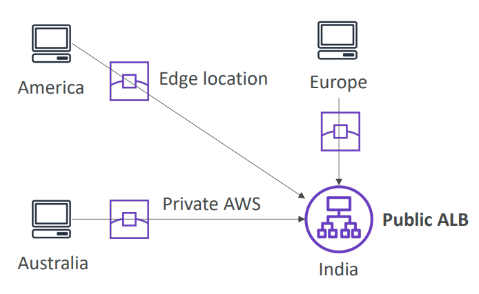

- Works with `Elastic IP`, `EC2` instances, `ALB`, `NLB`, public or private

- **Benefit**:

  - **Consistent Performance**

    - **Intelligent routing** to **lowest latency** and fast regional **failover**
    - No issue with client cache (because the IP doesn’t change)
    - Internal AWS network

  - **Health Checks**

    - Global Accelerator performs a health check of your applications
    - Helps make your application global (failover less than 1 minute for unhealthy)
    - Great for **disaster recovery** (thanks to the health checks)

  - **Security**
    - **only 2 external IP** need to be **whitelisted**
    - **DDoS protection** thanks to `AWS Shield`

---

- Sample question:
  - A company is migrating a web application to AWS Cloud and they are going to use a set of EC2 instances in an EC2 Auto Scaling Group. The web application is made of multiple components so they will need a host-based routing feature to route to specific web application components. This web application is used by many customers and therefore the **web application must have a static IP address** so it can be whitelisted by the customers’ firewalls. As the customers are distributed around the world, the web application must also provide **low latency** to all customers. Which AWS service can help you to assign a static IP address and provide low latency across the globe?
  - AWS Global Accelerator + Application Load Balancer

---

## Global Accelerator vs CloudFront

- **Commons**:

  - They both use the `AWS global network` and its `edge locations` around the world
  - Both services integrate with `AWS Shield` for `DDoS` protection.

- `CloudFront`

  - Improves performance for both
    - **cacheable content** (such as images and videos)
    - **Dynamic content** (such as API acceleration and dynamic site delivery)
  - Content is **served at the edge**

- `Global Accelerator`

  - Improves performance for a wide range of applications **over TCP or UDP**
  - Proxying packets at the edge to applications running in one or more AWS Regions.
  - Good fit for **`non-HTTP` use cases**, such as gaming (`UDP`), IoT (`MQTT`), or Voice over IP
  - Good for **`HTTP` use cases** that require **static IP addresses**
  - Good for **`HTTP` use cases** that required deterministic, fast regional failover

---

[TOP](#aws---cloudfront)
