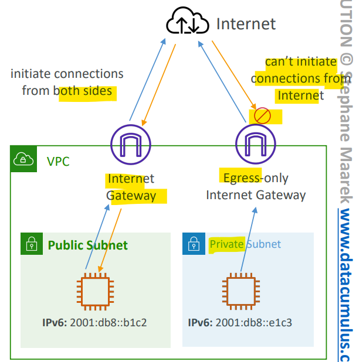
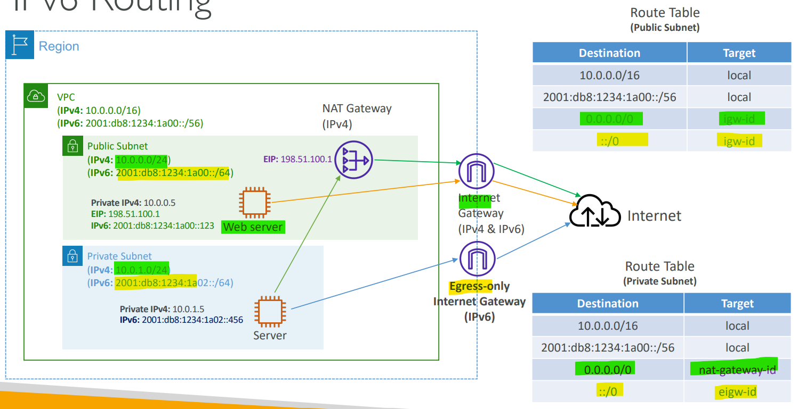
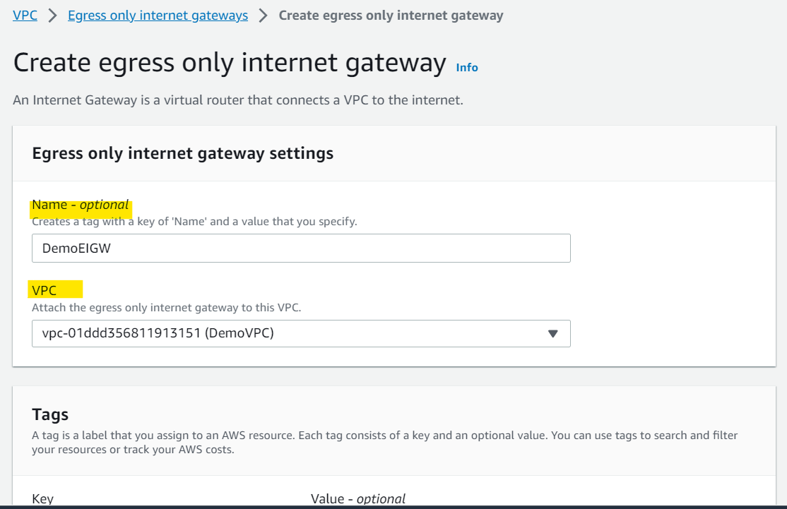
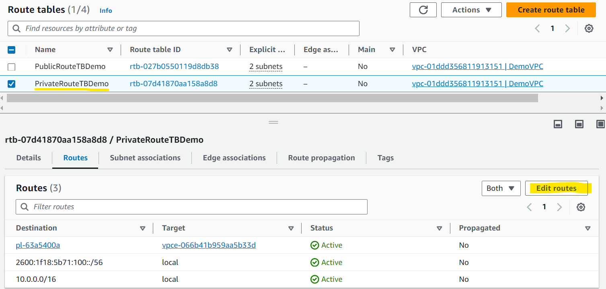
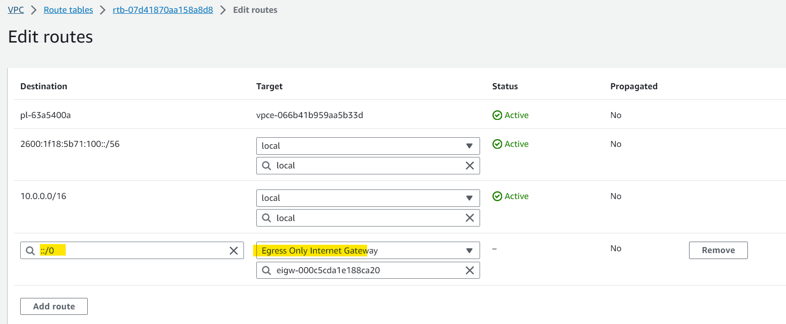

# AWS Networking - Egress-only Internet Gateway

[Back](../index.md)

- [AWS Networking - Egress-only Internet Gateway](#aws-networking---egress-only-internet-gateway)
  - [Egress-only Internet Gateway](#egress-only-internet-gateway)
  - [Routing](#routing)
    - [Hands-on](#hands-on)

---

## Egress-only Internet Gateway

- `Egress-only Internet Gateway`

  - Allows instances in your VPC **outbound connections** over `IPv6` while **preventing** the internet to initiate an IPv6 connection to your instances(only outbound connection) 准出不准入
  - similar to a `NAT Gateway` but for `IPv6`
  - Used for `IPv6` **only**

- You **must update** the `Route Tables`

---

## Routing

- Public Subnet

  - `0.0.0.0/0`, `::/0`: Internet Gateway

- Private Subnet
  - `0.0.0.0/0`: NAT Gateway
  - `::/0`: Egress-only Internet Gateway

---

### Hands-on

- Create an EIGW

- Edit private route table
  - all traffic to Internet via IPv6 route to EIGW

---

[TOP](#aws-networking---egress-only-internet-gateway)
