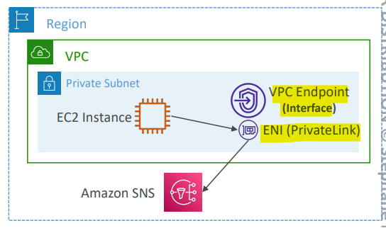

# AWS Networking - VPC Endpoints

[Back](../index.md)

- [AWS Networking - VPC Endpoints](#aws-networking---vpc-endpoints)
  - [VPC Endpoints](#vpc-endpoints)
  - [Types of Endpoints](#types-of-endpoints)
    - [Interface Endpoints(IP+SG+most)](#interface-endpointsipsgmost)
    - [Gateway Endpoints(Route TB+s3/dynamo)](#gateway-endpointsroute-tbs3dynamo)
    - [Choice on S3](#choice-on-s3)
    - [Hands-on](#hands-on)

---

## VPC Endpoints

- `VPC Endpoints`

  - powered by `AWS PrivateLink`
  - allows you to connect to AWS services **using a private network** instead of using the public Internet
    - Every AWS service is **publicly exposed (public URL)**

- Feature

  - They’re redundant and scale horizontally
  - They remove the need of IGW, NATGW, … to access AWS Services

- In case of issues:

  - Check DNS Setting Resolution in your VPC
  - Check Route Tables

- Example:
  - ec2 in **public** subnet: IGW(no charge) -> SNS(public)
  - ec2 in **private** subnet: NATGW(costly) -> IGW(no charge) -> SNS(public)
  - ec2 in **private** subnet: vpc endpoint -> SNS(private)

---

## Types of Endpoints

### Interface Endpoints(IP+SG+most)

- `Interface Endpoints` (powered by `PrivateLink`)
  - Provisions an `ENI (private IP address)` as an **entry point** (must **attach a Security Group**)
  - Supports most AWS services
  - \$ per hour + $ per GB of data processed

---

### Gateway Endpoints(Route TB+s3/dynamo)

- `Gateway Endpoints`
  - Provisions a gateway and must be used **as a target in a route table** (does not use security groups)
  - Supports both **S3 and DynamoDB**
  - **Free**

- Sample:
  - When using VPC Endpoints, what are the only two AWS services that have a Gateway Endpoint available?
    - S3+dynamoDB: **Gateway Endpoint** (remember it),
    - all the other ones have an **Interface endpoint** (powered by Private Link - means a **private IP**).

---

### Choice on S3

- Both Interface and Gateway Endpoints support S3

- `Gateway` is most likely going to be **preferred** all the time at the exam

  - no sg / IP; Route table only
  - Cost:
    - **free** for Gateway,
    - $ for interface endpoint

- Interface Endpoint is preferred access is
  - **required from on-premises** (Site to Site VPN or Direct Connect),
  - a **different VPC**
  - or a **different region**

---

### Hands-on

- Create a Bastion public and private instance.

- Create a new IAM role for this instance with S3ReadOnlyAccess permission.

- Try to connect public internet: fails because the private instance locates in the private VPC.
  - try to access S3: fails because cannot access the public internet.

- Create Endpoints

- Check the route table
  - pl-63a5400a: the prefix of S3
  - target will be the endpoint
  - Request for S3 will route to endpoint.

- Outcome
  - private instance cannot access to internet
  - private instance can access to S3 via Endpoint Gateway

---

[TOP](#aws-networking---vpc-endpoints)
