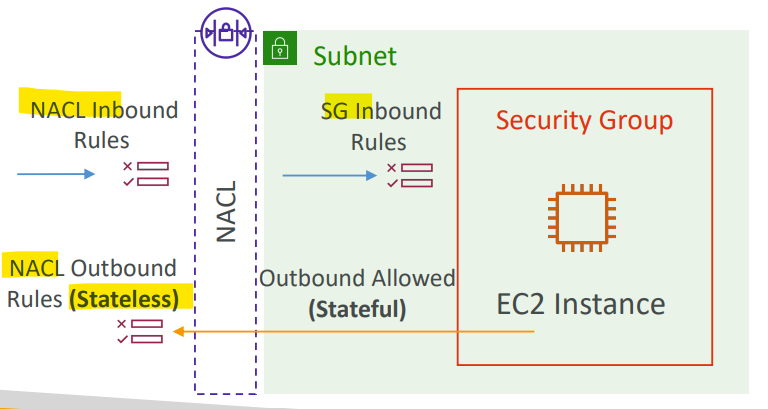
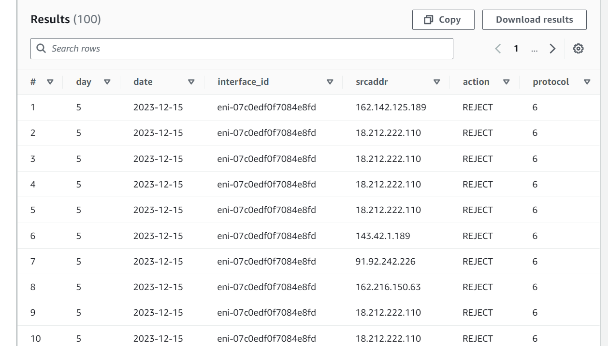

# AWS Networking - Flow Logs

[Back](../index.md)

- [AWS Networking - Flow Logs](#aws-networking---flow-logs)
  - [VPC Flow Logs](#vpc-flow-logs)
    - [Syntax](#syntax)
    - [Troubleshoot SG \& NACL issues](#troubleshoot-sg--nacl-issues)
    - [Architectures](#architectures)
    - [Hands-on](#hands-on)

---

## VPC Flow Logs

- Capture **information about IP traffic** going into your interfaces:

  - **VPC** Flow Logs
  - **Subnet** Flow Logs
  - **Elastic Network Interface (ENI)** Flow Logs

- Helps to **monitor & troubleshoot** connectivity issues
- Flow logs data can go to `S3`, `CloudWatch Logs`, and `Kinesis Data Firehose`
- Captures network information from **AWS managed interfaces** too:

  - ELB, RDS, ElastiCache, Redshift, WorkSpaces, NATGW, Transit Gateway…

- Sample:
  - How can you capture information about IP traffic inside your VPCs?
    - Enable VPC Flow Logs
    - Traffic Mirroring is copying.

---

### Syntax

- `srcaddr` & `dstaddr` – help identify problematic **IP**
- `srcport` & `dstport` – help identity problematic **ports**
- `Action` – success or failure of the **request** due to Security Group / NACL
- Can be used for analytics on **usage patterns**, or **malicious behavior**
- **Query** VPC flow logs using `Athena` on `S3` or `CloudWatch Logs Insights`
- Flow Logs examples: https://docs.aws.amazon.com/vpc/latest/userguide/flow-logs- records-examples.html

---

### Troubleshoot SG & NACL issues

- Look at the `ACTION` field

- Incoming Requests
  - Inbound `REJECT` => `NACL` or `SG`
  - Inbound `ACCEPT`, Outbound `REJECT` => `NACL` (stateless, sg=stateful)

- Outgoing Requests
  - Outbound `REJECT` => `NACL` or `SG`
  - Outbound `ACCEPT`, Inbound `REJECT` => `NACL`(stateless, sg=stateful)

---

### Architectures

- Top-10:
  - CloudWatch + Contributor

- Alarm + SNS

- Analysis

---

### Hands-on

- Create flow log: s3

---

- Analyze using Athena with S3

- Create a bucket for athena

- Specify the location of Athena's query result

- Create Athena table for flow log

  - ref: https://docs.aws.amazon.com/athena/latest/ug/vpc-flow-logs.html
  - Modify location

- Location of URI in the S3 where flow log is stored.

- Create table

- Alter table for dates

- URI to replace

- Alter table

- Query

---

- Create a new role

- Create a log group in CW

- Create flow log: cw

- In CW logs

---

[TOP](#aws-networking---flow-logs)
