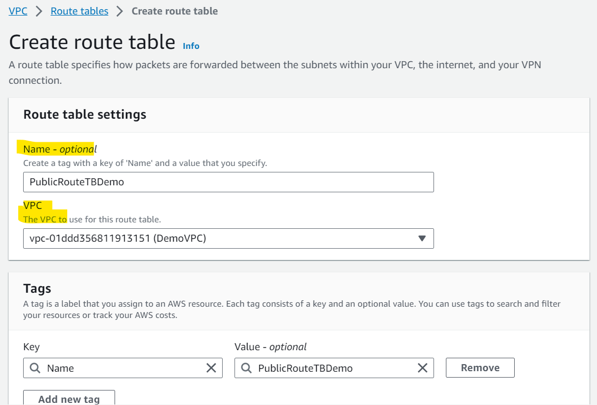

# AWS - Internet Gateway (IGW)

[Back](../index.md)

- [AWS - Internet Gateway (IGW)](#aws---internet-gateway-igw)
  - [`Internet Gateway (IGW)`](#internet-gateway-igw)
    - [Hands-on](#hands-on)

---

## `Internet Gateway (IGW)`

- no charge
- Allows resources (e.g., `EC2 instances`) in a `VPC` connect to the Internet
- It scales **horizontally** and is highly **available** and **redundant**
- Must be **created separately from** a `VPC`
- **One** `VPC` can **only** be attached to **one** `IGW` and vice versa 一对一
- Internet Gateways _on their own_ **do not allow** Internet access…
- `Route tables` **must** also be edited!

---

### Hands-on

- Create EC2 with a subnect

- Try to connect with ssh
  - fail due to lack of internet gateway

- Create a gateway

- Attatch to a VPC

- Create Route Table
  - 1 Public
  - 1 Private

- Associate to subnects

- Edit route
  - if the ip matching the first, route to local
  - `0.0.0.0/0` => **all IPs**,
    - if not match the first route, route to `IGW`

- Result
  - Gateway + Route table = access to internet

---

[TOP](#aws---internet-gateway-igw)
