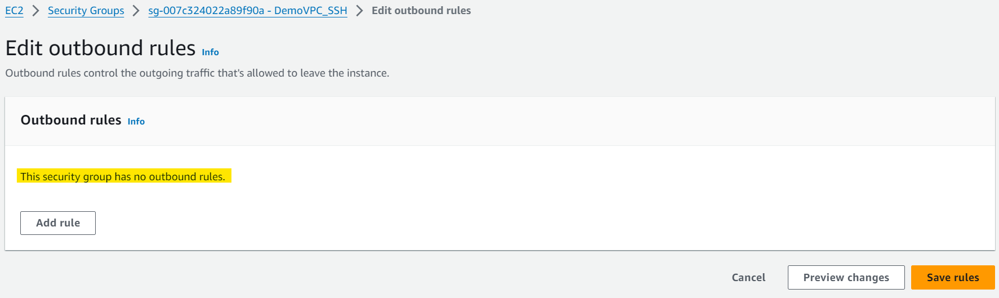

# AWS Networking - NACL

[Back](../index.md)

- [AWS Networking - NACL](#aws-networking---nacl)
  - [Network Access Control List (NACL)](#network-access-control-list-nacl)
  - [NACL vs SG](#nacl-vs-sg)
  - [Default NACL 常考](#default-nacl-常考)
  - [Ephemeral Ports](#ephemeral-ports)
  - [Create NACL rules for each target subnets CIDR](#create-nacl-rules-for-each-target-subnets-cidr)
  - [Security Group vs. NACLs](#security-group-vs-nacls)
  - [Hands-on](#hands-on)

---

## Network Access Control List (NACL)

- `Network Access Control List (NACL)`

- NACL are like a **firewall** which control traffic **from and to subnets**
- **One NACL per subnet**, new subnets are assigned the Default NACL. 一对一. 新归默认.
- You define NACL Rules:
  - Rules have a number (1-32766), higher precedence with a lower number
    - 1: highest priority
  - **First rule match** will drive the decision. 首现决定.
    - Example: if you define #100 ALLOW 10.0.0.10/32 and #200 DENY 10.0.0.10/32, the IP address will be allowed because 100 has a higher precedence over 200
    - Precedence of 100 > Precedence of 200
  - The last rule is an asterisk (`*`) and **denies** a request in case of no rule match
  - AWS recommends adding rules by increment of 100
- Newly created NACLs will deny everything
- NACL are a great way of **blocking** a specific **IP** address **at the subnet level**

---

- an extra layer outside the subnet
  - NACL > Subnet > Security Group
  - Request will be denied unless explicitily allowed.
  - 一对一

---

## NACL vs SG

|        | NACL      | SG        |
| ------ | --------- | --------- |
| State  | Stateless | Statefull |
| Subnet | Outside   | Inside    |

- Stateful:

  - whatever is accepted in can also goes out.(no rules being evaluated)

- Stateless:

  - No matter it has been accepted, NACL rules are evaluated.

- Incoming Request
  - The inbound request is evaluated **by NACL rules**.
  - The inbound request is evaluated **by SG**.
  - The outbound request is **not evalued by SG** due to stateful.
  - The outbound request is **evalued by SG** due to stateless.

- Incoming Request
  - The inbound request is evaluated **by NACL rules**.
  - The inbound request is evaluated **by SG**.
  - The outbound request is **not evalued by SG** due to stateful.
  - The outbound request is **evalued by SG** due to stateless.

- Sample:
  - You have attached an Internet Gateway to your VPC, but your EC2 instances still don't have access to the internet. What is NOT a possible issue?
    - The Security Group does not allow traffic in
    - Security groups are stateful and if traffic can go out, then it can go back in.
    - can be possible:
      - Route tables are missing entries(local)
      - EC2 instance don't have public IP
      - NACL not allow network traffic out
  - A web application hosted on a fleet of EC2 instances managed by an Auto Scaling Group. You are exposing this application through an Application Load Balancer. Both the EC2 instances and the ALB are deployed on a VPC with the following CIDR 192.168.0.0/18. How do you configure the **EC2 instances' security group** to ensure **only the ALB** can access them on port 80?
    - Add an Inbound Rule with port 80 and ALB's SG as the source.
    - Referencing by security groups in rules is an extremely powerful rule
    - ALB 一定在 pubic 子网, 所以不能引用 CIDR

---

## Default NACL 常考

- **Accepts everything** inbound/outbound with the subnets it’s associated with
  - 考点:关联的 VPC 将 open to everything
- Do **NOT modify** the Default NACL, instead **create** custom NACLs

---

## Ephemeral Ports

- `Ephemeral Ports`

  - a random port that is assigned only for connection life.
  - refer to the port on the client when connecting.

- For any two endpoints to establish a connection, they must use ports
- Clients connect to a **defined port**, and expect a **response on an ephemeral port**
  - When client is connecting to a server, the client will open a specific ports,which is ephemeral because it will be as long lived as the connection is between clients and server.
- Different **Operating Systems** use different port ranges, examples:
  - IANA & MS Windows 10: 49152 – 65535
  - Many Linux Kernels: 32768 – 60999

---

- NACL with Ephemeral Ports
  - 在 NACL 中会使用
  - example: request for DB

---

## Create NACL rules for each target subnets CIDR

- If a new target subnet is added, new nacle rules for the new subnet cidr should be updated.

---

## Security Group vs. NACLs

| Security                                                 | Group NACL                                                                                 |
| -------------------------------------------------------- | ------------------------------------------------------------------------------------------ |
| **instance** level                                       | **subnet** level                                                                           |
| Supports **allow** rules **only**                        | Supports **allow** rules and **deny** rules                                                |
| `Stateful`                                               | `Stateless`                                                                                |
| **All** rules are evaluated                              | Rules are evaluated in **order** (lowest to highest) , first match wins                    |
| Applies to **an** EC2 instance when specified by someone | Automatically applies to **all** EC2 instances **in the subnet** that it’s associated with |

- `Stateful`:
  - return traffic is **automatically allowed**, regardless of any rules
- `Stateless`:
  - return traffic **must be explicitly allowed** by rules (think of ephemeral ports)

---

## Hands-on

- Default NACL

---

- Connect an instance
  - Install `Apache HTTP Server` package: `sudo yum -y install httpd`
  - Enable httpd: `sudo systemctl enable httpd`
  - Status of httpd: `sudo systemctl enable httpd`
  - Start httpd service: `sudo systemctl enable httpd`
  - Using root: `sudo su`
  - Create http files: `echo "hello world" > /var/www/html/index.html`

- Enable http for inbound rule of SG

- Visit via public ip

- Edit NACL of this instance's subnet
  - Deny HTTP

- Outcome:
  - Not response due to deny rule

---

- Edit the rule number

- Outcome:
  - accessible due to the precedence of http rule

---

- edit the outbound rule

- Outcome:
  - cannot access
  - even though security group allows, meaning stateless.

- edit sg:
  - delete every outbound rules.

- edit the outbound rule of NACL
  - allow every rules

- Outcome:
  - can access
  - SG is statefule. Even if there is no SG, website is accessible as long as NACL allows.

---

[TOP](#aws-networking---nacl)
