# AWS Networking - NAT Gateway

[Back](../index.md)

- [AWS Networking - NAT Gateway](#aws-networking---nat-gateway)
  - [`NAT` Instance (outdated, but still at the exam)](#nat-instance-outdated-but-still-at-the-exam)
  - [`NAT Gateway`](#nat-gateway)
    - [High Availability](#high-availability)
    - [`NAT Gateway` vs. `NAT Instance`](#nat-gateway-vs-nat-instance)
    - [Hands-on](#hands-on)

---

## `NAT` Instance (outdated, but still at the exam)

- `NAT` / `Network Address Translation`

- `NAT Instance`

  - Allows EC2 instances in private subnets to connect to the Internet

- Features

  - Must be **launched** in a `public subnet`
  - Must **disable** EC2 setting:
    - **Source / destination Check**
    - because some ip address will be rewritten.
  - Must have `Elastic IP` attached to it
  - `Route Tables` must be configured to route traffic from private subnets to the `NAT` Instance

- 虽然过时, 但考试会涉及 NAT Instance 和 NAT Gateway 的差别.

- Limitations:

  - Pre-configured Amazon Linux **AMI** is available
    - Reached the end of standard support on **December 31, 2020**
  - **Not highly available / resilient** setup out of the box
    - You need to create an `ASG` in **multi-AZ** + resilient **user-data script**
  - Internet **traffic bandwidth** depends on EC2 instance type
  - You must manage Security Groups & rules:
    - Inbound:
      - Allow `HTTP / HTTPS` traffic coming from `Private Subnets`
      - Allow `SSH` from your **home network** (access is provided through Internet Gateway)
    - Outbound:
      - Allow `HTTP / HTTPS traffic` to the Internet

- 以下, 注意 scr 和 dest 的改变.
  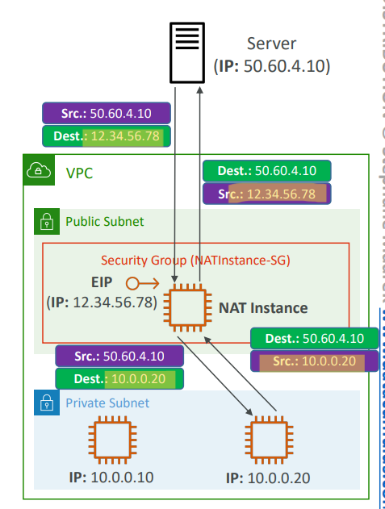

---

- Hands-on: Skip
- Edit route table in private subnet
  - when talk to the internet, route target is the NAT instance

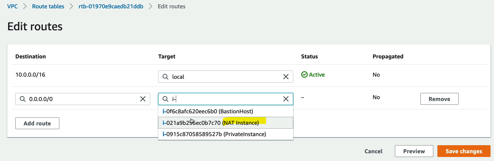

- Edit SG of NAT instace to allow inbound traffic

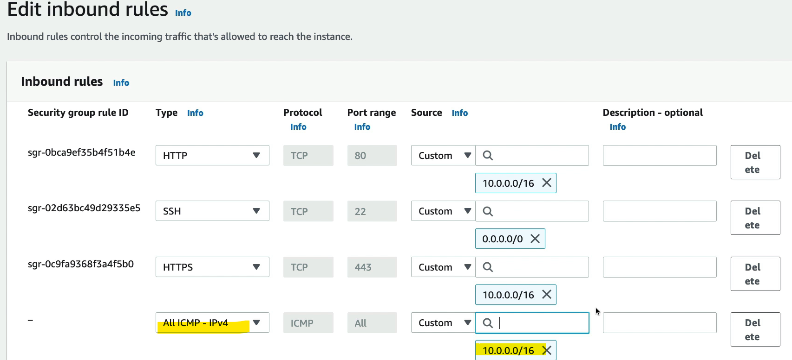

- 设置后, private instance 可以通过 NAT instance 访问 internet.

---

## `NAT Gateway`

- **AWS-managed** `NAT`, higher **bandwidth**, high **availability**, no **administration**
- Pay per hour for _usage_ and _bandwidth_
- `NATGW` is created in a specific Availability Zone, uses an `Elastic IP`
- Can’t be used by EC2 instance in the same subnet (**only from other subnets**)
  - commonly created in public subnect, then connected by a private subnet.
- Requires an `IGW`
  - `Private Subnet` => `NATGW` => `IGW`
- `5` Gbps of bandwidth with automatic scaling up to `100` Gbps
- **No Security Groups** to manage / required

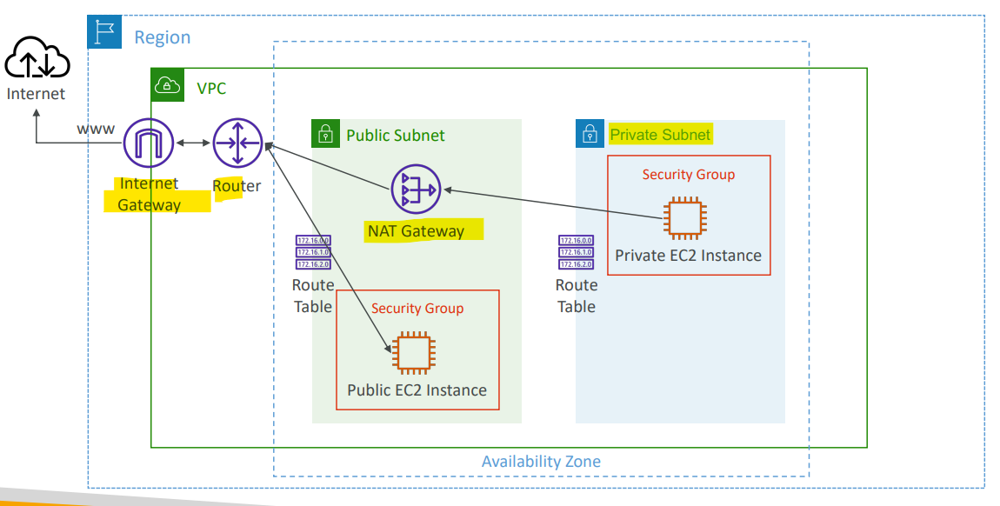

---

### High Availability

- `NAT Gateway` is **resilient** within a **single** `Availability Zone`
- Must create **multiple** `NAT Gateways` in **multiple** `AZs` for **fault-tolerance**
- There is **no cross-AZ failover needed** because if an AZ goes down it doesn't need NAT

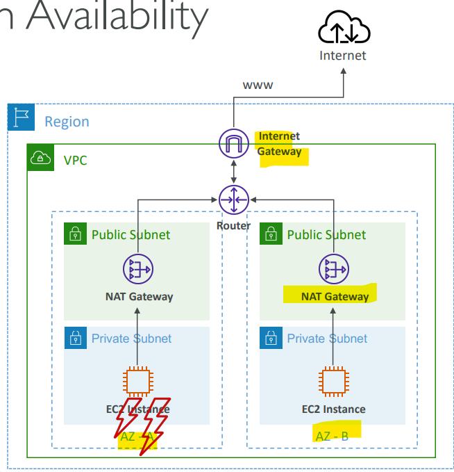

---

### `NAT Gateway` vs. `NAT Instance`

|                      | `NAT Gateway`                                             | `NAT Instance`                                        |
| -------------------- | --------------------------------------------------------- | ----------------------------------------------------- |
| Availability         | **Highly** available within **AZ** (create in another AZ) | Use a **script** to manage failover between instances |
| Bandwidth            | Up to 100 Gbps                                            | Depends on EC2 **instance type**                      |
| Maintenance          | Managed **by AWS** Managed                                | by you (e.g., software, OS patches, …)                |
| Cost                 | Per hour & amount of data transferred                     | Per hour, EC2 instance type and size, + network $     |
| **Public** IPv4      | Y                                                         | Y                                                     |
| **Private** IPv4     | Y                                                         | Y                                                     |
| Security Groups      | **N**                                                     | Y                                                     |
| Use as Bastion Host? | **N**                                                     | Y                                                     |

- Sample:
  - You would like to provide Internet access to your EC2 instances in private subnets with **IPv4** while making sure this solution requires **the least amount of administration** and **scales seamlessly**. What should you use?
    - NAT Gateway

---

### Hands-on

- Using the EC2 instance created in Bastion Instance.
  - the private instance cannot connect to the internet.

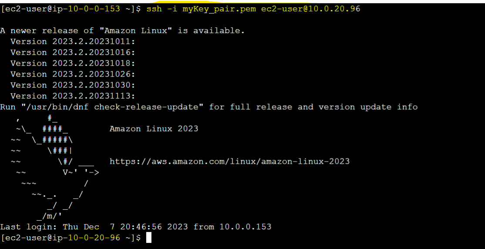

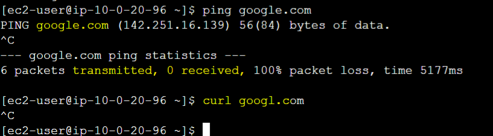

- Create a NAT gateway

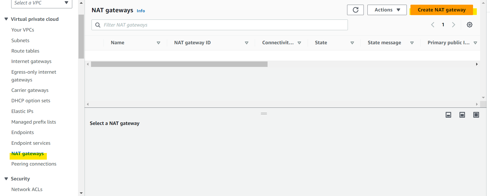

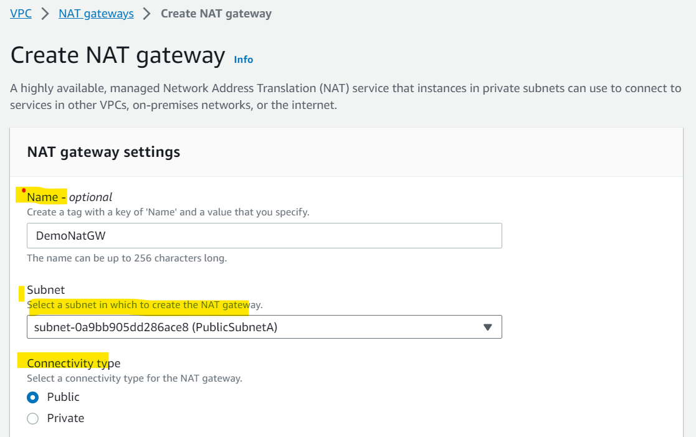

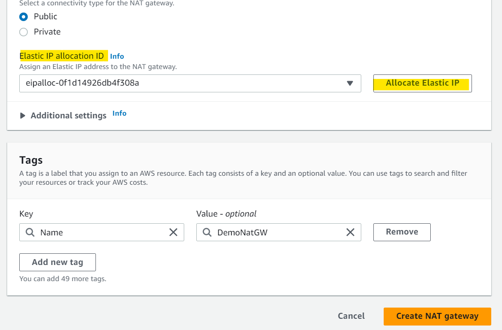

- Edit a route table of a subnet
  - when connecting to internet, target will be the nat gateway.

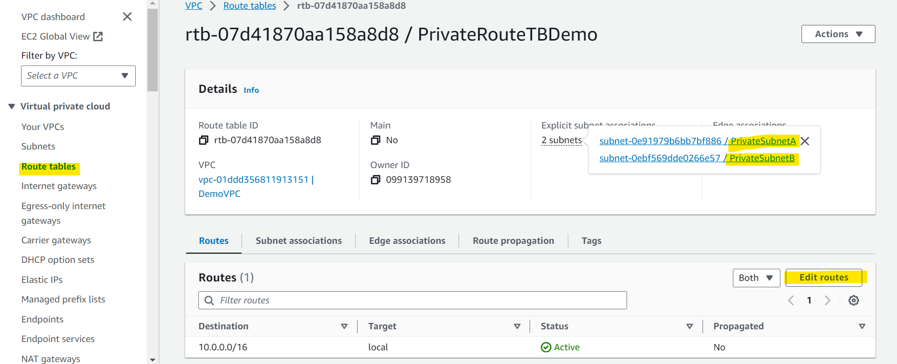

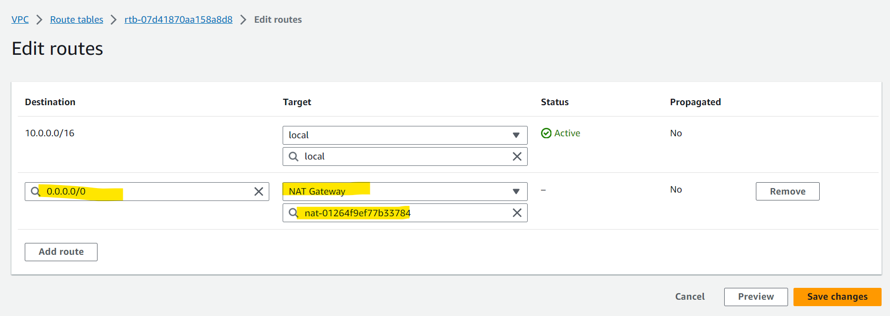

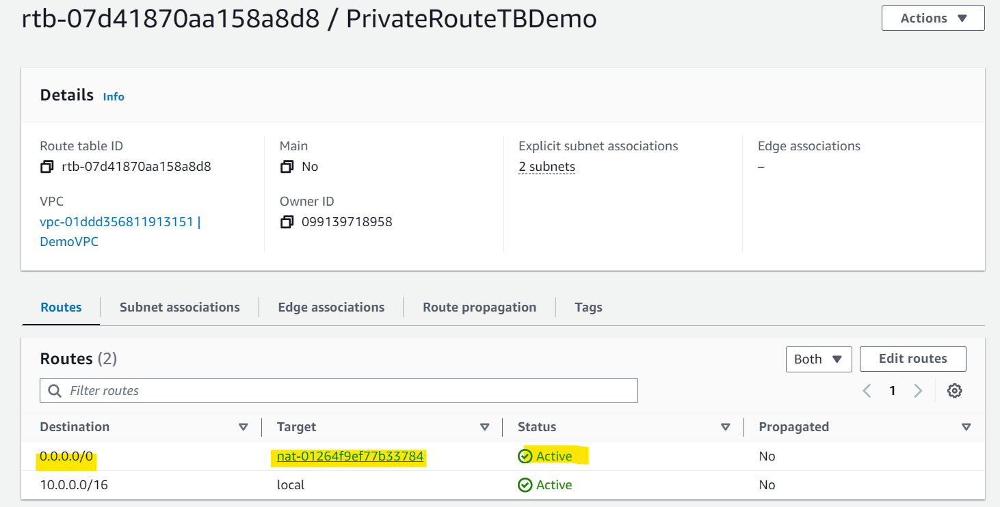

- Test instance in private subnet
  - now instance in private subnet can access to the internet.

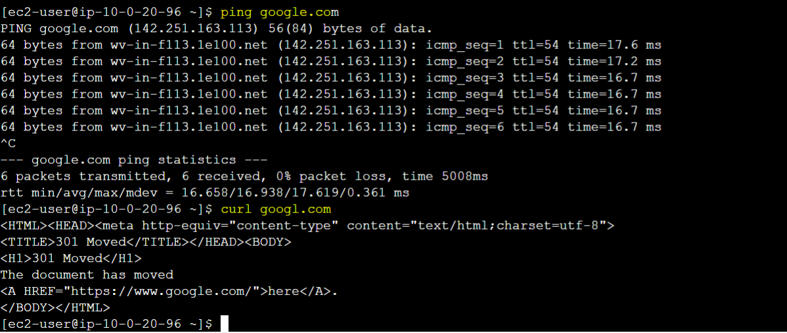

---
