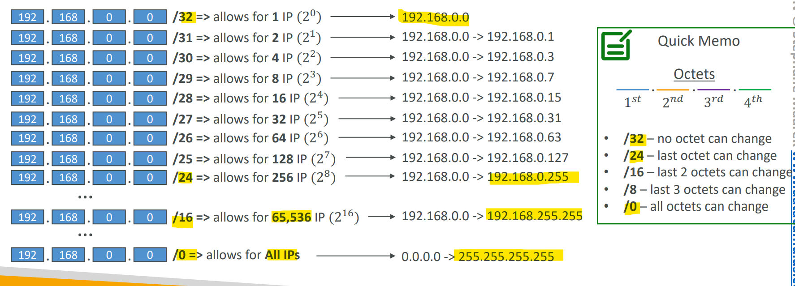

# AWS - Networking

[Back](../index.md)

- [AWS - Networking](#aws---networking)
  - [CIDR – IPv4](#cidr--ipv4)
    - [Subnet Mask](#subnet-mask)
  - [Public vs. Private IP (IPv4)](#public-vs-private-ip-ipv4)

---

## CIDR – IPv4

- `Classless Inter-Domain Routing`

  - a method for **allocating IP addresses**
  - Used in `Security Groups` rules and `AWS networking` in general

- They help to define an IP address range:

  - We’ve seen WW.XX.YY.ZZ/32 => **one IP**
  - We’ve seen `0.0.0.0/0` => **all IPs**
  - But we can define:192.168.0.0/26 =>192.168.0.0 – 192.168.0.63 (64 IP addresses)

- `CIDR`

  - consists of two components, `Base IP` and `Subnet Mask`

- `Base IP`

  - Represents an IP contained in the range (XX.XX.XX.XX)
  - e.g.: 10.0.0.0, 192.168.0.0, …

- `Subnet Mask`

  - Defines **how many bits can change** in the IP
  - e.g.: `/0`, `/24`, `/32`

---

### Subnet Mask

- Can take two forms:

  - `/8` <=> `255.0.0.0`
  - `/16` <=> `255.255.0.0`
  - `/24` <=> `255.255.255.0`
  - `/32` <=> `255.255.255.255`

- The `Subnet Mask` basically allows part of the underlying IP to get additional next values from the base IP

- `ip/num` => number of IP = `2^(32-num)` => `32-num` octets can change

---

## Public vs. Private IP (IPv4)

- The `Internet Assigned Numbers Authority (IANA)` established certain blocks of IPv4 addresses for the use of `private (LAN)` and `public (Internet)` addresses

- `Private IP` can only allow certain values:

  - `10.0.0.0` - `10.255.255.255 (10.0.0.0/8)` <= in big networks
  - `172.16.0.0` - `172.31.255.255 (172.16.0.0/12)` <= AWS **default VPC** in that range
  - `192.168.0.0` - `192.168.255.255 (192.168.0.0/16)` <= e.g., home networks

- `Public IP`:
  - All the rest of the IP addresses on the Internet are

---

[TOP](#aws---networking)
