# AWS - Networking

[Back](../index.md)

- [AWS - Networking](#aws---networking)
  - [CIDR – IPv4](#cidr--ipv4)
    - [Subnet Mask](#subnet-mask)
  - [Public vs. Private IP (IPv4)](#public-vs-private-ip-ipv4)
  - [IPv6](#ipv6)
    - [IPv6 in VPC](#ipv6-in-vpc)
    - [Troubleshooting(会考)](#troubleshooting会考)
    - [Hands-on](#hands-on)
  - [VPC Summary](#vpc-summary)
    - [Connection](#connection)
    - [Connect on-site](#connect-on-site)
    - [Private Subnet -\> Internet](#private-subnet---internet)
    - [Security](#security)
    - [Monitoring](#monitoring)

---

## CIDR – IPv4

- `Classless Inter-Domain Routing`

  - a method for **allocating IP addresses**
  - Used in `Security Groups` rules and `AWS networking` in general

- They help to define an IP address range:

  - We’ve seen WW.XX.YY.ZZ/32 => **one IP**
  - We’ve seen `0.0.0.0/0` => **all IPs**
  - But we can define:192.168.0.0/26 =>192.168.0.0 – 192.168.0.63 (64 IP addresses)

- `CIDR`

  - consists of two components, `Base IP` and `Subnet Mask`

- `Base IP`

  - Represents an IP contained in the range (XX.XX.XX.XX)
  - e.g.: 10.0.0.0, 192.168.0.0, …

- `Subnet Mask`

  - Defines **how many bits can change** in the IP
  - e.g.: `/0`, `/24`, `/32`

---

### Subnet Mask

- Can take two forms:

  - `/8` <=> `255.0.0.0`
  - `/16` <=> `255.255.0.0`
  - `/24` <=> `255.255.255.0`
  - `/32` <=> `255.255.255.255`

- The `Subnet Mask` basically allows part of the underlying IP to get additional next values from the base IP

- `ip/num` => number of IP = `2^(32-num)` => `32-num` octets can change

---

## Public vs. Private IP (IPv4)

- The `Internet Assigned Numbers Authority (IANA)` established certain blocks of IPv4 addresses for the use of `private (LAN)` and `public (Internet)` addresses

- `Private IP` can only allow certain values:

  - `10.0.0.0` - `10.255.255.255 (10.0.0.0/8)` <= in big networks
  - `172.16.0.0` - `172.31.255.255 (172.16.0.0/12)` <= AWS **default VPC** in that range
  - `192.168.0.0` - `192.168.255.255 (192.168.0.0/16)` <= e.g., home networks

- `Public IP`:
  - All the rest of the IP addresses on the Internet are

---

## IPv6

- `IPv4` designed to provide **4.3 Billion** addresses (they’ll be exhausted soon)

- `IPv6`

  - the **successor** of IPv4
  - designed to provide 3.4 × 10^38 unique IP addresses

- Every IPv6 address is **public** and **Internet-routable** (no private range)
- Format: x.x.x.x.x.x.x.x (x is **hexadecimal**, range can be from `0000` to `ffff`)
- Examples:
  - `2001:db8:3333:4444:5555:6666:7777:8888`
  - `2001:db8:3333:4444:cccc:dddd:eeee:ffff`
  - `::`: all 8 segments are zero
  - `2001:db8::`: the last 6 segments are zero
  - `::1234:5678`: the first 6 segments are zero
  - `2001:db8::1234:5678`: the middle 4 segments are zero

---

### IPv6 in VPC

- `IPv4` **cannot be disabled** for your VPC and subnets
- You can **enable** `IPv6` (they’re public IP addresses) to operate in `dual-stack mode`
  - Your EC2 instances will get at least a **private internal** `IPv4` and a **public** `IPv6`
  - They can communicate using **either** `IPv4` or `IPv6` to the internet through an `Internet Gateway`

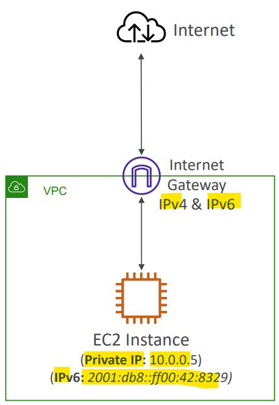

- Sample:
  - You have a VPC in your AWS account that runs in a dual-stack mode. You are continuously trying to launch an EC2 instance, but it fails. After further investigation, you have found that you are **no longer have IPv4 addresses** available. What should you do?
    - add an additional IPv4 CIDR to VPC

---

### Troubleshooting(会考)

- IPv4 cannot be disabled for your VPC and subnets
- So, if you cannot launch an EC2 instance in your subnet
  - It’s **not because it cannot acquire** an `IPv6` (the space is very large)
  - It’s because there are **no available** `IPv4` in your subnet
- **Solution**:
  - create a **new** `IPv4` **CIDR** in your subnet

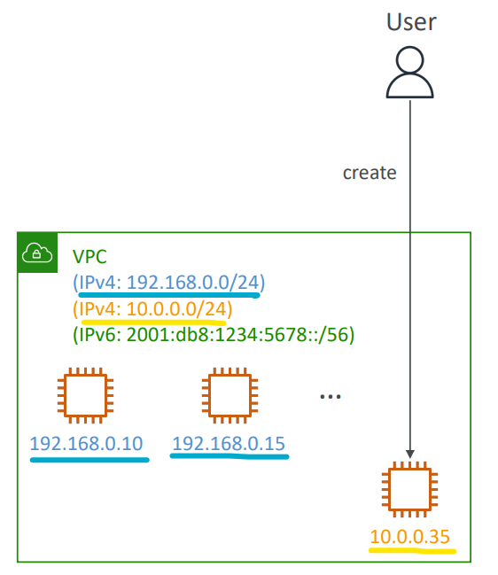

---

### Hands-on

- Enable IPv6 within a VPC

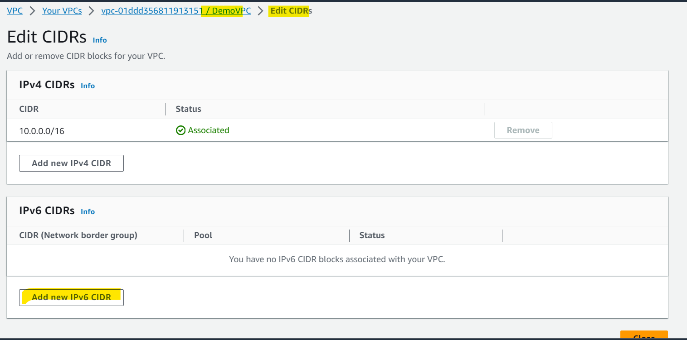

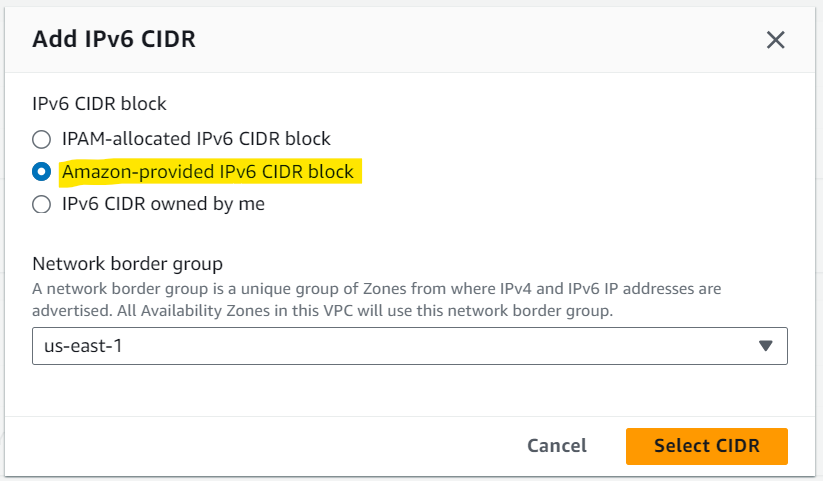

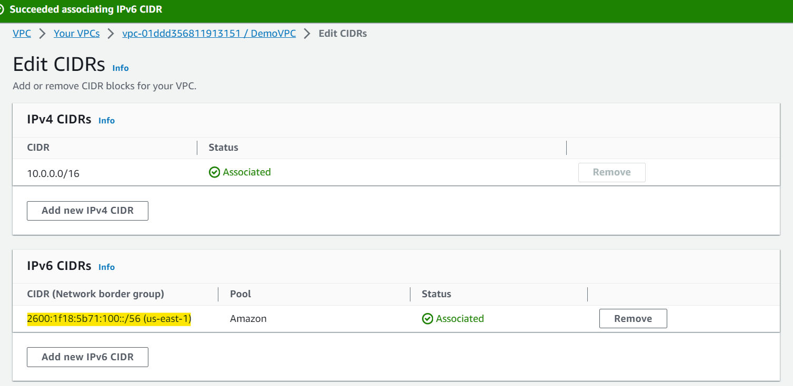

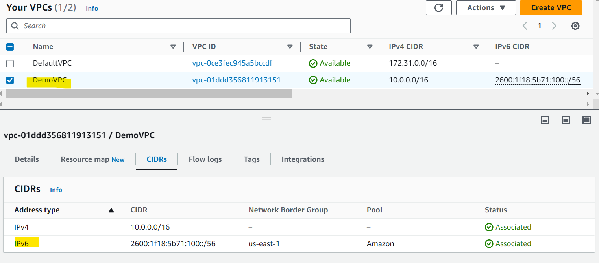

---

- Assign IPv6 CIDR to a Subnets

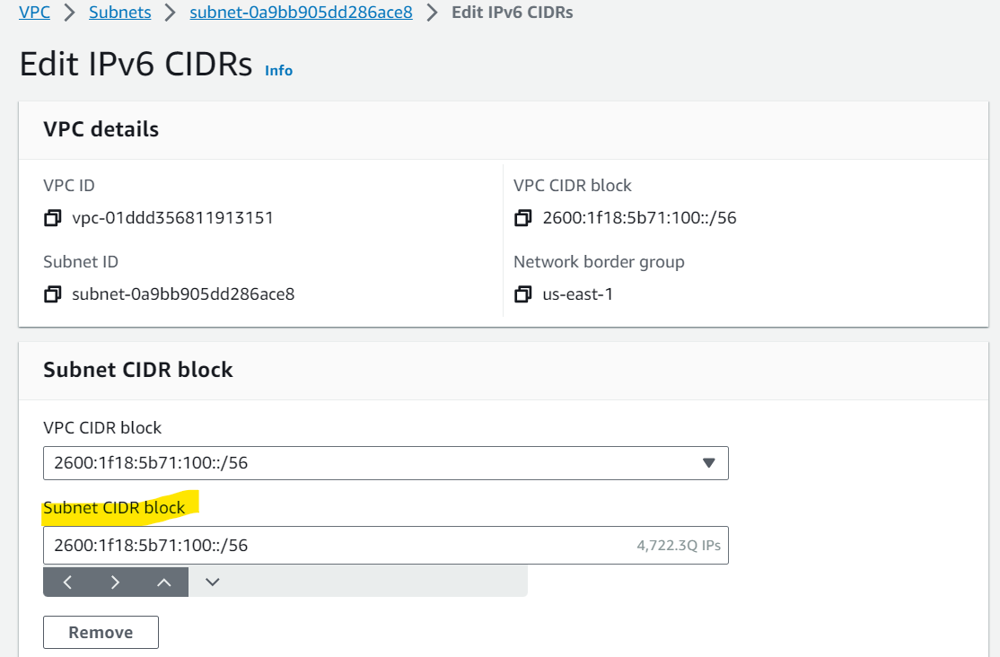

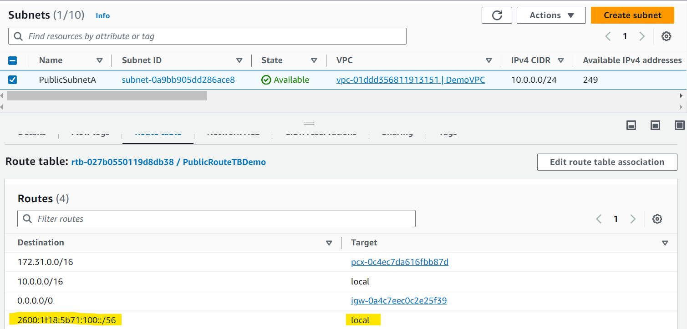

- Available address only related to IPv4

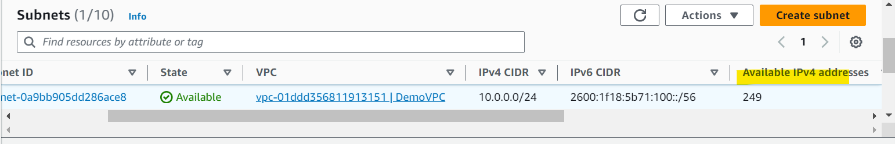

- Enable auto-assign IPv6

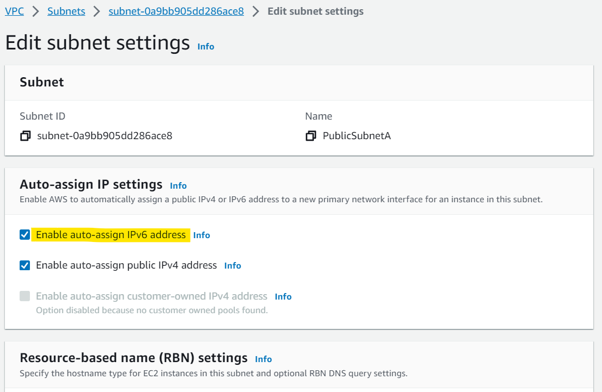

---

- Enable IPv6 to an EC2

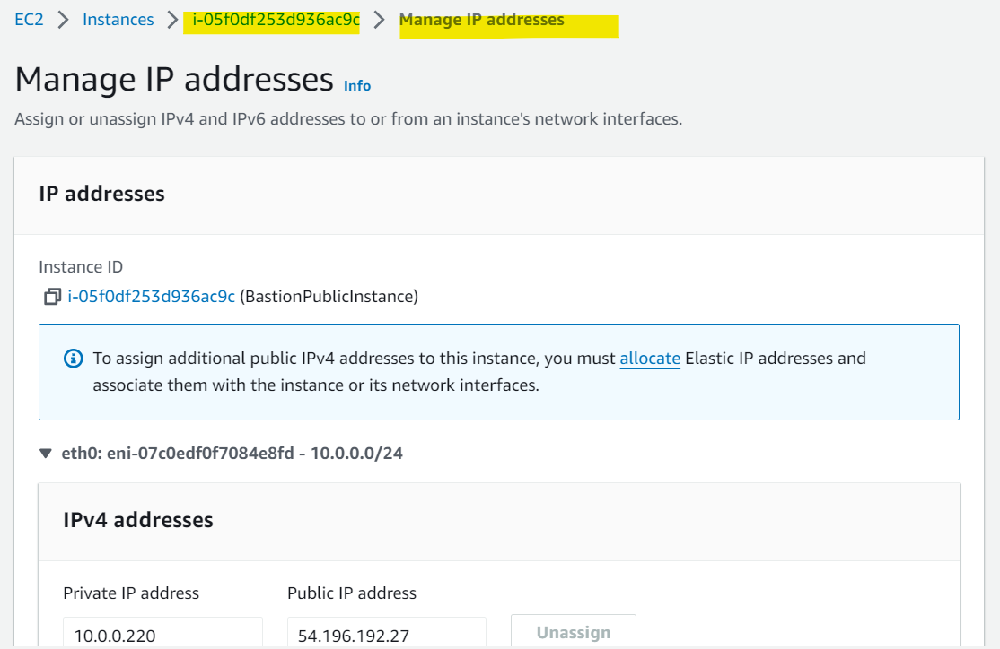

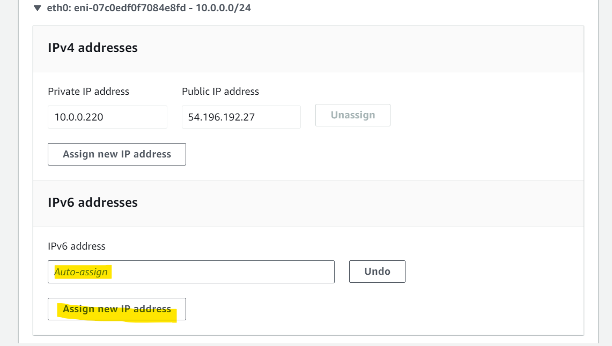

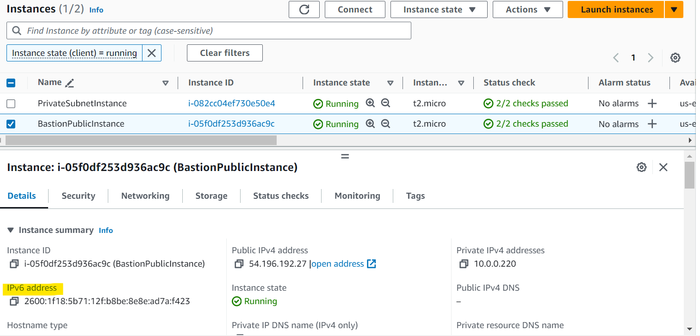

---

- Allow IPv6 to a security group

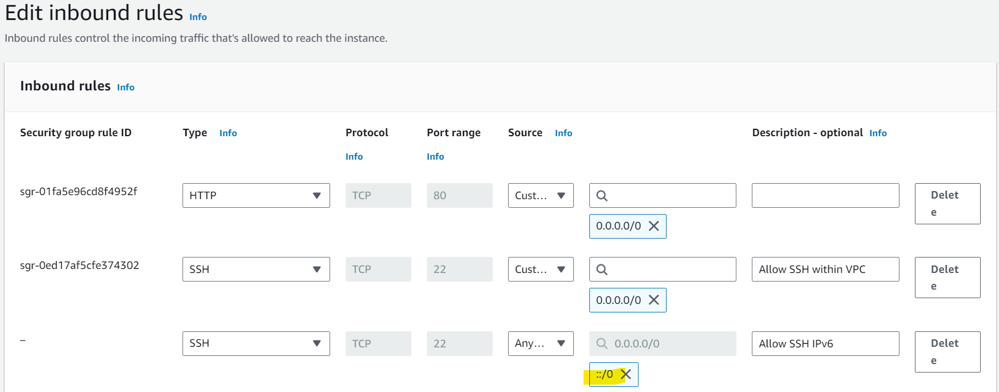

---

## VPC Summary

- `CIDR`
  - IP Range
- `VPC`
  - `Virtual Private Cloud`
  - we define a list of IPv4 & IPv6 CIDR
- `Subnets`
  - tied to an AZ,
  - we define a CIDR

---

### Connection

- `Internet Gateway`: for VPC

  - at the VPC level,
  - provide IPv4 & IPv6 Internet Access

- `Route Tables`: for Subnet

  - must be edited to add routes from subnets to the `IGW`, `VPC Peering` onnections, VPC `Endpoints`, …

- `ClassicLink`: for EC2

  - connect EC2-Classic `EC2` instances **privately** to your VPC

- `VPC Peering`: between VPC

  - connect two VPCs with **non overlapping** CIDR,
  - non-transitive

- `VPC Endpoints`: for AWS service within VPC

  - provide **private access** to AWS Services (S3, DynamoDB, CloudFormation, SSM) within a VPC
  - gateway endpoint: `S3` + `DynamoDB`
  - Interface endpoint: the rest

- `AWS PrivateLink` / `VPC Endpoint Services`: for AWS service within VPC
  - Connect **services privately** from your service VPC to customers VPC
  - Doesn’t need VPC Peering, public Internet, NAT Gateway, Route Tables
  - Must be used with `Network Load Balancer` & `ENI`

---

### Connect on-site

- `Site-to-Site VPN`: with on-premises via public

  - setup a `Customer Gateway` on **DC**,
  - a `Virtual Private Gateway` on **VPC**,
  - and site-to-site VPN **over public Internet**

- `AWS VPN CloudHub`: multiple sites

  - hub-and-spoke VPN model to **connect your sites**

- `Direct Connect`: DX location, private

  - setup a` Virtual Private Gateway` on VPC, and establish a **direct private connection** to an `AWS Direct Connect Location`

- `Direct Connect Gateway`: DX regions

  - setup a Direct Connect to many VPCs in **different AWS regions**

- `Transit Gateway`: peering
  - transitive **peering connections** for VPC, VPN & DX

---

### Private Subnet -> Internet

- `Bastion Host`: SSH

  - **public** EC2 instance to SSH into, that has `SSH` connectivity to EC2 instances in **private** subnets

- `NAT Instances`: internet access

  - gives **Internet access** to EC2 instances in **private** subnets.
  - Old, must be setup in a **public** subnet, **disable Source / Destination check** flag

- `NAT Gateway`: internet access IPv4

  - managed by AWS, provides scalable **Internet access to private** EC2 instances,
  - `IPv4` only

- `Egress-only Internet Gateway`: internet access IPv6
  - like a NAT Gateway, but for `IPv6`

---

### Security

- `NACL`:Subnet level

  - stateless,
  - subnet rules for inbound and outbound
  - don’t forget `Ephemeral Ports`

- `Security Groups`: instance level

  - stateful,
  - operate at the EC2 **instance level**

---

### Monitoring

- `VPC Flow Logs`: log

  - can be setup at the `VPC` / `Subnet` / `ENI` Level, for `ACCEPT` and `REJECT` traffic,
  - helps identifying attacks, analyze using `Athena` or `CloudWatch` Logs Insights

- `Traffic Mirroring`: copy
  - **copy** network traffic from `ENIs` for further **analysis**

---

[TOP](#aws---networking)
