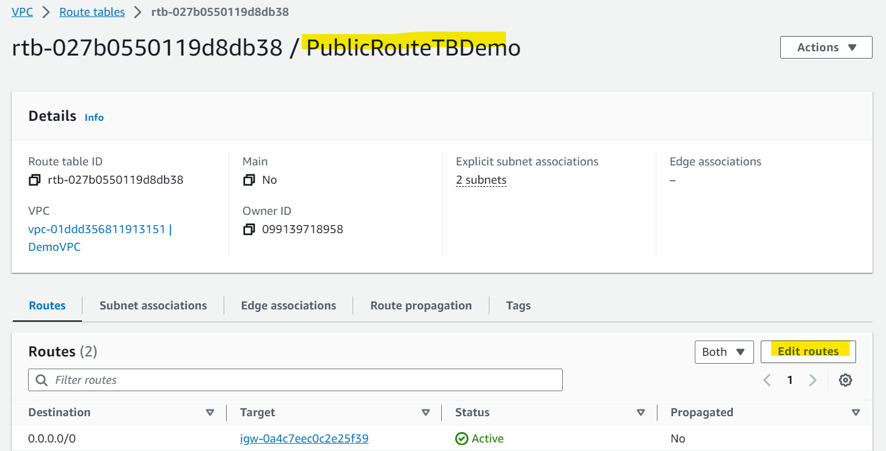

# AWS Networking - VPC Peering

[Back](../index.md)

- [AWS Networking - VPC Peering](#aws-networking---vpc-peering)
  - [VPC Peering](#vpc-peering)
  - [Hands-on](#hands-on)

---

## VPC Peering

- `VPC Peering`

  - **Privately connect two VPCs(might be in different regions and accounts)** using AWS’ network
  - Make them behave as if they were in the same network

- Must not have overlapping CIDRs, otherwise cannot communicate with each other.
- VPC Peering connection is **NOT transitive**

  - must be enabled for each VPC that need to communicate with one another. 相互启用, 不能单方启用.
  - You must **update route tables in each VPC’s subnets** to ensure EC2 instances can communicate with each other
  - example:
    - a->b, b->c. 但不能以此推导出 a->c, 没有传递性.
    - 必须启用 a->c.

- You can create VPC Peering connection between VPCs **in different AWS accounts/regions**
- You can **reference a security group** in a peered VPC (works **cross accounts – same region**)即只需要引用 sg, 而无需引用具体的 CIDR 或 IP 地址.

- Sample:
  - VPC Peering has been enabled between VPC A and VPC B, and the route tables have been **updated for VPC A**. But, the EC2 instances cannot communicate. What is the likely issue?
    - Check the Route Tables in VPC B
    - Route tables must be **updated in both** VPCs that are peered.
  - You have 3 VPCs A, B, and C. You want to establish a VPC Peering connection between all the 3 VPCs. What should you do?
    - A-B, B-C, A-C

---

## Hands-on

- Create 2 intances in 2 VPCs
- Bastion instance in Demo VPC
  - enable httpd service
  - Accessible via local priavte ip address: `curl <private_ip>:80/`

- DefaultVPCInstance in default VPC
  - Not accessible to the above ip address due to different VPC.

---

- Goal:

  - enable DefaultVPCInstance within Default VPC accessible to BastionHostPublic instance within Demo VPC.

- Create a peering connection, Requester=DemoVPC, Accepter=DefaultVPC.
- The owner of the requester VPC sends a request to the owner of the accepter VPC to create the VPC peering connection.

- Accept VPC peering request

- Edit both route table
- Route table where Bastion Instance located
  - Destination:
    - the CIDR of the peering VPC subnet
    - the request to destination will route to peering connection.

- Route table where DefaultVPCInstance located
  - Destination:
    - the CIDR of the peering VPC subnet
    - the request to destination will route to peering connection.

- Outcome

---

[TOP](#aws-networking---vpc-peering)
