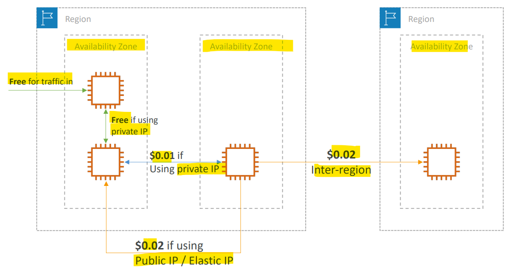
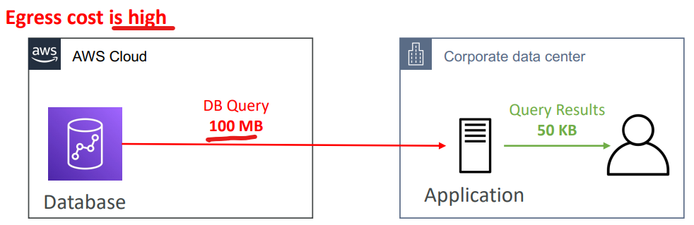
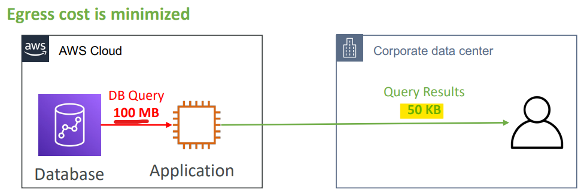
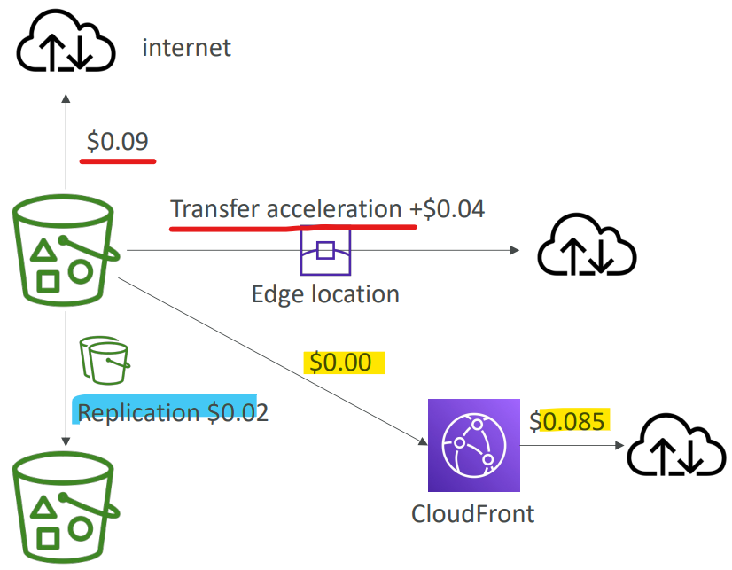
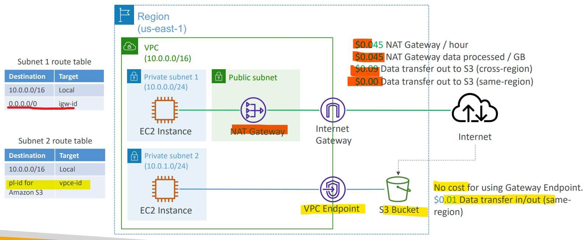

# AWS Networking - Pricing

[Back](../index.md)

- [AWS Networking - Pricing](#aws-networking---pricing)
  - [Networking Costs in AWS per GB](#networking-costs-in-aws-per-gb)
    - [Minimizing egress traffic network cost](#minimizing-egress-traffic-network-cost)
    - [S3 Data Transfer Pricing – Analysis for USA](#s3-data-transfer-pricing--analysis-for-usa)
    - [NAT Gateway vs Gateway VPC Endpoint](#nat-gateway-vs-gateway-vpc-endpoint)

---

## Networking Costs in AWS per GB

- Use **Private IP** instead of Public IP for good savings and better network performance

- Use **same AZ** for maximum savings
  - at the **cost of high vailability**

---

### Minimizing egress traffic network cost

- **Ingress traffic**:
  - **inbound** traffic - from outside to AWS (typically **free**)
- **Egress traffic**:
  - **outbound** traffic (from AWS to outside)
- Try to keep as much internet traffic **within AWS to minimize costs**
- `Direct Connect location` that are co-located in the **same AWS Region** result in lower cost for egress network

- Problem: high egress traffic

- Solution:
  - keep as number traffic within AWS
  - less egress traffic

---

### S3 Data Transfer Pricing – Analysis for USA

- S3 **ingress**: **free**
- S3 **egress(to Internet)**: $0.09 per GB
- S3 `Transfer Acceleration`:

  - Faster transfer times (50 to 500% better)
  - Additional cost on top of Data Transfer Pricing: + `$0.04` to `$0.08` per GB

- S3 to **CloudFront**:
  - **$0.00** per GB
  - `CloudFront` to **Internet**: $0.085 per GB (slightly cheaper than S3)
  - Caching capability (lower latency)
  - Reduce costs associated with S3 Requests Pricing (7x cheaper with CloudFront)
- S3 `Cross Region Replication`: $0.02 per GB

---

### NAT Gateway vs Gateway VPC Endpoint

- VPC Endpoint Gateway > NatGW

---

[TOP](#aws-networking---pricing)
