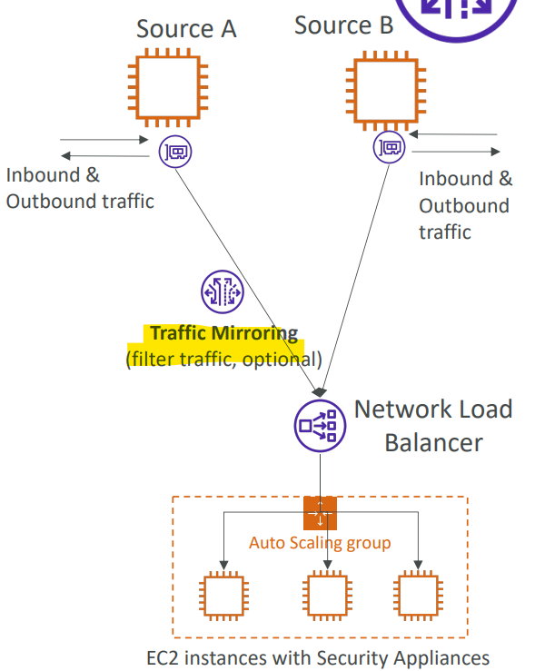

# AWS Networking - Traffic Mirroring

[Back](../index.md)

- [AWS Networking - Traffic Mirroring](#aws-networking---traffic-mirroring)
  - [`Traffic Mirroring`](#traffic-mirroring)

---

## `Traffic Mirroring`

- `Traffic Mirroring`

  - Allows you to **capture and inspect network traffic** in your VPC **in non-intrusive manner**.
  - **Route the traffic** to security appliances that you manage

- Feature:

  - **Capture** all packets or capture the packets of your interest (optionally, truncate packets)
  - Source and Target can be in the **same** VPC or **different** VPCs (`VPC Peering`)

- Capture the traffic

  - From (Source) – `ENIs`
  - To (Targets) – an `ENI` or a `Network Load Balancer`

- **Use cases**:
  - content inspection, threat monitoring, troubleshooting, …

---

[TOP](#aws-networking---traffic-mirroring)
