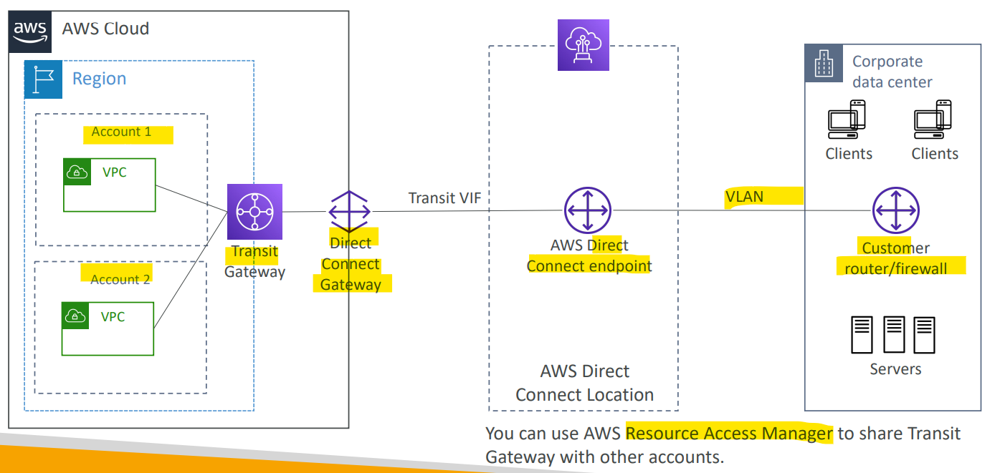

# AWS Networking - Transit Gateway

[Back](../index.md)

- [AWS Networking - Transit Gateway](#aws-networking---transit-gateway)
  - [`Transit Gateway`](#transit-gateway)
    - [Use Case: Site-to-Site VPN ECMP](#use-case-site-to-site-vpn-ecmp)
    - [Use case: Share Direct Connect between multiple accounts](#use-case-share-direct-connect-between-multiple-accounts)

---

## `Transit Gateway`

- Network topologies can become complicated
  - solution: Transit Gateway

- `Transit Gateway`

  - Used to establish **transitive peering** between thousands of `VPC` and `on-premises`, hub-and-spoke (star) connection

- Features:

  - **Regional** resource, can work **cross-region**
  - You can **peer** `Transit Gateways` **across regions**
  - Share (`VPC sharing`) **cross-account** using `Resource Access Manager (RAM)`
  - Works with `Direct Connect Gateway`, `VPN` connections
  - the **only** AWS service supports `IP Multicast`
    - not supported by any other AWS service

- need to setup `Route Tables`:
  - **limit** which VPC can talk with other VPC

---

### Use Case: Site-to-Site VPN ECMP

- To **increase the bandwith** of `site-to-site VPN` connection

- `ECMP`:

  - `Equal-cost multi-path routing`
  - Routing strategy to allow to **forward a packet over multiple best path**

- **Use case**:
  - create multiple `Siteto-Site VPN` connections to **increase the bandwidth** of your connection to AWS

- When establish a vpn, there are actually 2 tunnels, one going forward and one going back.
- When using transit gateway, and can have multiple VPN and two tunnels per VPN can be used at a time.

  - In the above case, there are 2 VPN attachments with 4 tunnels, increase the throughput of the connection.

- Throughput with VPN

- Throughput with VPN + tansit gateway:
  - multiple VPN
  - cost

- Sample:
  - You want to scale up an AWS Site-to-Site VPN connection throughput, established between your on-premises data and AWS Cloud, beyond a single IPsec tunnel's maximum limit of 1.25 Gbps. What should you do?
    - Transit Gateway

---

### Use case: Share Direct Connect between multiple accounts

---

[TOP](#aws-networking---transit-gateway)
