# AWS - VPC

[Back](../index.md)

- [AWS - VPC](#aws---vpc)
  - [`AWS VPC`](#aws-vpc)
    - [Hands-on](#hands-on)
  - [`Default VPC` Walkthrough](#default-vpc-walkthrough)
    - [Hands-on](#hands-on-1)
  - [Subnet](#subnet)
    - [Hands-on](#hands-on-2)
  - [Bastion Hosts](#bastion-hosts)
    - [Hands-on](#hands-on-3)
  - [`NAT` Instance (outdated, but still at the exam)](#nat-instance-outdated-but-still-at-the-exam)

---

## `AWS VPC`

- `VPC` / `Virtual Private Cloud`

- You can have **multiple** VPCs in an AWS region (**max. 5 per region** – soft limit)

- Max. `CIDR` per `VPC` is **5**, for each CIDR:

  - Min. size is `/28` (16 IP addresses)
  - Max. size is `/16` (65536 IP addresses)

- Because VPC is private, **only the Private IPv4 ranges** are allowed:

  - `10.0.0.0` – `10.255.255.255` (`10.0.0.0/8`)
  - `172.16.0.0` – `172.31.255.255` (`172.16.0.0/12`)
  - `192.168.0.0` – `192.168.255.255` (`192.168.0.0/16`)

- Your `VPC CIDR` should **NOT overlap** with your other networks (e.g., **corporate**)

---

- max `5` VPC / region
- max `5` CIDR / VPC
- `/16` - `/28` / CIDR

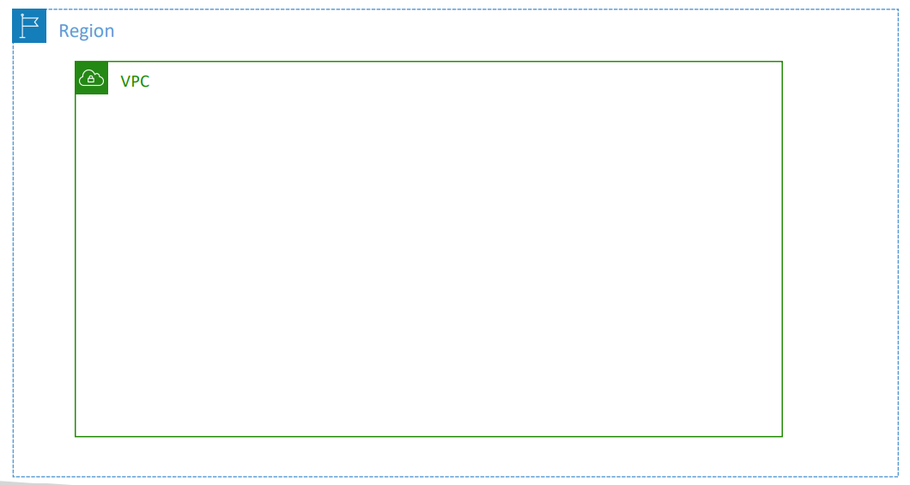

---

### Hands-on

- Create VPC

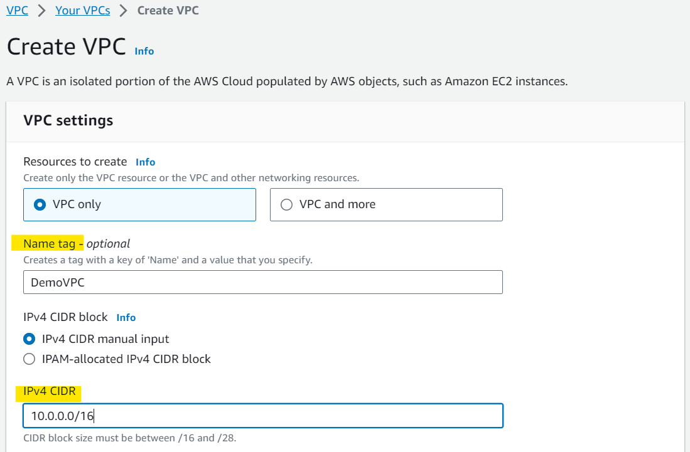

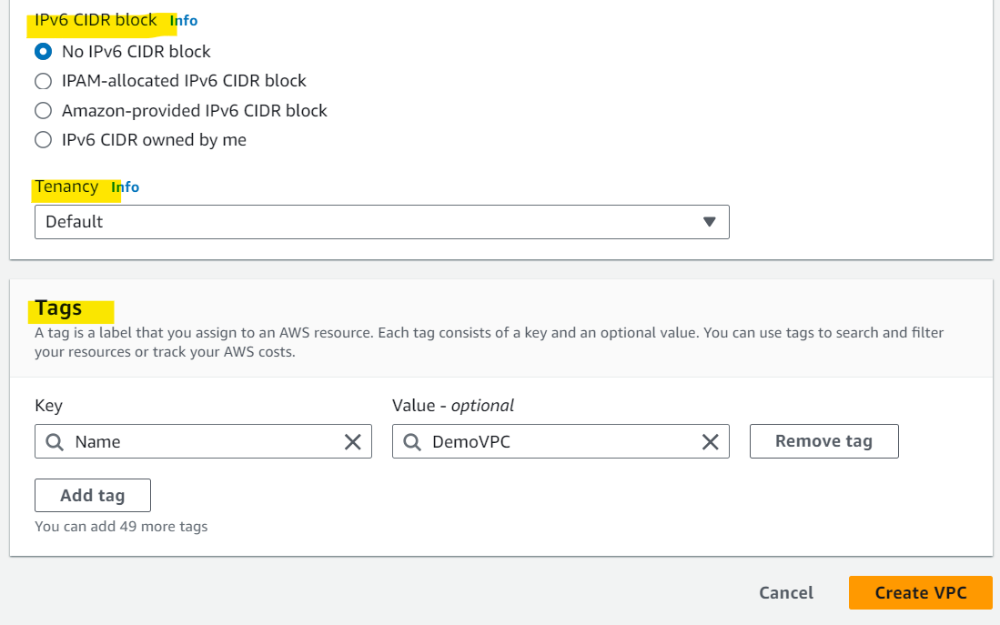

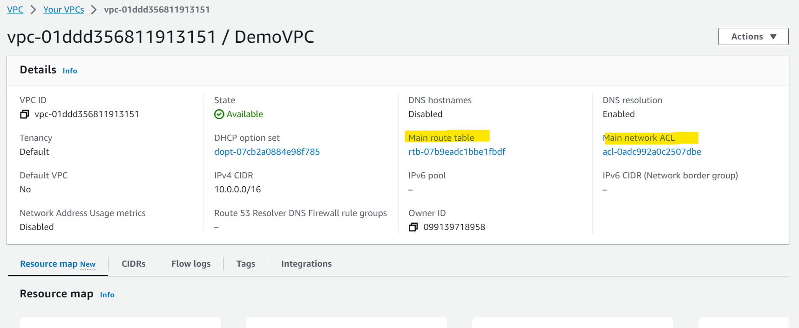

- Add CIDR
  - up to 5

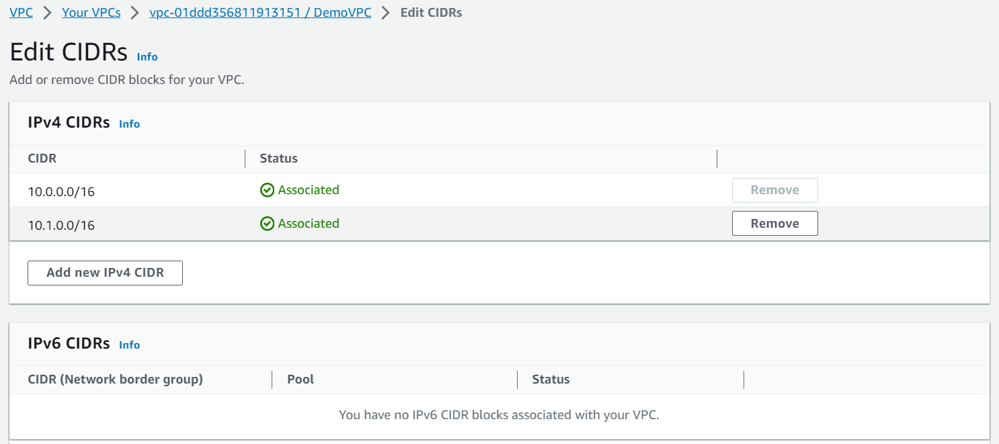

---

## `Default VPC` Walkthrough

- `172.16.0.0/12`
- All **new AWS accounts** have a `default VPC`
- New `EC2 instances` are **launched** into the `default VPC` if no subnet is specified
- `Default VPC`

  - has **Internet connectivity**
  - all `EC2 instances` inside it have `public IPv4 addresses`

- We also get a **public** and a **private** `IPv4 DNS names`

---

### Hands-on

- Default VPC
  - `173.16.0.0/12`

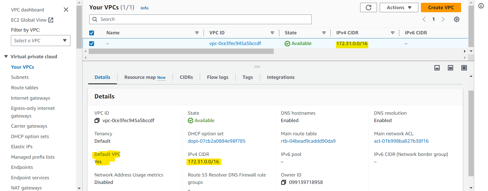

- Subnet
  - each subnet has its CIDR

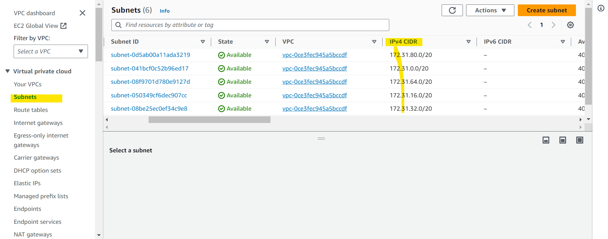

- 4091(5 are missing)

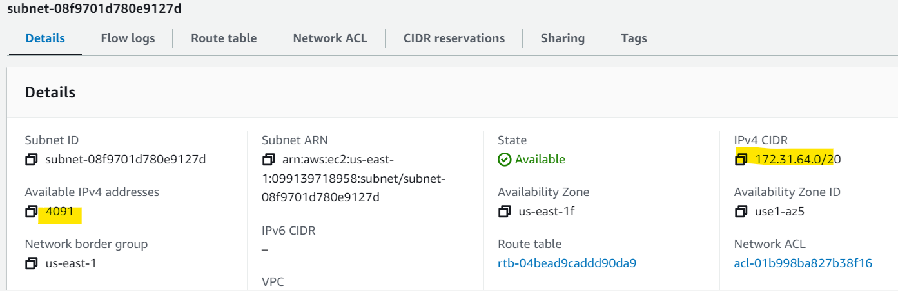

---

## Subnet

- AWS reserves **5 IP addresses (first 4 & last 1)** in each subnet

  - These 5 IP addresses are not available for use and can’t be assigned to an EC2 instance

- e.g.: if CIDR block 10.0.0.0/24, then reserved IP addresses are:

  - 10.0.0.0 – `Network Address`
  - 10.0.0.1 – reserved by AWS for the `VPC router`
  - 10.0.0.2 – reserved by AWS for **mapping** to `Amazon-provided DNS`
  - 10.0.0.3 – reserved by AWS for **future use**
  - 10.0.0.255 – `Network Broadcast Address`. AWS does **not support broadcast** in a VPC, therefore the address is reserved

- **Exam Tip**, if you need `29` IP addresses for EC2 instances:
  - You can’t choose a subnet of size /27 (32 IP addresses, 32 – 5 = 27 < 29)
  - You need to choose a subnet of size /26 (64 IP addresses, **64 – 5 = 59 > 29**)

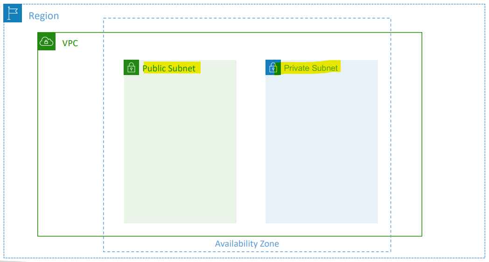

---

### Hands-on

- Create new subnet

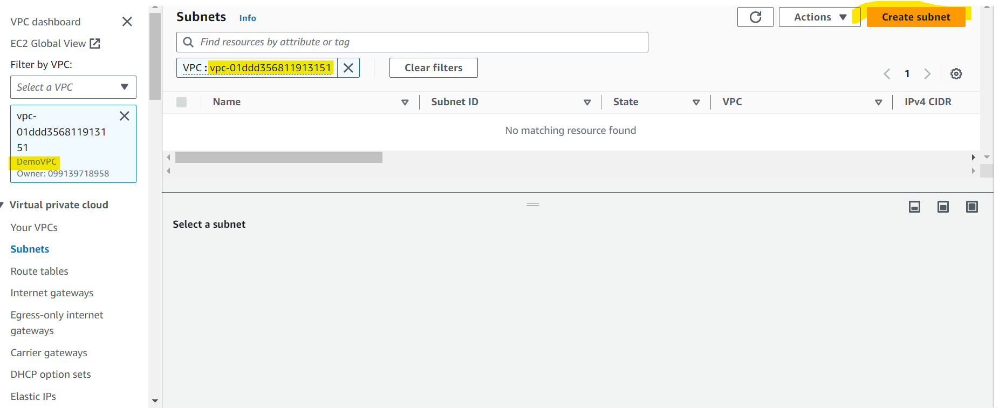

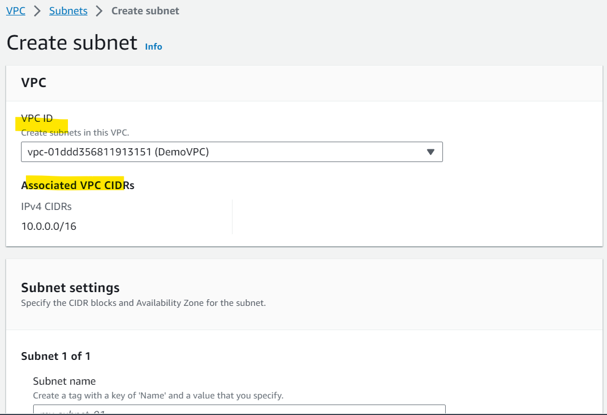

- Create 2 public subnet

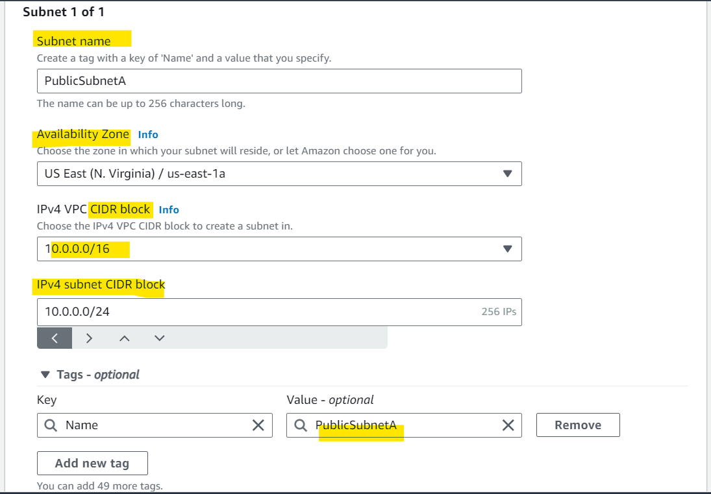

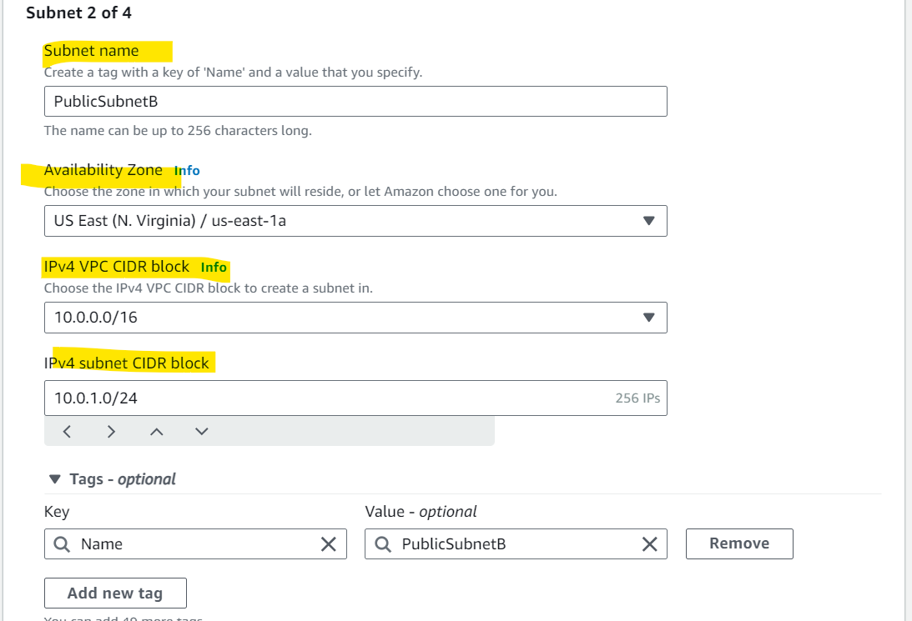

- Create 2 private subnet

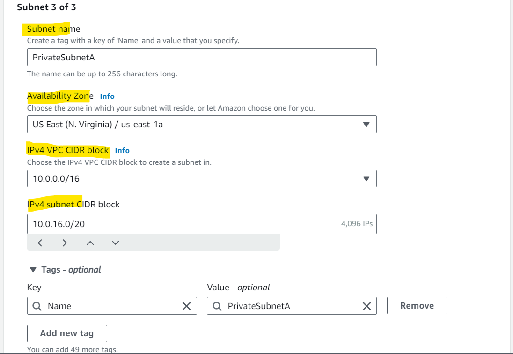

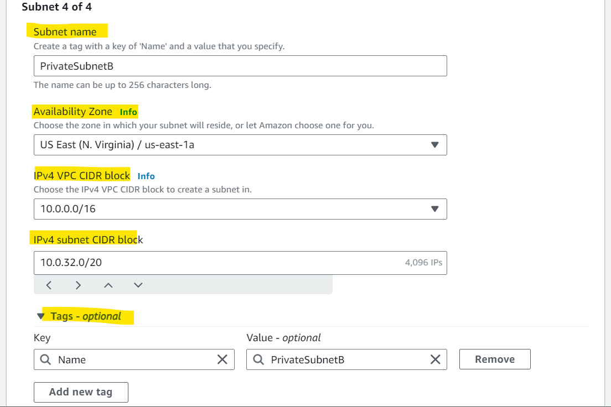

- Warning if overlap

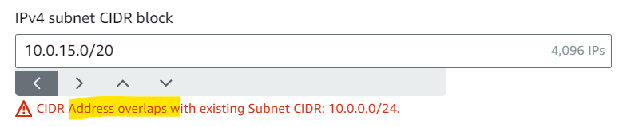

- result

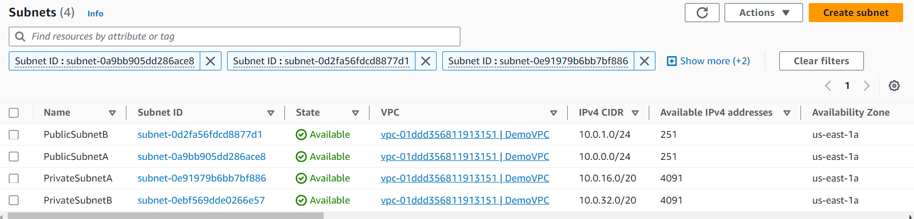

- Note:

  - the settings above is the same
  - Diff between public IP and Private IP is whether Auto-assign IP settings is enable

- By default, Auto-assign IP settings is disable.
  - if want to auto-assign IP within a subnet, need enable manually.

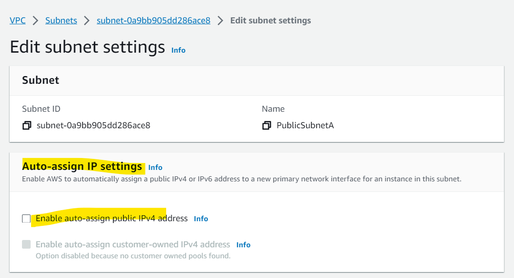

---

## Bastion Hosts

- `Bastion Host`
  - used to SSH into our private EC2 instances, which are in the private subnets and have not direct access to public internet.
- The `bastion` is in the `public subnet` which is then **connected to all other private subnets**

- `Bastion Host` **security group** must allow **inbound** from the internet on **port 22** from **restricted CIDR**, for example the public CIDR of your corporation

- `Security Group` of the EC2 Instances must allow

  - the `Security Group` of the `Bastion Host`
  - the `private IP` of the `Bastion host`

- 一台在公网=Bastion: 限定入流 CIDR,可以 SSH 到 internet 和私网
- 私网服务器: 允许 Basion/允许私有 IP

---

### Hands-on

- Note: SG's VPC must match with the EC2's VPC, otherwise instance cannot launch.

- Create SG in VPC allowing SSH

- Create `Bastion Host` EC2 instance in **public subnet** in the same VPC
  - using Key pair to enable SSH
  - attach sg allowing SSH

- Create an EC2 instacne in **private subnet** within the same VPC
  - using key pair
  - define a SG
    - define inbound rules: SSH + sg attached to Bastion Host

- Connect to Bastion Host to configure key pair `.pem` file

- change mode: `chmode 0400 <pem_file>`
- Connect to private EC2 instance with SSH: `ssh -i "pem_file" username@private_ip`

- Test connection: `ping google.com`
  - in private EC2, cannot ping
  - in Bastion Host, can ping

---

## `NAT` Instance (outdated, but still at the exam)

- `NAT` / `Network Address Translation`

  - Allows EC2 instances in private subnets to connect to the Internet

- Features
  - Must be **launched** in a `public subnet`
  - Must **disable** EC2 setting:
    - **Source / destination Check**
  - Must have `Elastic IP` attached to it
  - `Route Tables` must be configured to route traffic from private subnets to the `NAT` Instance

---

[TOP](#aws---vpc)
