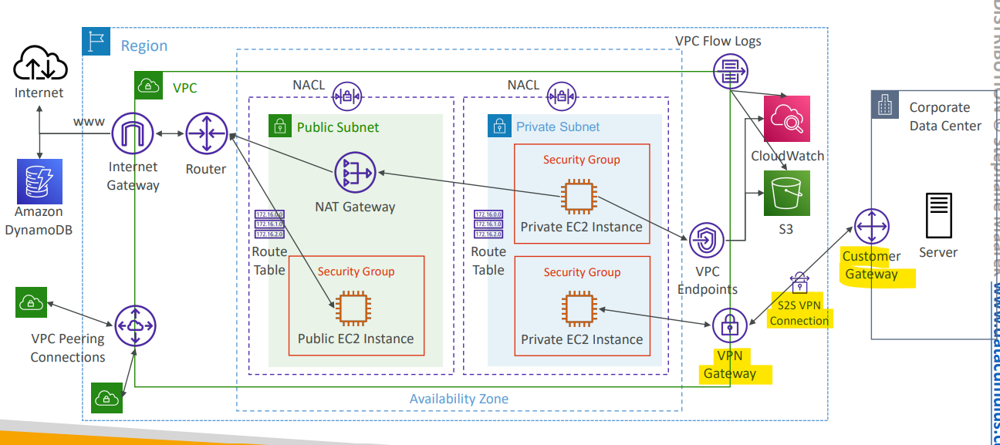
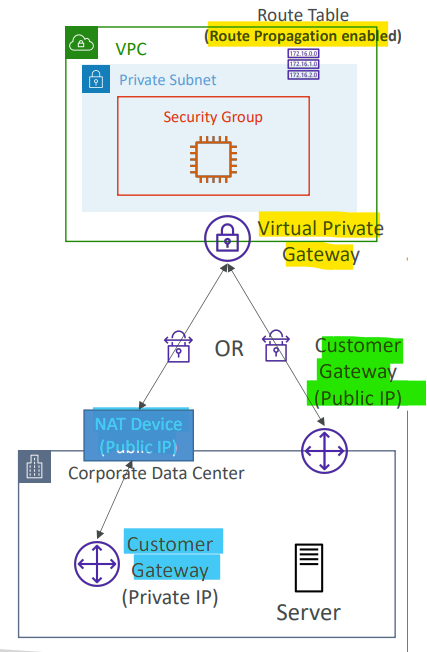
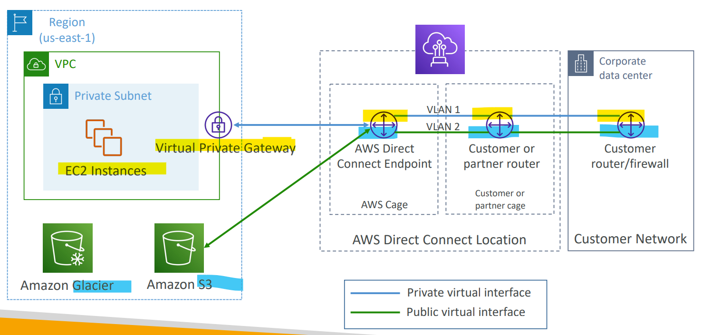
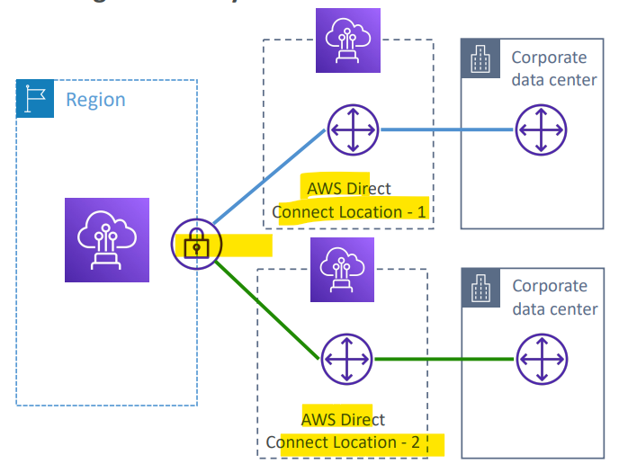
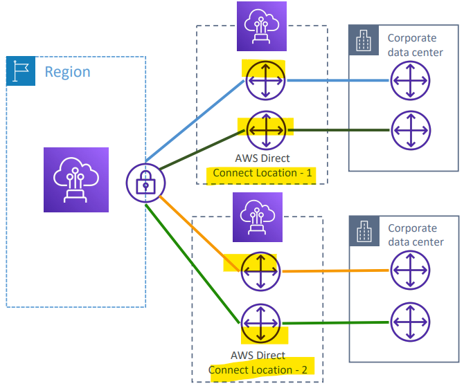
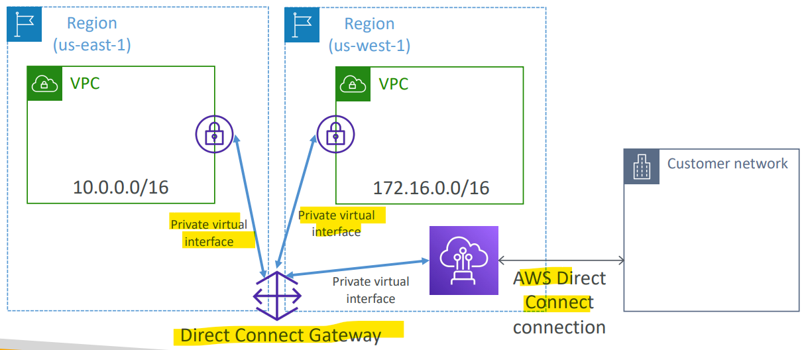

# AWS Networking - Site-to-Site VPN + Direct Connection(DX)

[Back](../index.md)

- [AWS Networking - Site-to-Site VPN + Direct Connection(DX)](#aws-networking---site-to-site-vpn--direct-connectiondx)
  - [`Site-to-Site VPN`](#site-to-site-vpn)
    - [Connections(会考)](#connections会考)
    - [Hands-on](#hands-on)
    - [`AWS VPN CloudHub`: diff sites, multi-VPNs](#aws-vpn-cloudhub-diff-sites-multi-vpns)
  - [`Direct Connect (DX)`](#direct-connect-dx)
    - [Connection Types](#connection-types)
    - [Encryption](#encryption)
    - [Resiliency](#resiliency)
    - [`Direct Connect Gateway`: cross regions](#direct-connect-gateway-cross-regions)
    - [DX backup: DX + Site-to-Site VPN connection](#dx-backup-dx--site-to-site-vpn-connection)

---

## `Site-to-Site VPN`

- `Site-to-Site VPN`

  - a private site-to-site connection established _through the public internet_ between **corporate data center using customer gateway** and **AWS VPC using VPN Gateway**.
  - encrypted connection
  - over the public internet

- Site-to-Site VPN requires 2 things:

  - `Virtual Private Gateway (VGW)`

    - **VPN concentrator** on the AWS side of the VPN connection
    - VGW is created and **attached to the VPC** from which you want to create the Site-to-Site VPN connection
    - Possibility to customize the `ASN (Autonomous System Number)`

  - `Customer Gateway (CGW)`
    - **Software** application or **physical device** on customer side of the VPN connection
    - https://docs.aws.amazon.com/vpn/latest/s2svpn/your-cgw.html#DevicesTested

---

### Connections(会考)

- `Customer Gateway` **Device** (On-premises)
  - What **IP address** to use?
    - **Public Internet-routable IP address** for your Customer Gateway device (when using public IP)
    - If it’s **behind a NAT device** that’s enabled for `NAT traversal (NAT-T)`, use the **public IP address of the NAT device**(private IP)(会考)
- Important step:
  - **enable** `Route Propagation` for the `Virtual Private Gateway` in the route table that is associated with your subnets
- If you need to **ping your EC2 instances** from on-premises, make sure you **add the ICMP protocol on the inbound** of your **security groups**

- Sample:
  - When you set up an AWS **Site-to-Site VPN** connection between your corporate on-premises datacenter and VPCs in AWS Cloud, what are the two major components you want to configure for this connection?
    - Customer Gateway + Virtual Private Gateway

---

### Hands-on

- skip, out of scope
- only need to know steps:
  - customer Gateway
  - Virtual Gateway
  - Connect two in Site-to-Site VPN Connections.

---

### `AWS VPN CloudHub`: diff sites, multi-VPNs

- Provide secure communication **between multiple sites**, if you have **multiple VPN connections**
- A low-cost hub-and-spoke(轴辐式枢纽) model for primary or secondary network connectivity between different locations (**VPN only**)(一个使用 VPN 连接多个 site 的中央枢纽)
  - customer network can communicate with each other.
- It’s a VPN connection so it **goes over the public Internet**
- To set it up, connect multiple VPN connections on the **same VGW**, setup **dynamic routing** and configure **route tables**

- Sample:
  - Your company has several on-premises sites across the USA. These sites are currently linked using private connections, but your private connections provider has been recently quite unstable, making your IT architecture partially offline. You would like to create a backup connection that will use the **public Internet** to link your **on-premises sites**, that you can failover in case of issues with your provider. What do you recommend?
    - VPN CloudHub

---

## `Direct Connect (DX)`

- `Direct Connect (DX)`

  - Provides a **dedicated private connection** from a **remote network** to your VPC

- Features

  - `Dedicated connection` must be setup between your DC and AWS Direct Connect locations
  - You need to setup a `Virtual Private Gateway` on your VPC
  - Supports both IPv4 and IPv6

- Benefit:

  - Access **public resources** (S3) and **private** (EC2) on same connection

- Use Cases:
  - **Increase bandwidth throughput**
    - working with large data sets
    - lower cost
  - More **consistent network** experience
    - applications using **real-time** data feeds
  - **Hybrid** Environments (on prem + cloud)

- Cage options:
  - AWS Cage
  - Custoer/partner cage
- 即可以连接私有资源(黄色), 又可以连接公有资源(蓝色)

- Sample:
  - You need to set up a **dedicated** connection between your on-premises corporate **datacenter** and AWS Cloud. This connection must be **private**, consistent, and traffic must **not travel through the Internet**. Which AWS service should you use?
    - Direct Connect
  - Using a Direct Connect connection, you can access both **public and private** AWS resources.
    - True

---

### Connection Types

- `Dedicated Connections`:

  - `1` Gbps, `10` Gbps and `100` Gbps capacity
  - **Physical ethernet port dedicated** to a customer
  - Request made to AWS **first**, then completed by `AWS Direct Connect Partners`

- `Hosted Connections`:

  - 50Mbps, 500 Mbps, to 10 Gbps
  - Connection requests are made via `AWS Direct Connect Partners`
  - Capacity can be **added** or **removed** on demand
  - 1, 2, 5, 10 Gbps available at select AWS Direct Connect Partners

- Lead times are often **longer than 1 month** to establish a new connection(常考: 需要提前至少 1 个月申请)

- Sample:
  - If you want a 500 Mbps Direct Connect connection between your corporate datacenter to AWS, you would choose a .................. connection.
    - Hosted
    - Hosted Direct Connect connection supports 50Mbps, 500Mbps, up to 10Gbps.

---

### Encryption

- Data **in transit** is **not encrypted** but is **private**
- AWS `Direct Connect` + `VPN` provides an **IPsec-encrypted private** connection
- Good for an extra level of **security**, but slightly more **complex** to put in place

---

### Resiliency

- 2 modes of resiliency archetectures

  - High Resiliency for Critical Workloads
  - Maximum Resiliency for Critical Workloads

- **High Resiliency** for Critical Workloads
  - One connection at multiple locations
  - if one of the DX location goes down, at least has backup DX location.

- **Maximum Resiliency** for Critical Workloads
  - Maximum resilience is achieved **by separate connections** terminating **on separate devices** in **more than one location**. 多链接多地点

---

### `Direct Connect Gateway`: cross regions

- `Direct Connect Gateway`
  - used to setup a `Direct Connect` to **one or more VPC** in **many different regions** (same account).

- Sample:
  - You have set up a Direct Connect connection between your corporate data center and your VPC A in your AWS account. You need to access VPC B in another AWS region from your corporate datacenter as well. What should you do?
    - Direct Connect Gateway

---

### DX backup: DX + Site-to-Site VPN connection

- In case Direct Connect fails, you can set up
  - a **backup** `Direct Connect connection` (**expensive**),
  - or a `Site-to-Site VPN` connection(reliable due to the use of public internet)

- Sample:
  - A company has set up a Direct Connect connection between their corporate data center to AWS. There is a requirement to prepare a cost-effective secure **backup** connection in case there are issues with this **Direct Connect** connection. What is the **most cost effective** and secure solution you recommend?
    - Site-to-Site VPN

---

[TOP](#aws-networking---site-to-site-vpn--direct-connectiondx)
