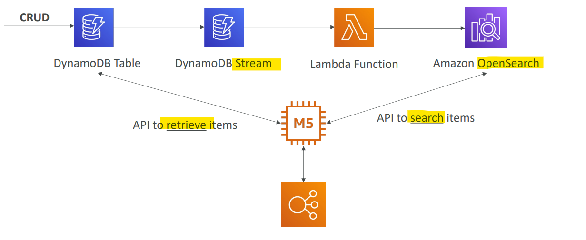
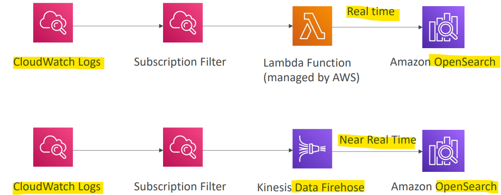
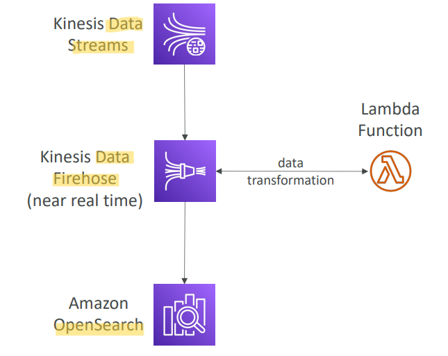
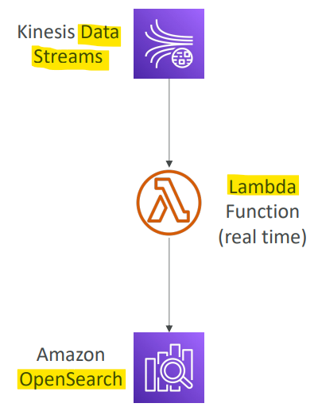

# AWS - Amazon OpenSearch

[Back](../index.md)

- [AWS - Amazon OpenSearch](#aws---amazon-opensearch)
  - [Amazon OpenSearch](#amazon-opensearch)
    - [OpenSearch patterns](#opensearch-patterns)

---

## Amazon OpenSearch

- `Amazon OpenSearch` is successor to `Amazon ElasticSearch`
- In DynamoDB, **queries** only exist by `primary key` or `indexes…`

- Used for analytic search:

  - With OpenSearch, you can **search any field**, even partially matches
  - It’s common to use `OpenSearch` as a **complement** to another database

- **Two modes**:

  - managed cluster
  - serverless cluster

- **Does not** natively support `SQL` (can be **enabled** via a **plugin**)

- Ingestion from `Kinesis Data Firehose`, `AWS IoT`, and `CloudWatch Logs`

- Security through `Cognito` & `IAM`, `KMS encryption`, `TLS`

- Comes with `OpenSearch Dashboards` (**visualization**)

---

### OpenSearch patterns

- **DynamoDB**
  - In this pattern, app running on EC2 instance can perform different kinds of search using OpenSearch, instead of search based on item id.
  - Once the search is done, app retrieves items from DB.

- **CloudWatch Logs**

- **Kinesis Data Streams & Kinesis Data Firehose**

---

[TOP](#aws---amazon-opensearch)
