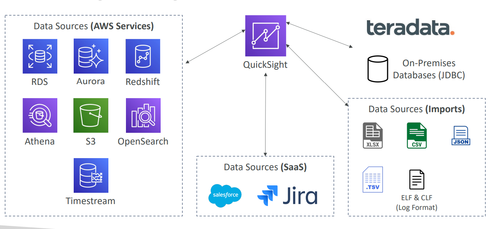

# AWS - Amazon QuickSight

[Back](../index.md)

- [AWS - Amazon QuickSight](#aws---amazon-quicksight)
  - [Amazon QuickSight](#amazon-quicksight)
    - [QuickSight Integrations](#quicksight-integrations)
    - [Dashboard \& Analysis](#dashboard--analysis)

---

## Amazon QuickSight

- `Amazon QuickSight`

  - **Serverless** **machine learning**-powered `business intelligence` service to create **interactive dashboards**

- Features:

  - Fast, automatically scalable, embeddable, with **per-session pricing**
  - Integrated with `RDS`, `Aurora`, `Athena`, `Redshift`, `S3…`

- `SPICE` engine

  - used for **In-memory computation** if data is **imported** into `QuickSight`
  - not work if connect to database but not import data.

- `Column-Level security (CLS)`

  - be setup in **Enterprise edition** to prevent present data to user who does not have enough right.

- **Use cases**:
  - **Business analytics**
  - Building **visualizations**
  - Perform ad-hoc **analysis**
  - Get business **insights** using data

---

### QuickSight Integrations

---

### Dashboard & Analysis

- Define `Users` (**standard** versions) and `Groups` (**enterprise** version)

  - These users & groups only exist **within** `QuickSight`, **not IAM !!**

- A `dashboard…`

  - is a **read-only snapshot** of an analysis that you can **share**
  - **preserves the configuration** of the analysis (filtering, parameters, controls, sort)

- You can **share** the _analysis_ or the _dashboard_ with `Users` or `Groups`
  - **To share** a dashboard, you must **first publish** it
  - `Users` who see the dashboard can also **see the underlying data**

---

[TOP](#aws---amazon-quicksight)
