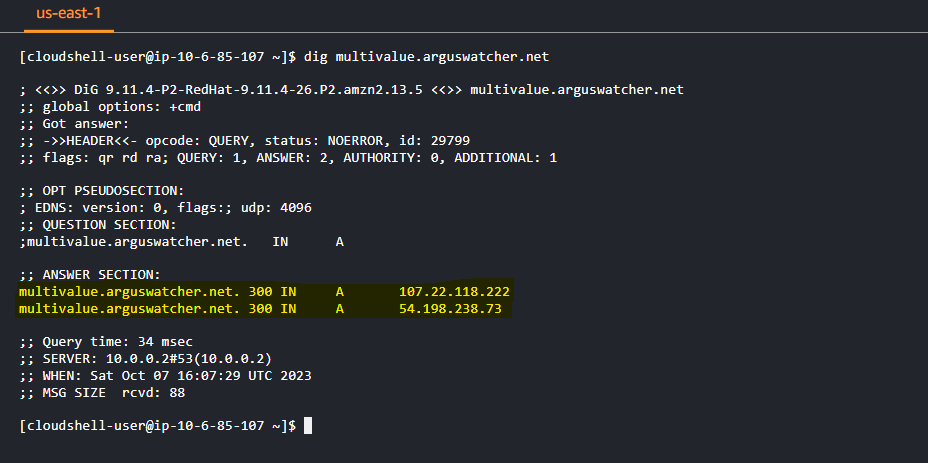

# AWS - Route53

[Back](../index.md)

- [AWS - Route53](#aws---route53)
  - [DNS](#dns)
  - [Amazon Route 53](#amazon-route-53)
    - [DNS Records](#dns-records)
    - [Record Types](#record-types)
    - [Hosted Zones](#hosted-zones)
    - [Hands-On: Register a Domain](#hands-on-register-a-domain)
    - [Records TTL (Time To Live)](#records-ttl-time-to-live)
  - [Alias Records](#alias-records)
    - [CNAME vs Alias](#cname-vs-alias)
    - [Alias Records Targets](#alias-records-targets)
    - [Hands-on](#hands-on)
  - [Health Checks](#health-checks)
    - [Health Checks – Monitor an Endpoint](#health-checks--monitor-an-endpoint)
    - [Route 53 – Calculated Health Checks](#route-53--calculated-health-checks)
    - [Health Checks – Private Hosted Zones](#health-checks--private-hosted-zones)
    - [Hands-on](#hands-on-1)
  - [Routing Policies](#routing-policies)
    - [Routing Policies – Simple](#routing-policies--simple)
    - [Routing Policies – Weighted](#routing-policies--weighted)
    - [Routing Policies - Latency-based](#routing-policies---latency-based)
    - [Routing Policies – Failover (Active-Passive)](#routing-policies--failover-active-passive)
    - [Routing Policies – Geolocation](#routing-policies--geolocation)
    - [Routing Policies – Geoproximity](#routing-policies--geoproximity)
    - [Routing Policies – IP-based Routing](#routing-policies--ip-based-routing)
    - [Routing Policies – Multivalue Answer](#routing-policies--multivalue-answer)
  - [Domain Registar vs. DNS Service](#domain-registar-vs-dns-service)

---

## DNS

- Domain Name System which translates the human friendly hostnames into the machine IP addresses
  - i.e.: www.google.com => 172.217.18.36
- DNS is the backbone of the Internet
- DNS uses hierarchical naming structure
  - .com
  - example.com
  - www.example.com
  - api.example.com

---

- Terminologies

- **Domain Registrar**: Amazon Route 53, GoDaddy, …
- **DNS Records**: A, AAAA, CNAME, NS, …
- **Zone File**: contains DNS records
- **Name Server**: resolves DNS **queries** (Authoritative or Non-Authoritative)
- `Top Level Domain (TLD)`: .com, .us, .in, .gov, .org, …
- `Second Level Domain (SLD)`: amazon.com, google.com, …

---

---

## Amazon Route 53

- A highly available, scalable, fully managed and **Authoritative** DNS
  - **Authoritative** = the customer (you) **can update the DNS records**
- Route 53 is also a **Domain Registrar**
- Ability to **check the health** of your resources
- The **only** AWS service which provides 100% availability **SLA**(Service Level Agreements)
- Benefit:
  - 53 is a **reference** to the **traditional DNS port**

---

### DNS Records

- `DNS Records`

  - how to route traffic for a domain

- Each record **contains**:

  - **Domain/subdomain Name** – e.g., example.com
  - **Record Type** – e.g., A or AAAA
  - **Value** – e.g., 12.34.56.78
  - **Routing Policy** – how Route 53 responds to queries
  - **TTL** – amount of time the record cached at DNS Resolvers

- Route 53 supports the following DNS record types:
  - **must know: A / AAAA / CNAME / NS**
  - (advanced) CAA / DS / MX / NAPTR / PTR / SOA / TXT / SPF / SRV

---

### Record Types

- `A` – maps a hostname to **IPv4**
- `AAAA` – maps a hostname to **IPv6**
- `CNAME` / `Canonical Name` – maps a hostname **to another hostname**
  - The **target** is a domain name which must have an **A or AAAA** record
  - **Can’t** create a CNAME record for the **top node** of a DNS namespace (Zone Apex)
  - Example: you **can’t** create for **example.com**, but you **can** create for **www**.example.com
- `NS` – Name Servers for the **Hosted Zone**
  - Control how traffic is routed for a domain

---

### Hosted Zones

- `Hosted Zones`

  - A **container** for records that **define how to route traffic** to a _domain_ and its _subdomains_

- Types of Hosted Zones:

  - **Public Hosted Zones**

    - contains records that specify how to **route traffic on the Internet** (**public** domain names)
    - e.g.:application1.mypublicdomain.com

- **Private Hosted Zones**

  - contain records that specify how you **route traffic within one or more VPCs(Virtual Private Cloud)** (**private** domain names)
  - e.g.:application1.company.internal

- pay $0.50 per month **per hosted zone**

---

### Hands-On: Register a Domain

- Create and buy a domain name

- using cloudshell to nslookup and dig

---

### Records TTL (Time To Live)

- `TTL` / `Time To Live`

  - a numerical value that determines **how long a DNS cache server** can serve a DNS record before reaching out to the authoritative DNS server and getting a new copy of the record.
  - Time to cache DNS record locally

- Strategy

  - The TTL value should be set to strike a **balance** between **how long the value should be cached** vs. h**ow many requests should go to the DNS Resolver**.
  - High TTL – e.g., 24 hr

    - Less traffic on Route 53
    - Possibly outdated records

  - Low TTL – e.g., 60 sec.

    - More traffic on Route 53 ($$)
    - Records are outdated for less time
    - Easy to change records

- TTL is **mandatory** for each DNS record
  - **Except** for `Alias records`

---

- Hands-On: TTL

---

## Alias Records

- `Alias Records`

  - Maps a hostname **to an AWS resource**
  - An extension to DNS functionality

- **Automatically** recognizes **changes** in the resource’s **IP addresses**

- Unlike CNAME, it can be used for the **top node of a DNS namespace (Zone Apex)**
  - e.g.: example.com
- Alias Record is **always** of **type A/AAAA** for AWS resources (IPv4 / IPv6)
- You **can’t** set the TTL (managed by AWS)

---

### CNAME vs Alias

- AWS Resources (Load Balancer, CloudFront...) **expose an AWS hostname**:

  - lb1-1234.us-east-2.elb.amazonaws.com and you want myapp.mydomain.com

- `CNAME`:

  - Points a hostname **to any other hostname**.
    - eg.: app.mydomain.com => blabla.anything.com
  - ONLY FOR **NON ROOT DOMAIN**
    - aka. something.mydomain.com

- `Alias`:

  - Points a hostname **to an AWS Resource**
    - e.g.: app.mydomain.com => blabla.**amazonaws.com**
  - Works for **ROOT DOMAIN** and **NON ROOT DOMAIN**
    - aka. mydomain.com

- **Free** of charge
- Native **health check**

---

### Alias Records Targets

- Elastic **Load Balancers**
- **CloudFront** Distributions
- **API Gateway**
- S3 **Websites**
- Elastic **Beanstalk** environments
- **VPC** Interface Endpoints
- Global **Accelerator** accelerator
- **Route 53 record** in the **same** hosted zone

- 注意:
  - You cannot set an ALIAS record **for an EC2 DNS name**

---

### Hands-on

- CNAME
  - the value below is the DNS name of the Applicatioin Load Balancer.

- CNAME cannot used for root domain name.

- Alias
  - Route to Target Group as ALB
  - Free

---

## Health Checks

- HTTP Health Checks are only for **public** resources
- Health Check => Automated DNS **Failover**:

  1. Health checks that monitor an **public endpoint** (application, server, other AWS resource)
  2. Health checks that monitor **other health checks** (`Calculated Health Checks`)
  3. Health checks that monitor `CloudWatch Alarms` (full control !!) – e.g., throttles of DynamoDB, alarms on RDS, custom metrics, … (helpful for private resources)

- Health Checks are integrated with **CloudWatch metrics**

---

### Health Checks – Monitor an Endpoint

- About `15` global health checkers will check the endpoint health

  - Healthy/Unhealthy Threshold – `3` (default)
  - Interval – 30 sec (can set to 10 sec – higher cost)
  - Supported protocol: HTTP, HTTPS and TCP
  - If **> 18%** of health checkers report the endpoint is **healthy**, Route 53 considers it Healthy. Otherwise, it’s Unhealthy

- Ability to **choose which locations** you want Route 53 to use
- Health Checks pass only when the endpoint responds with the **2xx and 3xx status codes**
- Health Checks can be setup to pass / fail based **on the text in the first 5120 bytes** of the response
- Configure you **router/firewall to allow** incoming requests from Route 53 Health Checkers

---

### Route 53 – Calculated Health Checks

- Combine the results of multiple Health checks into a single Health Check
- You can use **OR**, **AND**, or **NOT**
- Can monitor up to `256` **Child** Health Checks
- **Specify how many** of the health checks need to pass to make the parent pass

- **Usage**:
  - perform **maintenance** to your website without causing all health checks to fail

---

### Health Checks – Private Hosted Zones

- Route 53 health checkers are **outside the VPC**
- They can’t access private endpoints (private VPC or on-premises resource)
- You can create a `CloudWatch Metric` and associate a `CloudWatch Alarm`, then create a Health Check that checks the alarm itself

---

### Hands-on

- Health Check: Endpoint

- Health check status after block http in security group.

- Calculated health check.
  - health check fail, because one is block http in SG. one returns 400 code due to the application reason.

---

## Routing Policies

- `Routing Policy`
  - Define **how** Route 53 **responds to DNS queries**
- Don’t get confused by the word “Routing”
- It’s not the same as Load balancer routing which routes the traffic
- **DNS does not route any traffic**, it **only responds to the DNS queries**

- Route 53 Supports the following Routing Policies
  - Simple
  - Weighted
  - Failover
  - Latency based
  - Geolocation
  - Multi-Value Answer
  - Geoproximity (using Route 53 Traffic Flow feature)

---

### Routing Policies – Simple

- Typically, route traffic **to a single resource**
- Can specify **multiple values** in the same record
  - If multiple values are returned, a **random one** is **chosen by the client**
- When **Alias** enabled, specify **only one AWS resource**
- **Can’t** be associated with `Health Checks`

- Hands-on: Multiple Values

---

### Routing Policies – Weighted

- Control the % of the requests that go to each specific resource
- Assign each record a relative weight:

- Weights don’t need to sum up to 100
- DNS records must have the **same name** and **type**
- Can be associated with **Health Checks**
- Use cases:

  - load balancing **between regions**,
  - testing new application versions…

- Assign a weight of `0` to a record to **stop** sending traffic to a resource
- If all records have weight of `0`, then all records will be returned **equally**

- Hands-on

---

### Routing Policies - Latency-based

- Redirect to the resource that **has the least latency** close to client.
- Super helpful when latency for users is a priority
- Latency is **based on traffic between users and AWS Regions**
  - Germany users may be directed to the US (if that’s the lowest latency)
- Can be associated with **Health Checks** (has a **failover** capability)
- 注意, 因为 latency 与位置有关,相同位置的延迟先后是固定的,所以最后访问的 target 是相同.

- Hands-on

---

### Routing Policies – Failover (Active-Passive)

- Using health check to determine.

- Hands-on

---

### Routing Policies – Geolocation

- Different from Latency-based!
- This routing is **based on user location**
- Specify location by Continent, Country or by US State
  - if there’s overlapping, most precise location selected
- Should create a **“Default”** record (in case there’s no **match** on location)

- **Use cases**:
  - website localization, **restrict** content distribution, **load balancing,** …
- Can be associated with **Health Checks**

- Hands-one

---

### Routing Policies – Geoproximity

- Route traffic to your resources **based on the geographic location of users and resources**
- Ability to **shift more traffic to resources** based on the defined **bias**
- To change the size of the geographic region, specify bias values:
  - To expand (1 to 99) – more traffic to the resource
  - To shrink (-1 to -99) – less traffic to the resource
- Resources can be:
  - AWS resources (specify AWS region)
  - Non-AWS resources (specify Latitude and Longitude)
- You must use `Route 53 Traffic Flow` to use this feature
- Use case:
  - when needs to shift traffic from one region to another by increasing the bias.

---

### Routing Policies – IP-based Routing

- Routing is **based on clients’ IP addresses**
- You provide a **list of CIDRs** for your clients and the corresponding endpoints/locations (**user-IP-to-endpoint mappings**)

- Use cases:
  - Optimize performance, reduce network costs…
  - Example: route end users from a particular ISP to a specific endpoint

---

### Routing Policies – Multivalue Answer

- Use when routing traffic **to multiple resources**
- Route 53 **return multiple values/resources**
- Can be associated with **Health Checks** (return only values for healthy resources)
  - whereas `simple policy` can return multiple resources but **cannot associate with Health Checks.**
- Up to `8` healthy records are returned for each Multi-Value query
- Multi-Value is not a substitute for having an ELB
  - ELB on Client side.
  - Client choose one.

- Hands-on

- if dig, it will return 2 since only 2 of 3 passed the health check. User can choose one out of 2.

---

## Domain Registar vs. DNS Service

- You **buy or register your domain name** with a `Domain Registrar` typically by paying annual charges (e.g., GoDaddy, Amazon Registrar Inc., …)
- The `Domain Registrar` usually provides you with a **DNS service to manage your DNS records**
- But you can use another DNS service to manage your DNS records

  - Example: purchase the domain from GoDaddy and use Route 53 to manage your DNS records

- 3rd Party Registrar with Amazon Route 53

  - If you buy your domain on a 3rd party registrar, you can still use Route 53 as the DNS Service provider

  1. Create a Hosted Zone in Route 53
  2. Update NS Records on 3rd party website to use Route 53 **Name Servers**

- Domain Registrar != DNS Service
  - But every Domain Registrar usually comes with some DNS features

---

[TOP](#aws---route53)
