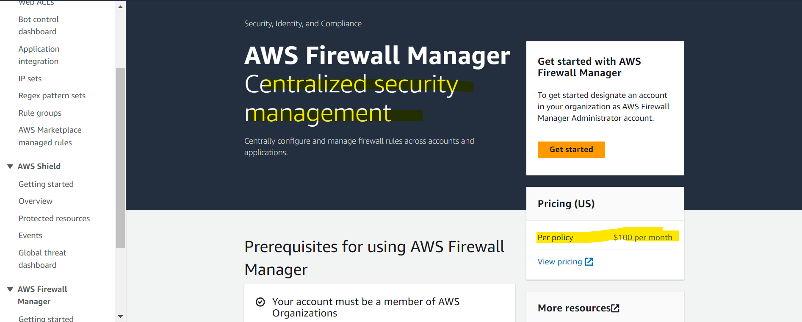

# AWS - Firewall Manager

[Back](../index.md)

- [AWS - Firewall Manager](#aws---firewall-manager)
  - [`AWS Firewall Manager`](#aws-firewall-manager)
  - [Hands-on](#hands-on)

---

## `AWS Firewall Manager`

- **Manage rules** in **all accounts** of an `AWS Organization`
- `Security policy`: common set of security rules

  - `WAF` rules (Application Load Balancer, API Gateways, CloudFront)
  - AWS `Shield` **Advanced** (ALB, CLB, NLB, Elastic IP, CloudFront)
  - `Security Groups` for EC2, Application Load BAlancer and ENI resources in VPC
  - AWS `Network Firewall` (VPC Level)
  - Amazon `Route 53` Resolver DNS Firewall
  - **Policies** are created at the **region** level

- Rules are applied to new resources **as they are created (good for compliance)** across all and future accounts in your `Organization`

- Sample:
  - Which AWS service allows you to **centrally manage** EC2 Security Groups and AWS Shield Advanced across all AWS accounts in your AWS Organization?
    - AWS Firewall Manager is a security management service that allows you to **centrally** configure and manage **firewall rules** across your accounts and applications in AWS **Organizations**. It is integrated with AWS Organizations so you can enable AWS `WAF` rules, AWS `Shield` Advanced protection, `security groups`, AWS `Network Firewall` rules, and Amazon `Route 53` Resolver DNS Firewall rules.
  - You are managing an AWS Organization with multiple AWS accounts. Each account has a separate application with different resources. You want **an easy way to manage** Security Groups and WAF Rules across those accounts as there was a security incident the last week and you want to tighten up your resources. Which AWS service can help you to do so?
    - Firewall Manager

---

## Hands-on

---

[TOP](#aws---firewall-manager)
