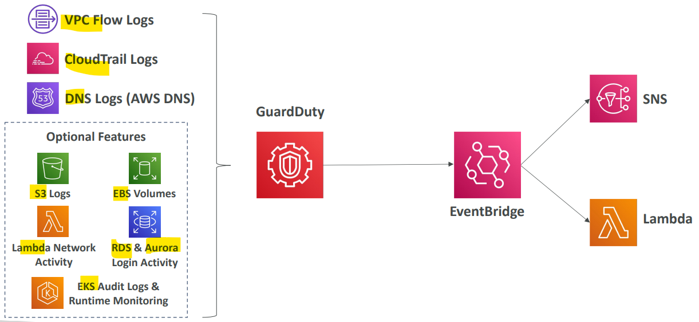

# AWS - GuardDuty

[Back](../index.md)

- [AWS - GuardDuty](#aws---guardduty)
  - [`Amazon GuardDuty`](#amazon-guardduty)

---

## `Amazon GuardDuty`

- Usage

  - **Intelligent Threat discovery** to protect your **AWS Account**

- Features:

  - Uses **Machine Learning algorithms**, anomaly detection, 3rd party data
  - One click to enable (30 days trial), **no need to install** software

- **Input** data includes:

  - `CloudTrail Events Logs`
    - unusual API calls, unauthorized deployments
  - `CloudTrail Management Events`
    - create VPC subnet, create trail, …
  - `CloudTrail S3 Data Events`
    - get object, list objects, delete object, …
  - `VPC Flow Logs`
    - unusual internal traffic, unusual IP address
  - `DNS Logs`
    - compromised EC2 instances sending encoded data within DNS queries
  - Optional Features
    - `EKS Audit Logs`, `RDS` & `Aurora`, `EBS`, `Lambda`, `S3 Data Events`…

- Integration

  - Can setup `EventBridge` rules to be **notified** in case of findings
  - `EventBridge` rules can target AWS `Lambda` or `SNS`

- Can **protect against CryptoCurrency attacks**
  - has a dedicated “finding” for it

- Sample:
  - AWS GuardDuty scans the following data sources, EXCEPT ................
    - CloudWatch Logs

---

[TOP](#aws---guardduty)
