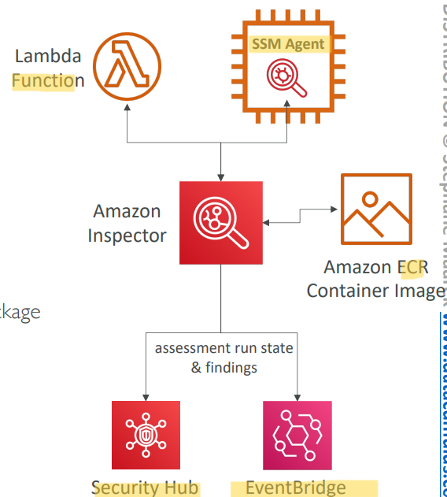

# AWS - Inspector

[Back](../index.md)

- [AWS - Inspector](#aws---inspector)
  - [`Amazon Inspector`](#amazon-inspector)
  - [What does Amazon Inspector evaluate?](#what-does-amazon-inspector-evaluate)

---

## `Amazon Inspector`

- `Amazon Inspector`

  - Automated **Security Assessments**

- **For EC2 instances**

  - Leveraging the `AWS System Manager (SSM) agent`
  - Analyze against **unintended network accessibility**
  - Analyze the running OS against **known vulnerabilities**

- **For Container Images push to Amazon ECR**

  - Assessment of **Container Images** as they are pushed

- **For Lambda Functions**

  - Identifies software **vulnerabilities in function code and package dependencies**
  - Assessment of functions as they are **deployed**

- **Reporting** & integration with `AWS Security Hub`
- Send findings to Amazon `EventBridge`

- Sample:
  - You would like to analyze OS vulnerabilities from within EC2 instances. You need these analyses to occur weekly and provide you with concrete recommendations in case vulnerabilities are found. Which AWS service should you use?
    - Inspect

---

## What does Amazon Inspector evaluate?

- Remember:
  - only for `EC2` instances, `Container Images` & `Lambda` functions
- **Continuous scanning** of the infrastructure, only when needed
- **Package** vulnerabilities (`EC2`, `ECR` & `Lambda`) – database of `CVE(Common Vulnerabilities and Exposures)`
- **Network reachability** (EC2)
- A **risk score** is associated with all vulnerabilities for prioritization

---

[TOP](#aws---inspector)
