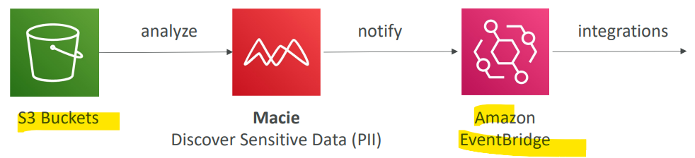

# AWS - Macie

[Back](../index.md)

- [AWS - Macie](#aws---macie)
  - [`AWS Macie`](#aws-macie)

---

## `AWS Macie`

- `Amazon Macie`
  - a fully managed **data security** and **data privacy** service that uses **machine learning** and pattern matching to discover and protect your **sensitive data** in AWS.
- Macie helps identify and **alert** you to **sensitive data**, such as personally identifiable information (PII)

- Sample:
  - Which AWS service helps you protect your sensitive data stored in S3 buckets?
    - Macie

---

[TOP](#aws---macie)
