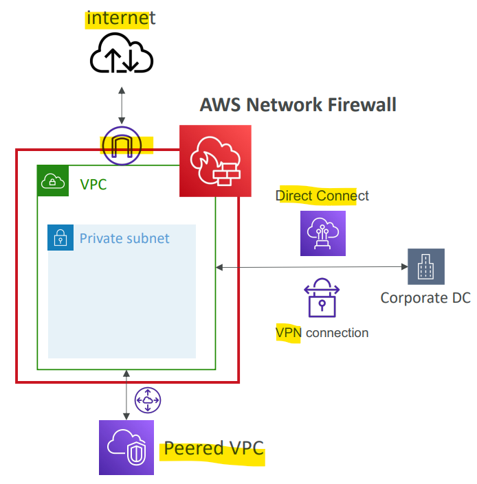

# AWS - Network Firewall

[Back](../index.md)

- [AWS - Network Firewall](#aws---network-firewall)
  - [AWS Network Firewall](#aws-network-firewall)
    - [Network Protection on AWS](#network-protection-on-aws)
    - [Fine Grained Controls](#fine-grained-controls)

---

## AWS Network Firewall

- `Network Firewall`

  - Protect your **entire Amazon VPC**
  - From Layer `3` to Layer `7` protection

- Feature

  - Internally, the AWS `Network Firewall` uses the `AWS Gateway Load Balancer`(not 3rd-party app, but aws manage it)
  - **Rules** can be centrally managed **cross-account** by `AWS Firewall Manager` to apply to **many VPCs**

- Any direction, you can **inspect**
  - **VPC to VPC** traffic
  - **Outbound** to internet
  - **Inbound** from internet
  - To / from `Direct Connect` & Site-to-Site `VPN`

---

### Network Protection on AWS

- To protect network on AWS, we’ve seen
  - `Network Access Control Lists (NACLs)`
  - Amazon VPC `security groups`
  - AWS `WAF` (protect against malicious **HTTP** requests)
  - AWS `Shield` & AWS `Shield Advanced`(**DDoS**)
  - AWS `Firewall Manager` (to manage them **across accounts**)
  - AWS `Network Firewall`(VPC level)

---

### Fine Grained Controls

- Supports **1000s** of rules

  - **IP** & **port**
    - example: 10,000s of **IPs filtering**
  - **Protocol**
    - example: **block** the SMB protocol for outbound communications
  - **Stateful domain list rule groups**:
    - only allow outbound traffic to `*.mycorp.com` or third-party software repo
  - General **pattern matching using regex**

- **Traffic filtering**:
  - Allow, drop, or alert for the traffic that matches the rules
- **Active flow inspection** to protect against network threats with intrusionprevention capabilities
  - like `Gateway Load Balancer`, but all managed by AWS
- **Send logs of rule matches** to Amazon `S3`, `CloudWatch Logs`, `Kinesis Data Firehose`

---

[TOP](#aws---network-firewall)
