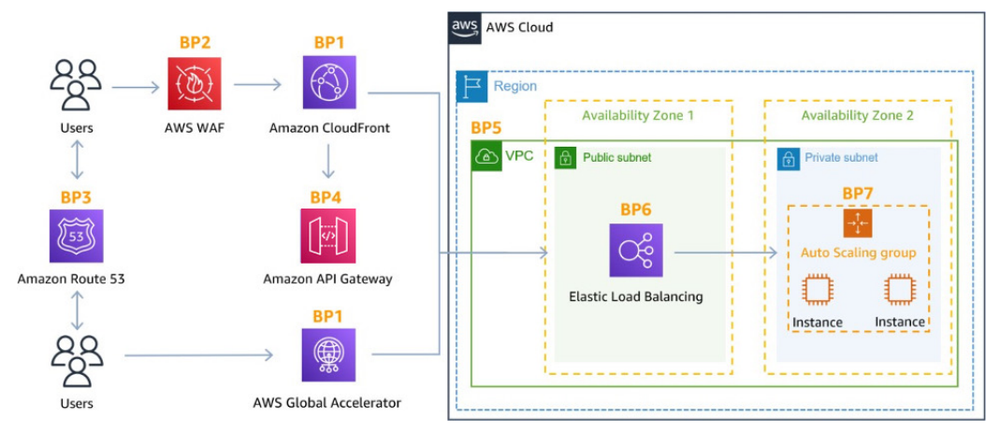

# AWS - Security

[Back](../index.md)

- [AWS - Security](#aws---security)
  - [Summary](#summary)
  - [WAF vs. Firewall Manager vs. Shield](#waf-vs-firewall-manager-vs-shield)
  - [AWS Best Practices for DDoS Resiliency](#aws-best-practices-for-ddos-resiliency)
    - [Edge Location Mitigation (BP1, BP3)](#edge-location-mitigation-bp1-bp3)
    - [Best pratices for DDoS mitigation](#best-pratices-for-ddos-mitigation)
    - [Application Layer Defense](#application-layer-defense)
    - [Attack surface reduction](#attack-surface-reduction)

---

## Summary

| Services           | Features                               |
| ------------------ | -------------------------------------- |
| `WAF`              | ACL rules, HTTP,layer 7, ALB(not NLB)  |
| `Shield`           | DDos, Layer 3/4                        |
| `Firewall Manager` | accounts in Organ,                     |
| `GuardDuty`        | Threat discovery, ML                   |
| `Inspector`        | Security Assessments, EC2, ECS, Lambda |
| `Macie`            | sensitive data, ML                     |

---

## WAF vs. Firewall Manager vs. Shield

- `WAF`, `Shield` and `Firewall Manager` are **used together for comprehensive protection**

- `WAF`

  - Define your `Web ACL rules`
  - For granular protection of your resources, WAF alone is the correct choice

- `WAF` + `Firewall Manager`

  - If you want to use AWS `WAF` **across accounts**, **accelerate** WAF configuration, **automate** the protection of new resources, use Firewall Manager with AWS WAF

- `Shield`
  - If you’re prone to frequent `DDoS` attacks, consider purchasing Shield Advanced
  - `Shield Advanced` adds additional features on top of AWS `WAF`, such as dedicated support from the `Shield Response Team (SRT)` and advanced **reporting**.

---

## AWS Best Practices for DDoS Resiliency

### Edge Location Mitigation (BP1, BP3)

- **BP1 – `CloudFront`**

  - Web Application **delivery at the edge**
  - Protect from DDoS Common Attacks (SYN floods, UDP reflection…)

- **BP1 – `Global Accelerator`**

  - **Access** your application from the **edge**
  - **Integration** with `Shield` for DDoS protection
  - Helpful if your backend is not compatible with `CloudFront`

- **BP3 – Route 53**
  - **Domain Name Resolution** at the **edge**
  - DDoS Protection mechanism

---

### Best pratices for DDoS mitigation

- **Infrastructure layer defense (BP1, BP3, BP6)**

  - Protect Amazon `EC2` **against high traffic**
  - That includes using `Global Accelerator`, `Route 53`, `CloudFront`, `Elastic Load Balancing`

- **Amazon EC2 with Auto Scaling (BP7)**

  - Helps scale **in case of sudden traffic surges** including a flash crowd or a DDoS attack

- **Elastic Load Balancing (BP6)**
  - `Elastic Load Balancing` **scales** with the traffic increases and will **distribute the traffic** to many EC2 instance

---

### Application Layer Defense

- **Detect and filter malicious web requests (BP1, BP2)**

  - `CloudFront` **cache static content** and serve it from edge locations, protecting your backend
  - `CloudFront` can **block specific geographies**
  - `AWS WAF` is used on top of CloudFront and Application Load Balancer to **filter and block requests** based on request signatures
  - WAF **rate-based rules** can **automatically block** the IPs of bad actors
  - Use **managed rules** on WAF to block attacks based on IP reputation, or block anonymous Ips

- **Shield Advanced (BP1, BP2, BP6)**
  - `Shield Advanced` automatic application layer DDoS mitigation automatically creates, evaluates and deploys **AWS WAF rules** to **mitigate layer 7 attacks**

---

### Attack surface reduction

- **Obfuscating AWS resources (BP1, BP4, BP6)**

  - Using `CloudFront`, `API Gateway`, `Elastic Load Balancing` to **hide** your backend resources (Lambda functions, EC2 instances)

- **Security groups and Network ACLs (BP5)**

  - Use `security groups` and `NACLs` to **filter traffic** based on specific IP at the subnet or ENI-level
  - `Elastic IP` are protected by AWS `Shield Advanced`

- **Protecting API endpoints (BP4)**
  - API can **Hide** EC2, Lambda, elsewhere
  - **Edge-optimized mode**, or `CloudFront` + **regional mode** (more control for DDoS)
  - `WAF` + `API` Gateway: burst limits, headers filtering, use API keys

---

[TOP](#aws---security)
