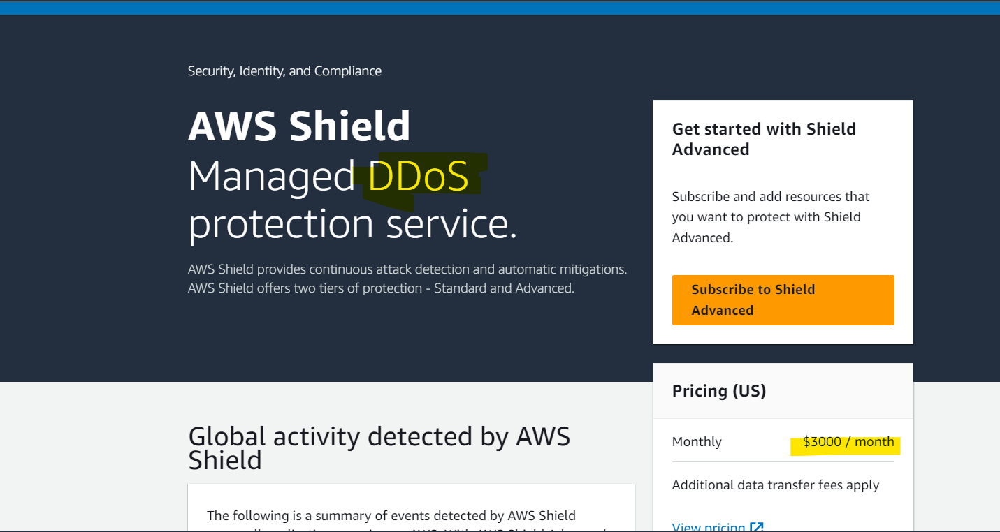

# AWS - Shield

[Back](../index.md)

- [AWS - Shield](#aws---shield)
  - [AWS Shield](#aws-shield)
  - [Hands-on](#hands-on)

---

## AWS Shield

- `AWS Shield`

  - used to protect from DDoS attack

- `DDoS(Distributed Denial of Service)`:

  - many requests at the same time
  - to overwhelm or overload target infrastructure, stopping services.

- `AWS Shield Standard`:

  - **Free** service that is activated for every AWS customer
  - Provides protection from attacks such as `SYN/UDP Floods`, **Reflection attacks** and other **layer 3/layer 4** attacks

- `AWS Shield Advanced`:

  - **Optional** DDoS mitigation service ($3,000 per month per organization)
  - Protect against more sophisticated attack on Amazon `EC2`, `Elastic Load Balancing (ELB)`, Amazon `CloudFront`, AWS `Global Accelerator`, and `Route 53`
  - **24/7 access to `AWS DDoS response team (DRP)`**
  - **Protect against higher fees** during usage spikes due to DDoS
  - Shield Advanced automatic application layer `DDoS mitigation` automatically creates, evaluates and deploys AWS WAF **rules to mitigate** `layer 7` attacks

- Sample:
  - Your user-facing website is a high-risk target for DDoS attacks and you would like to get **24/7 support** in case they happen and AWS **bill reimbursement** for the incurred costs during the attack. What AWS service should you use?
    - AWS Shield Advanced

---

## Hands-on

---

[TOP](#aws---shield)
