# AWS - Web Application Firewall(WAF)

[Back](../index.md)

- [AWS - Web Application Firewall(WAF)](#aws---web-application-firewallwaf)
  - [`AWS WAF – Web Application Firewall`](#aws-waf--web-application-firewall)
    - [Access Control List](#access-control-list)
  - [Use Case: Fixed IP while using WAF with a Load Balancer](#use-case-fixed-ip-while-using-waf-with-a-load-balancer)
  - [Hands-on](#hands-on)

---

## `AWS WAF – Web Application Firewall`

- **Protects your web applications** from common web exploits (`Layer 7`)
- `Layer 7` is `HTTP`

  - `Layer 4` is `TCP/UDP`

- Deploy on 记住
  - `CloudFront` (Global)
  - `Application Load Balancer` (Not `NLB``)
  - `API Gateway`
  - `AppSync GraphQL API`
  - `Cognito` User Pool

- Sample:
  - You have a website hosted on a fleet of EC2 instances fronted by an **Application Load Balancer**. What should you use to protect your website from common web application attacks (e.g., **SQL Injection**)?
    - WAF

---

### Access Control List

- Define `Web ACL (Web Access Control List)` Rules to filter based on:
  - **IP Set**: up to 10,000 IP addresses
    - use **multiple** Rules for more IPs
  - HTTP headers, HTTP body, or URI strings Protects from common attack
    - e.g.: `SQL injection` and `Cross-Site Scripting (XSS)`
  - Size **constraints**, **geo**-match (block countries)
  - **Rate-based rules** (to count **occurrences** of events) – for `DDoS` protection
- `Web ACL` are **Regional**
  - except for CloudFront
- A `rule group`
  - a **reusable set of rules** that you can add to a web ACL

---

## Use Case: Fixed IP while using WAF with a Load Balancer

- WAF **does not support** the `Network Load Balancer` (`Layer 4`)
- ALB does not have fixed IP
- Solution:
  - can use `Global Accelerator` for **fixed IP** and `WAF` on the `ALB`

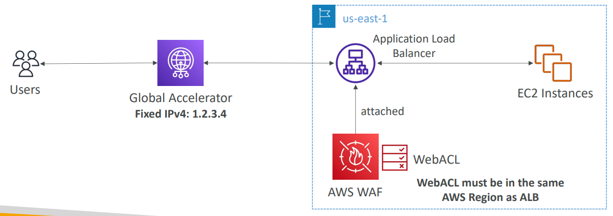

---

## Hands-on

- WAF: CloudFront
  - Region: Global

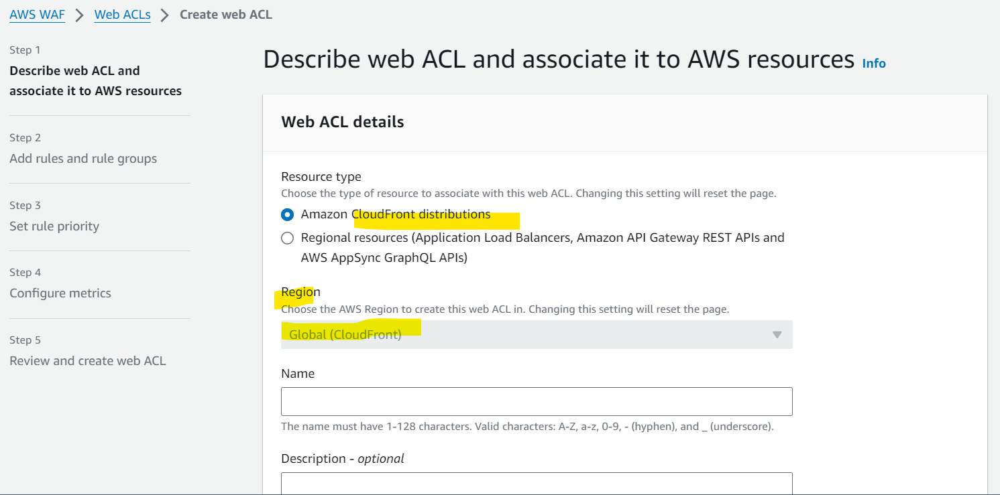

- WAF: Regional resources
  - Application Load Balancers,
  - Amazon API Gateway REST APIs,
  - Amazon App Runner services,
  - AWS AppSync GraphQL APIs,
  - Amazon Cognito user pools,
  - and AWS Verified Access Instances

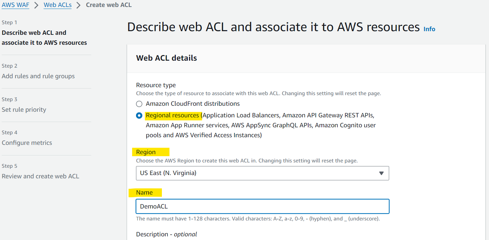

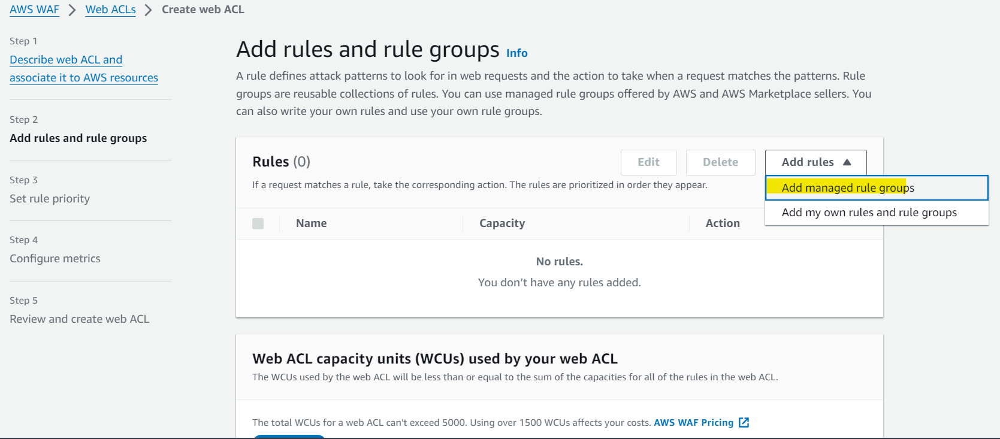

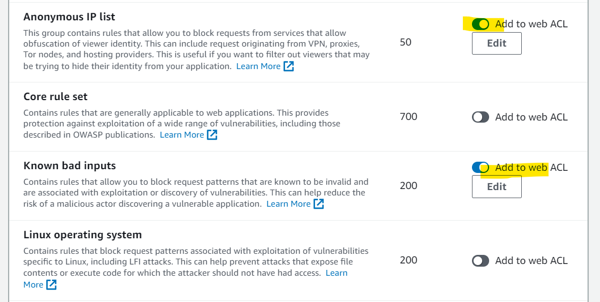

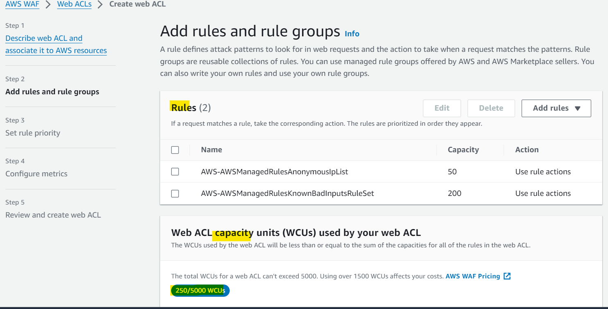

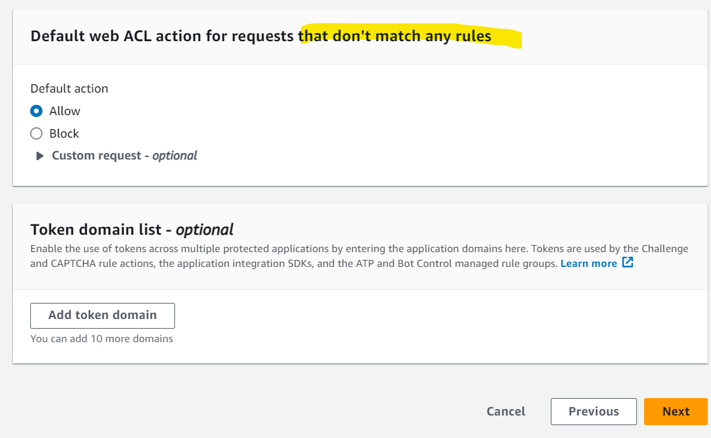

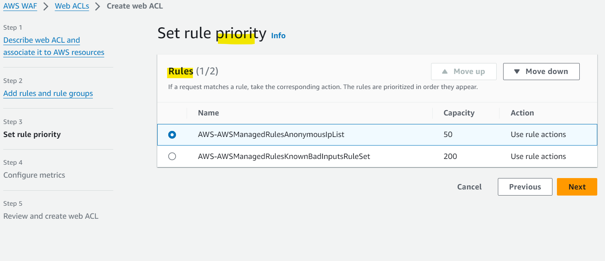

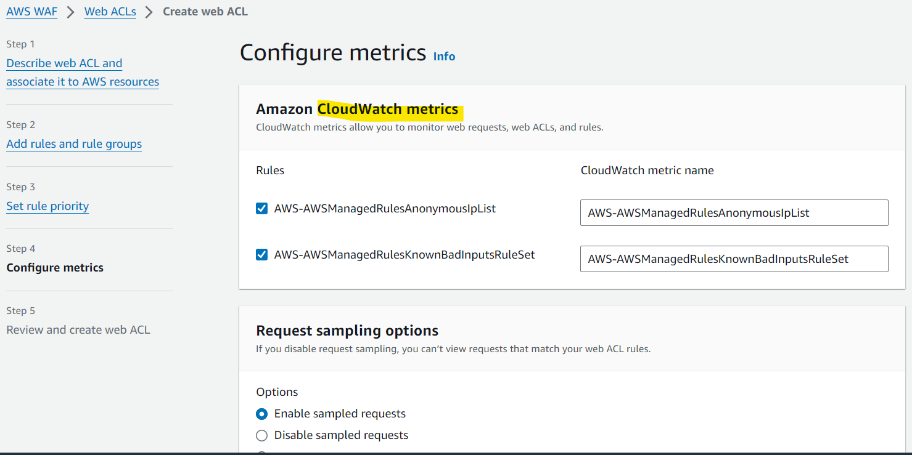

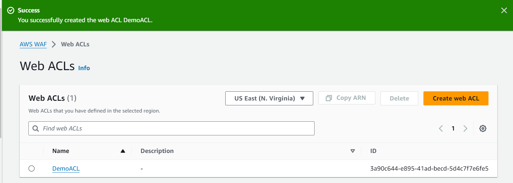

- IP sets

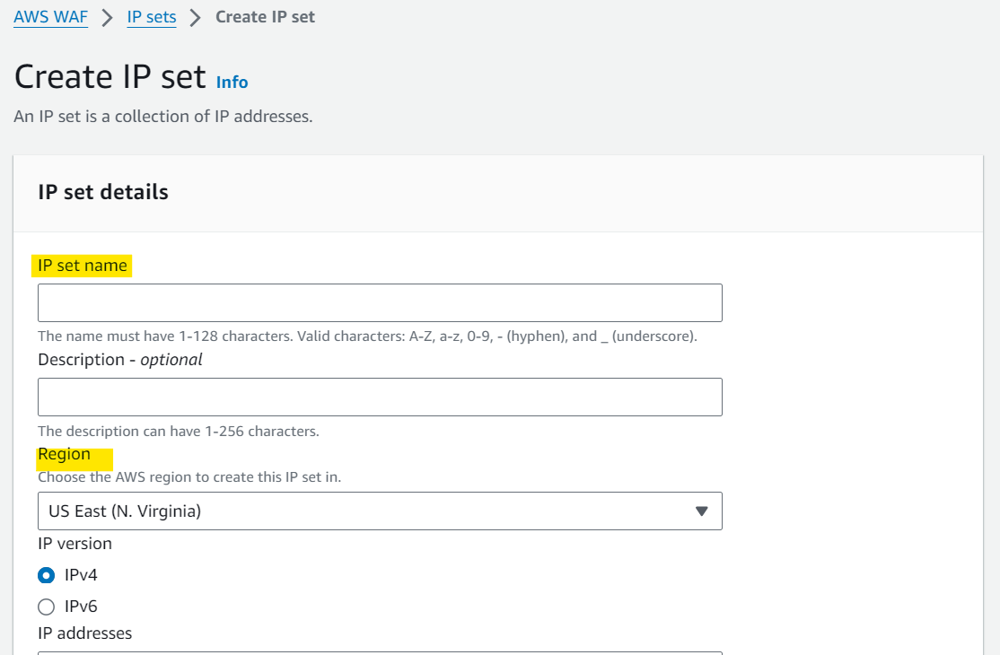

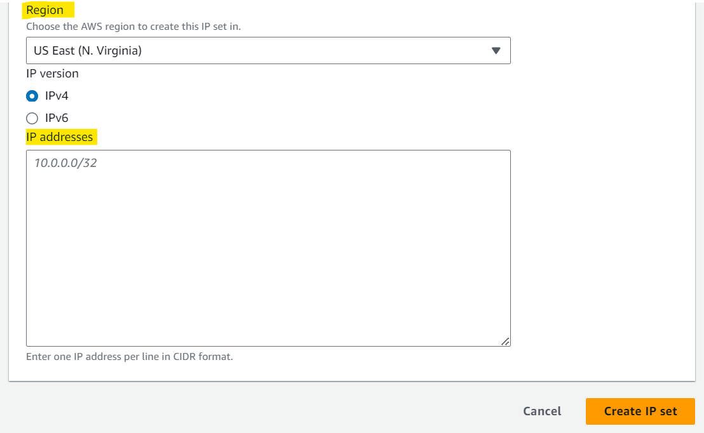

---

[TOP](#aws---web-application-firewallwaf)
