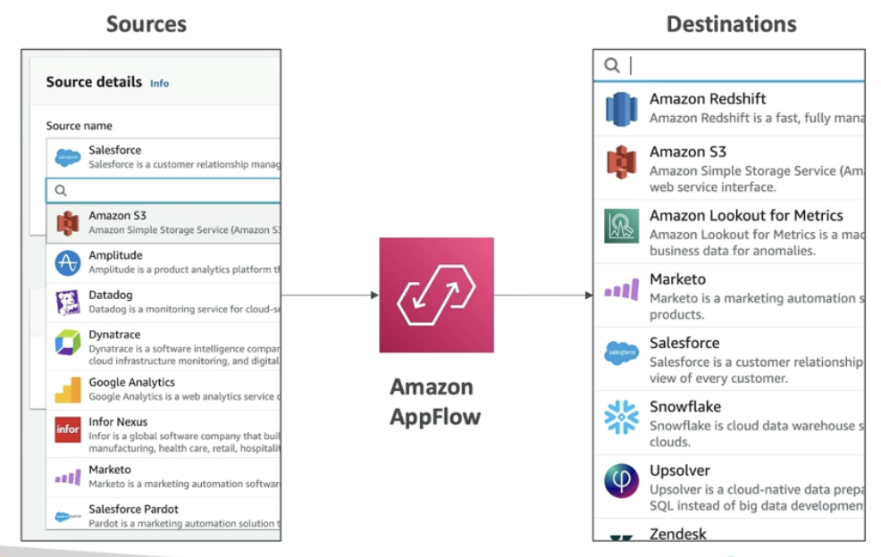

# AWS Service - Amazon AppFlow

[Back](../../index.md)

- [AWS Service - Amazon AppFlow](#aws-service---amazon-appflow)
  - [`Amazon AppFlow`](#amazon-appflow)

---

## `Amazon AppFlow`

- `AppFlow`

  - Fully managed **integration service** that enables you to securely **transfer data** between **`Software-as-a-Service (SaaS)` applications** and **AWS**

- Features:

  - Data transformation capabilities like **filtering** and **validation**
  - **Encrypted** over the **public** internet or **privately** over AWS `PrivateLink`
  - **Sources**:

    - `Salesforce`, `SAP`, `Zendesk`, `Slack`, and `ServiceNow`

  - **Destinations**:

    - AWS services like Amazon `S3`, Amazon `Redshift` or nonAWS such as `SnowFlake` and `Salesforce`

  - **Frequency**:

    - on a schedule, in response to events,
    - or on demand

- Benefits:
  - Don’t spend time writing the integrations and **leverage APIs immediately**

---

[TOP](#aws-service---amazon-appflow)
