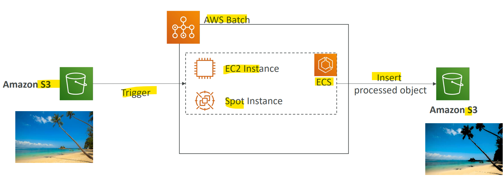

# AWS Service - AWS Batch

[Back](../../index.md)

- [AWS Service - AWS Batch](#aws-service---aws-batch)
  - [`AWS Batch`](#aws-batch)
  - [`Batch` vs `Lambda`](#batch-vs-lambda)

---

## `AWS Batch`

- `AWS Batch`

  - Fully managed **batch processing** at any scale

- `batch job`

  - a job **with a start and an end**
  - opposed to continuous

- **Features**:

  - Efficiently run 100,000s of computing **batch jobs** on AWS
  - Batch will **dynamically launch** `EC2` instances or `Spot Instances`
  - AWS Batch provisions the **right amount** of compute / memory
  - You **submit** or schedule batch jobs and `AWS Batch` **does the rest!**

- Batch jobs are **defined** as `Docker` images and run on `ECS`

- **Benefits**:
  - Helpful for **cost optimizations** and **focusing less on the infrastructure**

---

- Example:

---

## `Batch` vs `Lambda`

- `Lambda`:

  - **Time limit**
  - Limited **runtimes**
  - Limited temporary **disk space**
  - **Serverless**

- `Batch`:
  - **No** time limit
  - **Any runtime** as long as it’s packaged as a `Docker` image
  - Rely on `EBS` / `instance store` for disk space
  - Relies on EC2 (can be **managed by AWS**)

---

[TOP](#aws-service---aws-batch)
