# AWS Service - CloudFormation

[Back](../../index.md)

- [AWS Service - CloudFormation](#aws-service---cloudformation)
  - [`CloudFormation`](#cloudformation)
    - [Benefits](#benefits)
    - [Stack Designer](#stack-designer)
    - [Hands-on](#hands-on)

---

## `CloudFormation`

- `CloudFormation`

  - a declarative way of **outlining your AWS Infrastructure**, for any resources (most of them are supported).

- For example, within a `CloudFormation` **template**, you say:

  - I want a security group
  - I want two EC2 instances using this security group
  - I want an S3 bucket
  - I want a load balancer (ELB) in front of these machines

- Then `CloudFormation` creates those for you, **in the right order**, with the exact configuration that you specify

- 考点:
  - infrastructure as code
  - need to repeat an architecture in different environments, different regions, different accounts.

---

### Benefits

- **Infrastructure as code**
  - **No** resources are **manually** created, which is excellent for control
  - Changes to the infrastructure are **reviewed through code**
- **Cost**

  - Each resources within the stack is **tagged with an identifier** so you can easily see how much a stack costs you
  - You can **estimate the costs** of your resources using the `CloudFormation` **template**
  - **Savings** strategy:
    - In Dev, you could **automation deletion** of templates at 5 PM and recreated at 8 AM, safely

- **Productivity**

  - Ability to **destroy and re-create** an infrastructure on the cloud **on the fly**
  - **Automated generation of Diagram** for your templates!
  - **Declarative** programming
    - **no** need to figure out **ordering and orchestration**

- **Don’t re-invent the wheel**

  - Leverage **existing templates** on the web!
  - Leverage the **documentation**

- **Supports (almost) all AWS resources:**
  - Everything we’ll see in this course is supported
  - You can use “custom resources” for resources that are not supported

---

### Stack Designer

- Example: WordPress CloudFormation Stack
- We can see all the **resources**
- We can see the **relations** between the components

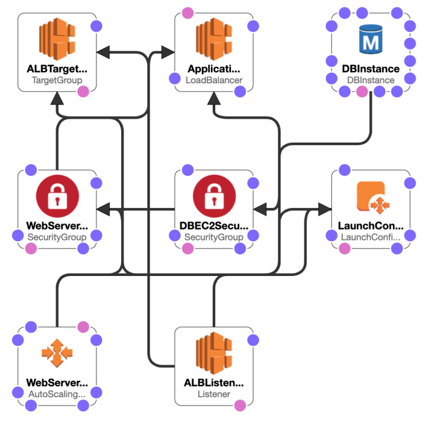

---

### Hands-on

- Mind the region
- Create a stack by uploading a yaml file

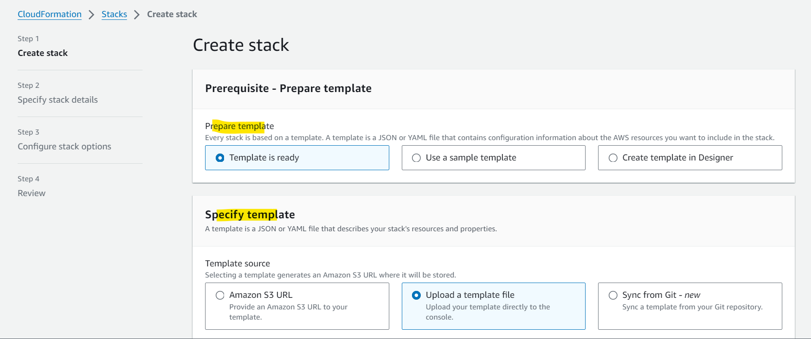

- View in Designer

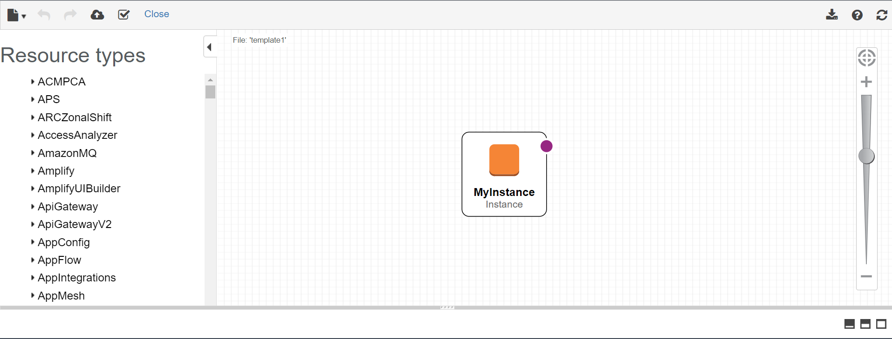

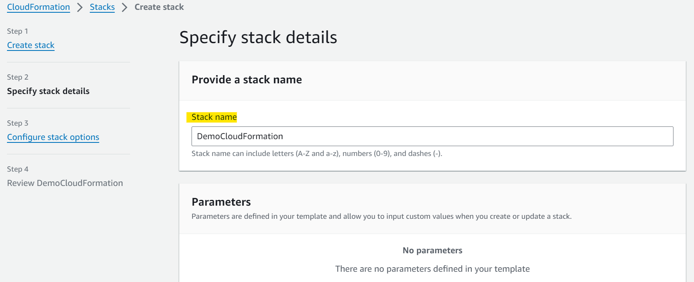

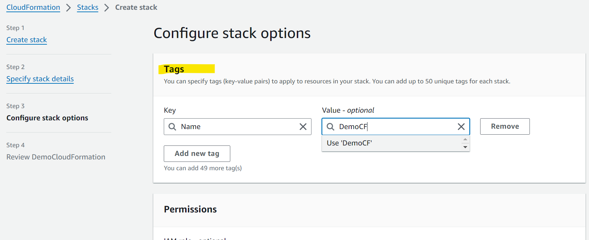

- Outcome:

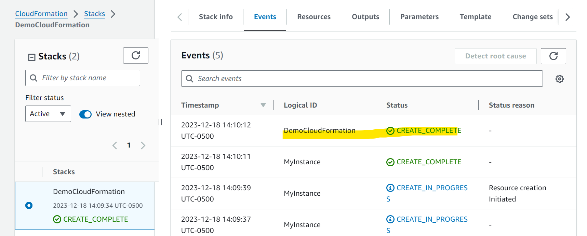

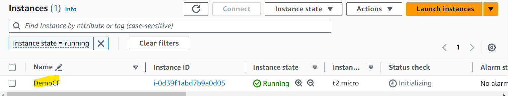

---

- Update a new template

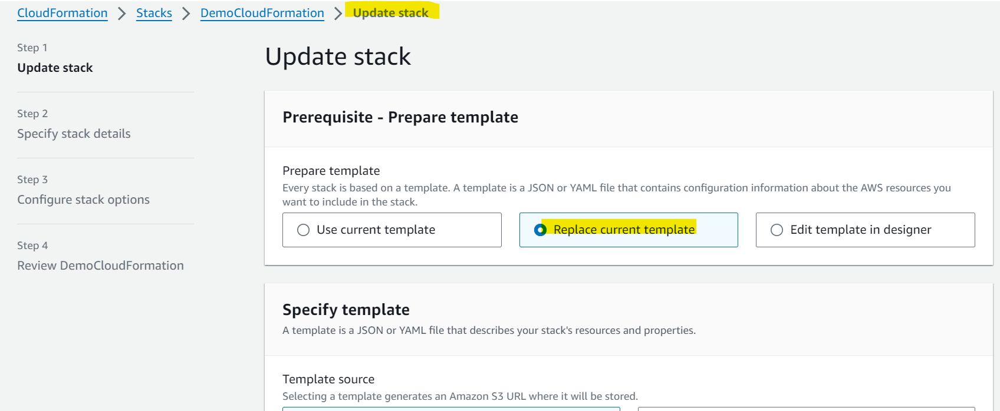

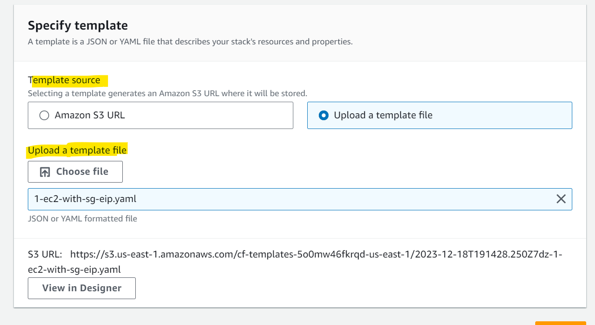

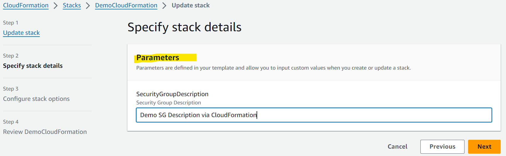

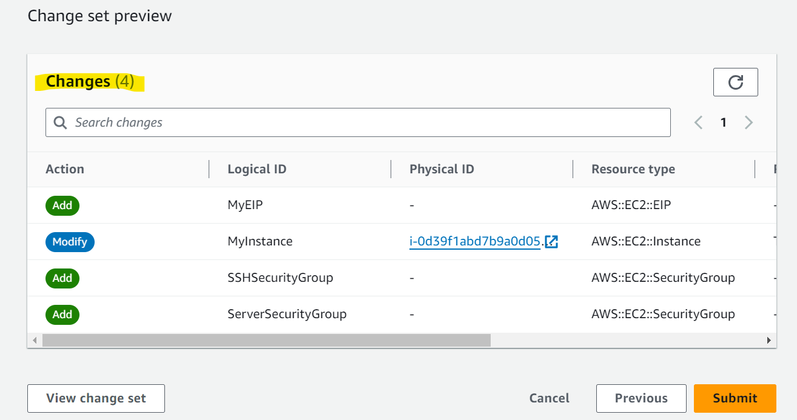

- View in designer

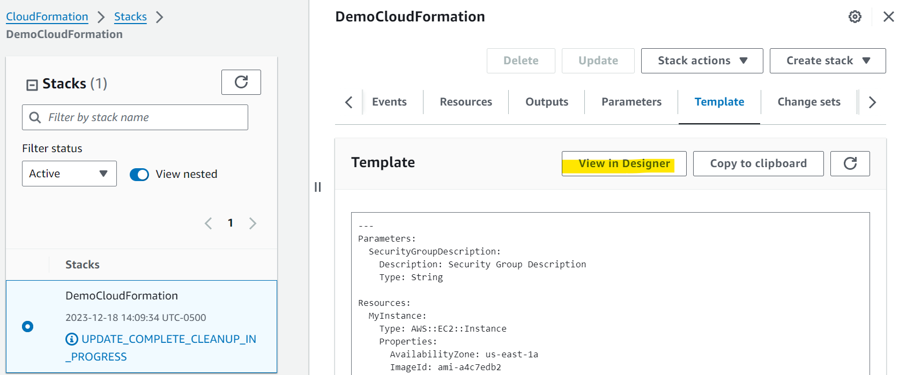

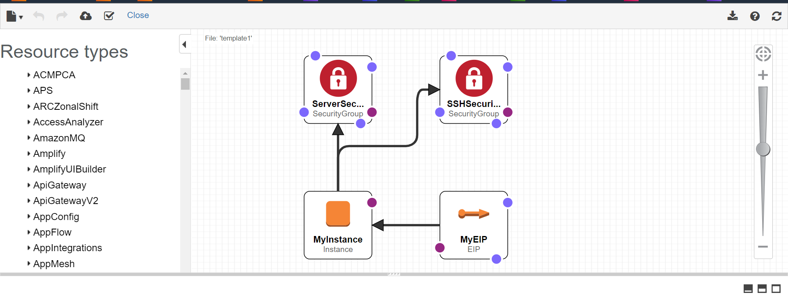

- Outcome

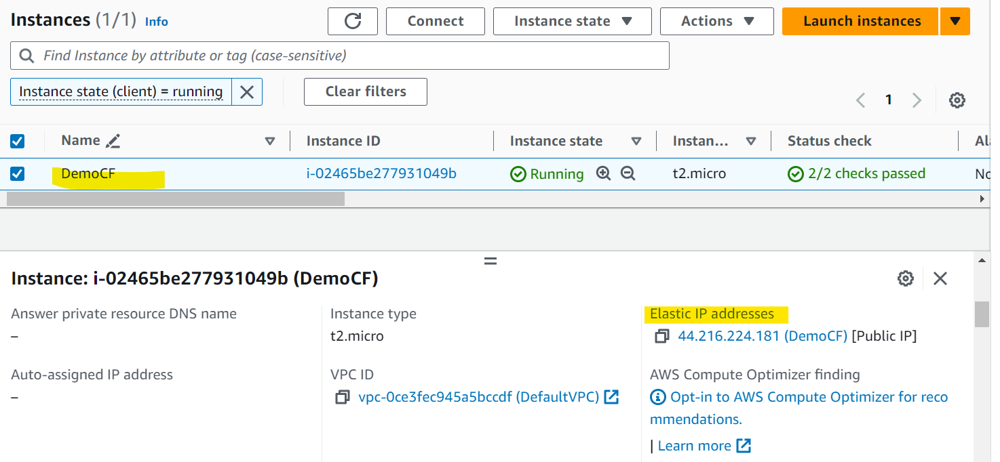

- Delete

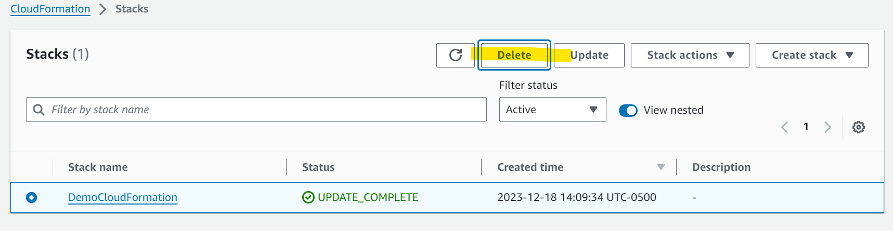

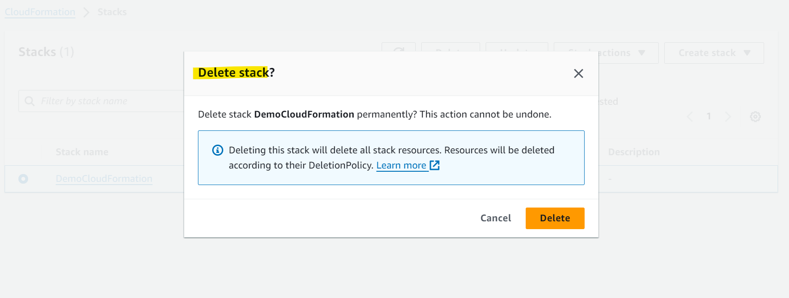

---

[TOP](#aws-service---cloudformation)
