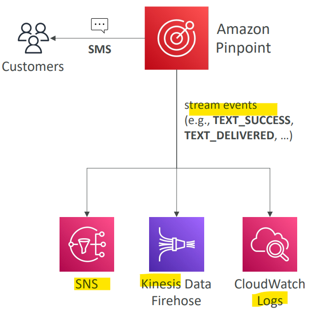

# AWS Service - Amazon Pinpoint

[Back](../../index.md)

- [AWS Service - Amazon Pinpoint](#aws-service---amazon-pinpoint)
  - [Amazon Pinpoint](#amazon-pinpoint)

---

## Amazon Pinpoint

- `Amazon Pinpoint`

  - Scalable 2-way (outbound/inbound) **marketing communications service**

- Features

  - **Supports** email, SMS, push, voice, and in-app messaging
  - Ability to **segment** and **personalize messages** with the right content to customers
  - Possibility to **receive replies**
  - **Scales** to billions of messages per day

- **Use cases**:

  - run **campaigns by sending marketing**, bulk, transactional **SMS** messages

- Versus `Amazon SNS` or `Amazon SES`
  - In `SNS` & `SES` you managed **each** message's audience, content, and delivery schedule. 逐个设置
  - In Amazon `Pinpoint`, you create message **templates**, delivery schedules, highly-targeted **segments**, and **full campaigns** (批量)

---

[TOP](#aws-service---amazon-pinpoint)
