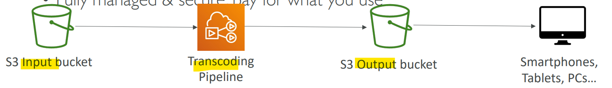

# AWS Service - Elastic Transcoder

[Back](../../index.md)

- [AWS Service - Elastic Transcoder](#aws-service---elastic-transcoder)
  - [Amazon Elastic Transcoder](#amazon-elastic-transcoder)

---

## Amazon Elastic Transcoder

- `Elastic Transcoder`

  - used to **convert media files** stored in `S3` into media files in the **formats** required by consumer playback devices (phones etc..)

- **Benefits**:
  - Easy to use
  - Highly **scalable**
    - can handle **large volumes** of media files and **large file sizes**
  - Cost effective
    - **duration-based** pricing model
  - Fully managed & secure, pay for what you use

---

[TOP](#aws-service---elastic-transcoder)
