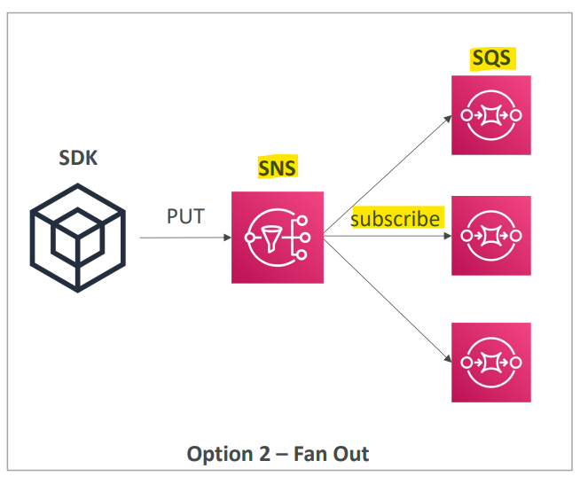

# AWS Solution

[Back](../../index.md)

- [AWS Solution](#aws-solution)
  - [Event processing](#event-processing)
    - [Lambda, SNS \& SQS](#lambda-sns--sqs)
    - [Fan Out Pattern: deliver to multiple SQS](#fan-out-pattern-deliver-to-multiple-sqs)
    - [`S3` Event Notifications](#s3-event-notifications)
    - [`S3` Event Notifications: `S3` + `EventBridge`](#s3-event-notifications-s3--eventbridge)
    - [Intercept API Calls: `CloudTrail` + `EventBridge`](#intercept-api-calls-cloudtrail--eventbridge)
    - [Sent External events to AWS: `API Gateway` + `Kinesis`](#sent-external-events-to-aws-api-gateway--kinesis)
  - [Caching Strategies](#caching-strategies)
  - [Blocking an IP address](#blocking-an-ip-address)
    - [Basic](#basic)
    - [with an ALB](#with-an-alb)
    - [with an NLB](#with-an-nlb)
    - [ALB + WAF](#alb--waf)
    - [ALB, CloudFront WAF](#alb-cloudfront-waf)
  - [High Performance Computing (HPC)(变得常考)](#high-performance-computing-hpc变得常考)
    - [Data Management \& Transfer](#data-management--transfer)
    - [Compute and Networking](#compute-and-networking)
    - [Storage](#storage)
    - [Automation and Orchestration](#automation-and-orchestration)
  - [Creating a highly available EC2 instance](#creating-a-highly-available-ec2-instance)
    - [Standby EC2 instance](#standby-ec2-instance)
    - [With an Auto Scaling Group](#with-an-auto-scaling-group)
    - [With ASG + EBS](#with-asg--ebs)
  - [More Architecture Examples](#more-architecture-examples)

---

## Event processing

### Lambda, SNS & SQS

- **SQS + Lambda**
  - lambda try and retry to poll SQS queue.
  - when there is a big problem with a message, for example five tries, it is sent to a `DLQ(dead letter queue)`.

- **SQS FIFO + Lambda**
  - message processed **in order**.
  - lambda try and retry to poll SQS queue.
  - Due to processing in order, failure of processing one message creates a blocking.
  - `DLQ(dead letter queue)` set up on the `SQS` side to send the failure message off the SQS queue.

- **SNS + Lambda**
  - message go through `SNS` then sent **asynchronously** to `Lambda`
  - lambda function retry, e.g., 3 times.
    - if not processed, lambda send the messge into a SQS queue as `DLQ` for latter processing.
    - DLQ is on the lambda side.

---

### Fan Out Pattern: deliver to multiple SQS

- APP + SQS
  - not reliable
  - each SQS proccess different messages.

- App + SNS + SQS
  - SQS subscribe to SNS topic
  - messages are sent to all SQS
  - Common design pattern

---

### `S3` Event Notifications

- S3 events:
  `S3:ObjectCreated`, `S3:ObjectRemoved`, `S3:ObjectRestore`, `S3:Replication`…
- **Object name filtering** possible (\*.jpg)
  - filter the event for different types of files.
- Use case:
  - **generate thumbnails** of images uploaded to S3
- Can create **as many** “S3 events” **as desired**
- Can deliver to `SNS`, `SQS`, and `lambda`.
- S3 event notifications typically deliver events in seconds but **can sometimes take a minute or longer**

- Sample:
  - You are working on a Serverless application where you want to process objects uploaded to an S3 bucket. You have configured S3 Events on your S3 bucket to **invoke a Lambda function** every time an object has been uploaded. You want to ensure that events that can't be processed are **sent to a Dead Letter Queue (DLQ)** for further processing. Which **AWS service** should you use to set up the DLQ?
    - lambda

---

### `S3` Event Notifications: `S3` + `EventBridge`

- Advanced **filtering** options with **JSON** rules (metadata, object size, name...)
- **Multiple Destinations**
  - ex `Step Functions`, `Kinesis` Streams / Firehose…
- EventBridge Capabilities
  - **Archive**, **Replay** Events, Reliable **delivery**

---

### Intercept API Calls: `CloudTrail` + `EventBridge`

- Use EventBridge to intercept API Calls

---

### Sent External events to AWS: `API Gateway` + `Kinesis`

- use API gateway

---

## Caching Strategies

- `Dynamic route`

  - `CloudFront`
    - caching at the edge(as close as possible to users, very quick)
    - use `TTL` to make sure the cache is **often renewed**.
  - `API Gateway`
    - has caching capabilities.
    - cache in API Gateway is **network lying** since API Gateway is **regional** service.不同地区可能有不同缓存.
  - App logic
    - **no caching**
  - `DAX`
    - cache the result of **frequent queries**.
    - saving pressure on DB.
  - `DB`
    - **no caching**

- `Static Route`
  - `CloudFront`
    - caching at the edge(as close as possible to users, very quick)
    - use `TTL` to make sure the cache is often renewed.
  - `S3`
    - **no caching**

---

## Blocking an IP address

### Basic

- NACL:
  - Subnet level
  - Deny rule to reject request
- SG
  - only allow a subset of IP
  - not very helpful if app is global(no way to identify the subset of IP), due to no deny rule
- Firewall in EC2
  - optional
  - will be a CPU cost

---

### with an ALB

- `NACL`:
  - Subnet level
  - Deny rule
- `ALB`
  - between the user and instance
  - Connection termination
  - SG
    - can block only if the range of IP is known
    - helpless if global app, allow everything
- `EC2 SG`
  - only allow SG of ALB

---

### with an NLB

- Same as ALB

---

### ALB + WAF

- `WAF`:
  - not a layer between ALB and clients.
  - filter IP address
  - can create rules to count request
  - costly

---

### ALB, CloudFront WAF

- `CloudFront`
  - outside of VPC
  - use **Geo Restiction** to limit a client from a country
- `WAF`:
  - filter IP address
  - costly
- `NACL`:
  - not helpful
  - allow all traffice from CloudFront
- `ALB SG`

  - not helpful
  - allow all traffice from CloudFront

- Sample:
  - As a Solutions Architect, you have created an architecture for a company that includes the following AWS services: **CloudFront**, Web Application Firewall (**AWS WAF**), AWS Shield, **Application Load Balancer**, and **EC2** instances managed by an Auto Scaling Group. Sometimes the company receives malicious requests and wants to **block these IP addresses**. According to your architecture, Where should you do it?
    - WAF

---

## High Performance Computing (HPC)(变得常考)

- The cloud is the perfect place to perform HPC

  - You can create a very high number of resources **in no time**
  - You can speed up time to results by **adding more resources**
  - You can **pay only** for the systems you have used

- Use Case:

  - Perform genomics, computational chemistry, financial risk modeling, weather prediction, machine learning, deep learning, autonomous driving

- Which services help perform HPC? The following sections

---

### Data Management & Transfer

- `AWS DataSync`

  - Move **large amount** of data between on-premises and `S3`, `EFS`, `FSx` for Windows

- `AWS Direct Connect`:

  - Move `GB`/s of data to the cloud, over a **private secure network**

- `Snowball` & `Snowmobile`

  - Move `PB` of data to the cloud
  - physical route

---

### Compute and Networking

- **EC2 Instances:**

  - **CPU** optimized, **GPU** optimized
  - **Spot** Instances / Spot Fleets for **cost savings** + **Auto Scaling**

- **EC2 Placement Groups:**
  - Cluster for good **network performance**

- **EC2 Enhanced Networking (SR-IOV)**(考)

  - Higher **bandwidth**, higher **PPS (packet per second)**, lower **latency**
  - Option 1:
    - `Elastic Network Adapter (ENA)` up to **100 Gbps**
  - Option 2:
    - `Intel 82599 VF` up to **10 Gbps** – **LEGACY**

- `Elastic Fabric Adapter (EFA)` (考)

  - **Improved** `ENA` for HPC, **only works for Linux**
  - Great for inter-node communications, tightly coupled workloads
  - Leverages `Message Passing Interface (MPI)` standard (distributed computation)
  - **Bypasses** the underlying Linux OS to provide low-latency, reliable transport

- Sample:
  - Your EC2 instances are deployed in Cluster Placement Group in order to perform High-Performance Computing (HPC). You would like to **maximize network performance** between your EC2 instances. What should you use?
    - Elastic Fabric Adapter

---

### Storage

- **Instance-attached** storage:

  - `EBS`: scale up to 256,000 IOPS with io2 Block Express
  - `Instance Store`: scale to millions of IOPS, linked to EC2 instance, **low latency**

- **Network** storage:
  - Amazon `S3`: **large blob**, not a file system
  - Amazon `EFS`: scale IOPS based on total size, or use provisioned IOPS
  - Amazon `FSx` for `Lustre`:
    - **HPC optimized distributed file system**, millions of IOPS
    - Backed by S3

---

### Automation and Orchestration

- `AWS Batch`

  - supports **multi-node parallel jobs**, which enables you to run single jobs that **span multiple EC2 instances**.
  - Easily **schedule** jobs and **launch** EC2 instances accordingly

- `AWS ParallelCluster`
  - Open-source **cluster management** tool to deploy HPC on AWS
  - Configure with text files
  - **Automate creation** of VPC, Subnet, cluster type and instance types
  - **Ability to enable** `EFA` on the cluster **(improves network performance)**

---

## Creating a highly available EC2 instance

### Standby EC2 instance

- CW
  - monitor
  - alarm to trigger lambda
  - lambda launch standby and attech ip.

---

### With an Auto Scaling Group

- ASG

  - min 1: when existing down, auto create 1
  - max 1: limit instance number
  - 2 AZ: allow cross-AZ(HA)

- no CW

- To attach Elastic IP:
  - User data to attach
  - instance role to allow to call

---

### With ASG + EBS

- ASG:
  - when the first instance terminated, use lifecycle hook to run a script to create a EBS snapshot
  - When the new instance launch, use lifecycle hook to craete EBS volume out of EBS Snapshot in a new AZ.

---

## More Architecture Examples

- If you want to see more AWS architectures:
  - https://aws.amazon.com/architecture/
  - https://aws.amazon.com/solutions/

---

[TOP](#aws-solution)
