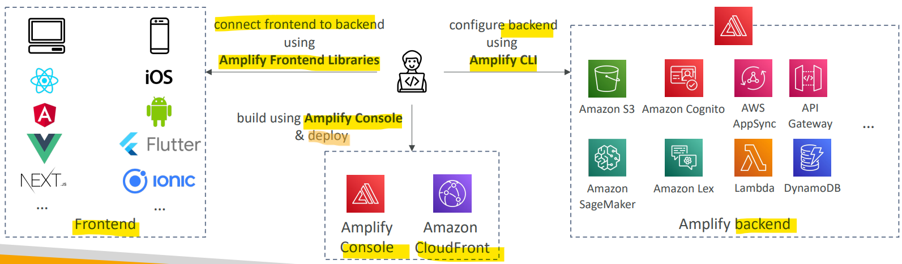

# AWS Service - AWS Amplify

[Back](../../index.md)

- [AWS Service - AWS Amplify](#aws-service---aws-amplify)
  - [`AWS Amplify`](#aws-amplify)

---

## `AWS Amplify`

- `AWS Amplify`

  - A set of **development tools** and services that helps you **develop and deploy** scalable full stack **web and mobile applications**
  - can think as the `Elastic Beanstalk` for web and mobile applications.

- Features:
  - Authentication, Storage, API (REST, GraphQL), CI/CD, PubSub, Analytics, AI/ML Predictions, Monitoring, …
  - Connect your source code from GitHub, AWS CodeCommit, Bitbucket, GitLab, or upload directly

---

[TOP](#aws-service---aws-amplify)
