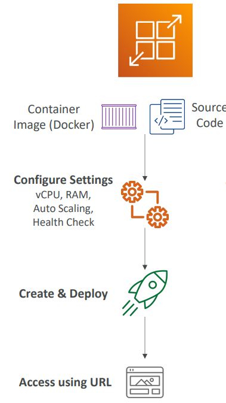
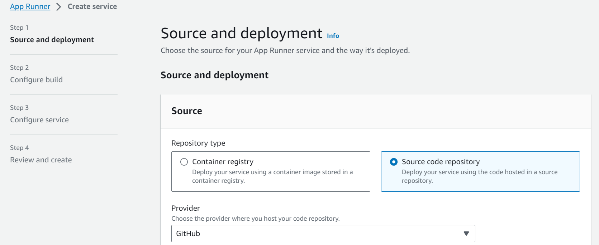

# AWS Deployment - AWS App Runner

[Back](../../index.md)

- [AWS Deployment - AWS App Runner](#aws-deployment---aws-app-runner)
  - [AWS App Runner](#aws-app-runner)
    - [Hands-On](#hands-on)

---

## AWS App Runner

- **Fully managed** service that makes it easy to deploy web applications and APIs at scale
- No **infrastructure experience required**
- Start with your **source code** or **container image**
- Automatically **builds and deploy** the web app
- Automatic **scaling**, highly **available**, **load balancer**, **encryption**
- **VPC access** support
- Connect to **database**, **cache**, and **message queue** services

- **Use cases**:
  - web apps,
  - APIs,
  - microservices,
  - rapid production deployments

- Sample:
  - A developer has a running website and APIs on his local machine using containers and he wants to deploy both of them on AWS. The developer is new to AWS and **doesn’t know much about different AWS services**. Which of the following AWS services allows the developer to build and deploy the website and the APIs in the easiest way according to AWS best practices?
  - App Runner.

---

### Hands-On

---

[TOP](#aws-app-runner)
